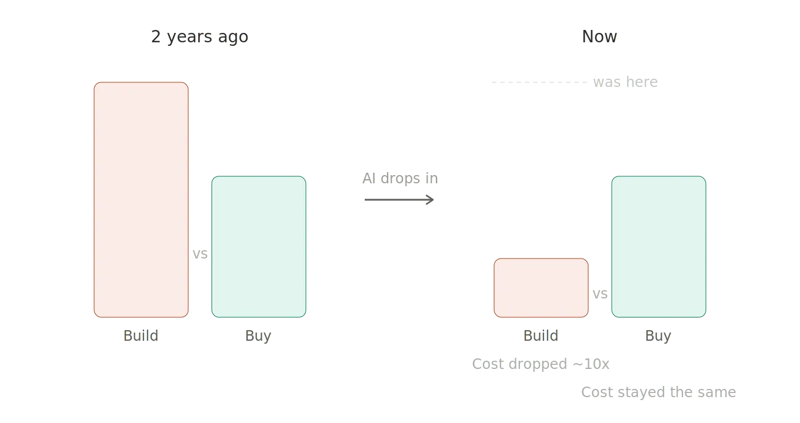
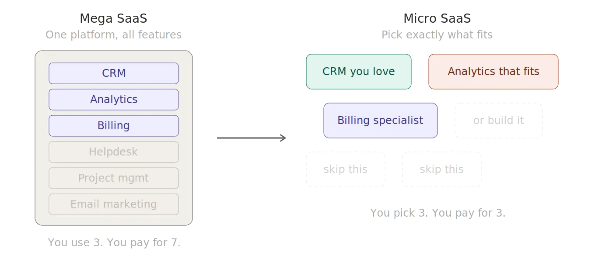
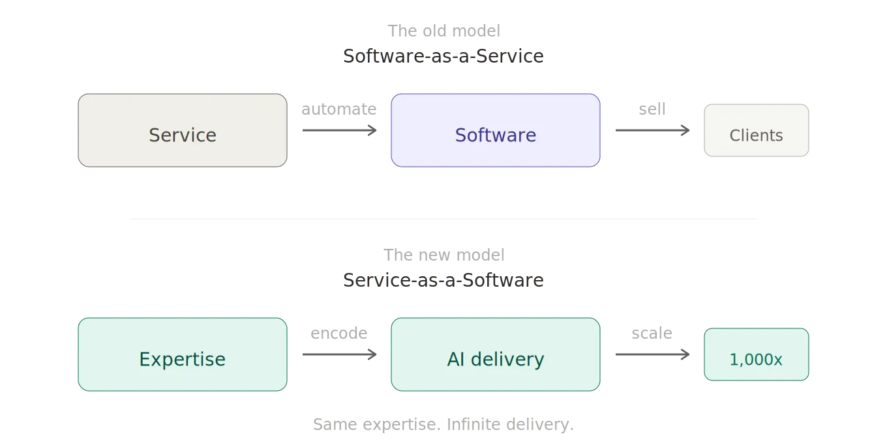

## The math changed

Here's what happened. AI made coding cheap. Not free, not effortless, but cheap enough that the build vs. buy equation flipped for a lot of teams.

Two years ago, building an internal tool to replace a SaaS product meant hiring developers, managing scope creep, and maintaining something forever. The total cost of ownership was brutal. So you bought. Everyone bought. That's how we ended up with companies running 200+ SaaS subscriptions and a full-time person just to manage them.

Now a senior engineer with an AI coding agent can prototype that same internal tool in a weekend. The build side of the equation dropped by an order of magnitude. The buy side stayed the same, or got more expensive.

When you change one side of an equation that dramatically, everything downstream moves.

## What actually dies

The SaaS products most exposed are the ones that were always a thin layer of logic on top of a database. The ones where the value was never the technology. It was the fact that building it yourself was too expensive to justify.

CRUD apps with nice UIs. Dashboards that rearrange data you already own. Workflow tools that are basically a form connected to a database connected to an email.

These were always a convenience tax. AI just made the convenience optional.

And it goes further than that. It will feel archaic in two years that we used to click through user interfaces to navigate databases and complete tasks. Agents just do it. One prompt. Done. 90% of the entire application layer is going to get eaten over the next decade. The dashboards. The forms. The CRUD. All of it.

## What doesn't die

Some SaaS products have moats that AI doesn't erode. It actually makes them more valuable.

**Regulated environments.** If your software needs certification, if it operates in a space where compliance isn't optional, if regulators need to audit your processes, you can't vibe-code your way through it. A weekend prototype doesn't pass regulatory review. The certification itself is the product. It takes years to build, and your customers can't replicate it no matter how cheap their engineers are.

**Deep dependency.** Some tools wove themselves so deeply into how teams operate that ripping them out is more expensive than any alternative. This isn't lock-in through malice. It's lock-in through genuine usefulness. When a product becomes the operating system of a team's daily work, the switching cost has nothing to do with code.

**Humans in the loop.** There are domains where the service requires human judgment. Regulatory requirements that demand a qualified person signs off. Subjective decisions where the accumulated knowledge of specialists still matters. AI can assist here, but it can't replace the human, and in many cases the law doesn't allow it to. The SaaS layer that orchestrates this human expertise? That's not going anywhere.

**Domain knowledge that's still out of reach.** Some industries have accumulated wisdom that isn't in any training set. The edge cases, the unwritten rules, the things you only learn by operating in a space for years. Products built on this knowledge aren't competing with AI. They're competing with decades of experience, and AI doesn't have it yet.

## From mega to micro

The era of mega-SaaS, the all-in-one platform that tries to be everything for everyone, is the part under real pressure. These products survive because the pain of integrating five smaller tools used to outweigh the pain of paying for features you don't use. That integration pain is getting cheaper too.

What's emerging is micro-SaaS. Smaller, sharper products that do one thing well for a specific audience. The economics work because building them is cheaper. The market works because teams can now afford to be picky. Instead of buying the whole suite and using 20% of it, you find the tool that fits your exact problem.

More products competing on actual fit instead of feature count. More teams paying for what they use instead of what they might use someday. That's healthier.

## The inversion

Here's where it gets interesting. Look at those moats again. Regulated environments. Human expertise. Domain knowledge. What do they all have in common?

The value is the service. The software is the delivery mechanism.

We've spent two decades packaging services as software. The whole SaaS model was: take a process that used to require people, automate it, sell the automation. The direction was always service into software.

That direction is inverting.

The real opportunity for most companies isn't building another SaaS product. It's taking genuine domain expertise and baking it into AI-powered delivery. Service-as-a-Software.

An ad agency that encodes its winning playbooks into AI systems and serves 1,000 clients with the quality it used to give 10. An IP law firm that packages decades of expertise into AI skill files and delivers legal services at near-zero marginal cost. An HR and payroll company that operates across European regulatory environments, where the humans in the loop aren't a limitation but the entire product.

The backend is AI. The frontend is your expertise packaged as a service. The moat is that you actually know what good looks like in your domain.

You're not competing with OpenAI. You're competing with other service providers who are still doing everything manually. That's not a hard fight to win.

## So is SaaS dead?

SaaS isn't dead. It's inverting.

The version that existed because building was too hard, that charged enterprise prices for commodity logic, that bundled everything to justify the price tag? That part is dying.

What replaces it is sharper. Micro-SaaS tools that earn their place by fitting perfectly. And underneath those, a new layer: companies that stopped trying to sell software and started selling their expertise through it.

The technology gets commoditized. The person who knows how to use it doesn't.
