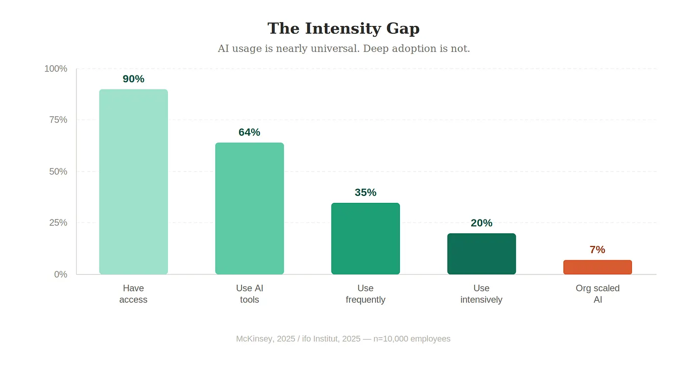
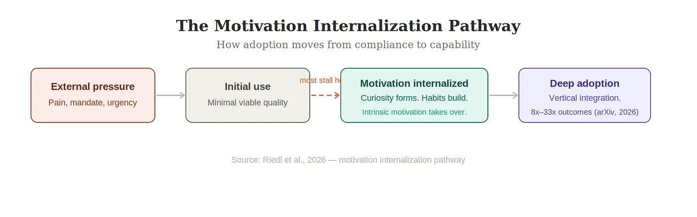
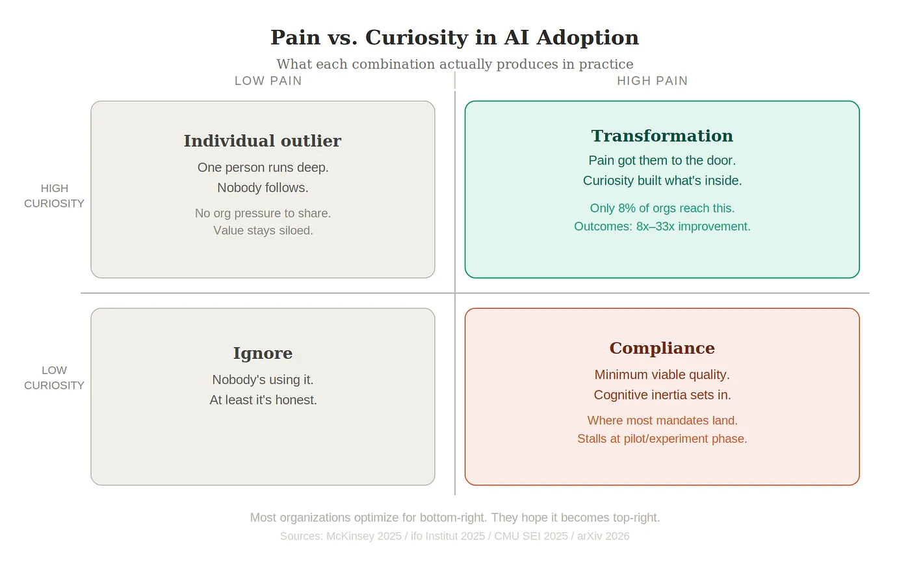

There's a post circulating where someone describes their CEO checking everything through AI. Website copy. Campaign strategy. Webinar talking points. Every time someone presents work, the response is the same: "Have you asked AI what it thinks?"

The team is frustrated. Demoralized. I get it.

I also think the CEO might be the most rational person in the room.

He found something that gives direct answers. That doesn't ask for three more days. That doesn't say "we have experts on the team." He isn't obsessed — he's just less tolerant of slow feedback than he used to be. Both things are probably true. The frustration just runs in opposite directions.

But here's the part worth thinking about: his relationship with AI will probably stay exactly as shallow as it is right now. Because what drove him there was pain. And pain is a poor architect.

## Pain lowers the activation energy

Organizations love the pain frame when it comes to adoption. Make the old way uncomfortable enough, and people will reach for the new one. It follows standard diffusion logic — people change when the cost of not changing exceeds the friction of changing.

And it works. Partially.

Pain gets someone to open the tool instead of dismissing it. Mandate usage metrics, change the approval process, put an impatient CEO in the room. People will start using it.

The numbers back this up. According to McKinsey's 2025 State of AI report, nearly 90% of organizations now use AI regularly in at least one function. Adoption, by most surface measures, is nearly universal.

But a 2025 study of 10,000 employees by the ifo Institute found something that sits awkwardly next to that headline: while 64% of workers use AI tools, only 20% use them frequently or intensively. Broad diffusion. Shallow use. The same tool, open in millions of browser tabs, barely touched beneath the surface.

McKinsey puts the scaling number at 7%. That's the share of organizations that have successfully embedded AI across the enterprise — not just piloting it, not just reporting usage, but actually running on it.

The gap between 90% and 7% is the whole article.

## What pain actually produces

Pain-driven adoption has a specific texture. The ifo Institute research names it directly: cognitive inertia. When organizational pressure is the primary driver, users rely on AI to complete tasks with "minimally acceptable quality" rather than using it to think differently about the problem. The tool becomes a shortcut, not a collaborator.

The same study found that top-down formal adoption — mandates, training programs, supervision — determines how deeply AI is embedded in daily workflows. But it doesn't broaden the pool of people actually using it well. That part is driven by something else: informal, employee-led experimentation. People going off-script. Trying things nobody asked them to try.

In other words, pain sets the floor. It does not raise the ceiling.

The CEO checking every presentation through AI isn't building capability. He's building a habit. Those are different things. One compounds. The other plateaus.

## What curiosity actually produces

A 2026 study published in Frontiers in Psychology identified intrinsic motivation as the strongest single predictor of creative and frequent AI use. More than access. More than training. More than organizational mandate.

And critically: when extrinsic pressure becomes the dominant driver, it can actively weaken the effect of intrinsic motivation on creativity. The mandate crowds out the curiosity. You get a utilitarian atmosphere — people using AI to get things done — where what you actually needed was people using AI to figure out what's worth doing differently.

This distinction shows up clearly in what separates high performers from the rest. Carnegie Mellon's AI Maturity research categorizes only 8% of organizations as "reinvention-ready." What sets them apart isn't better tools or bigger budgets. It's a shift from what the research calls horizontal layering — adding AI on top of existing silos — to vertical integration, where teams take end-to-end ownership of AI-augmented workflows and actively redesign how work gets done.

The productivity gap between those two modes is not marginal. It ranges from 8x to 33x reductions in resource consumption. Same technology. Completely different relationship to it.

## The uncomfortable part

Here's where this gets genuinely difficult: you can manufacture pain. Restructure a workflow. Change an approval process. Hire an impatient CEO. Create urgency.

You cannot manufacture curiosity.

A 2026 study confirmed what most practitioners already sense: the psychological pathway to sustained AI adoption runs through motivation internalization. External pressure initiates behavior. But what sustains it — what makes it compound rather than plateau — is curiosity and the habits it builds. Intrinsic motivation and behavioral habit are the core nodes that hold the entire psychological adoption network together.

Which means the real question for any organization serious about going past the 7% isn't "how do we get people to use this." It's: where are the people who are already curious, and are we giving them room to run?

Because those people exist in almost every organization. They've already figured out something their team hasn't. They're using AI in ways nobody asked them to. They probably haven't told anyone because there's no incentive to.

Most adoption programs walk right past them. They're too busy measuring the 90%.

## What this means in practice

Compliance-based adoption is real. It generates the numbers that go in board decks. In a narrow sense, it works.

What it doesn't produce is the person who comes in on Monday having spent the weekend figuring something out. The junior hire who quietly builds a workflow that changes how a whole department operates. The team member who reframes a problem nobody had thought to reframe.

Those people moved because of curiosity. They didn't need a mandate. They needed room.

The organizations building real AI capability aren't the ones with the most aggressive adoption programs. They're the ones where a handful of genuinely curious people went ahead, figured something out, and made it impossible for everyone else to ignore.

## Back to the annoying CEO

He's in the high-pain, low-curiosity quadrant. Fed up with slow, vague answers — and relieved to have something that just responds. Whether that relief becomes genuine curiosity, or stays a coping mechanism for organizational frustration, is an open question.

His team's frustration is legitimate. But part of what's underneath it — unspoken — is that they haven't found their own reason to go deeper. The CEO found his, even if it's imperfect.

The gap isn't really between the CEO and the team. It's between both of them and the version of this that actually compounds.

Pain is the ignition. Curiosity is the engine.

You need both. But only one of them scales.
