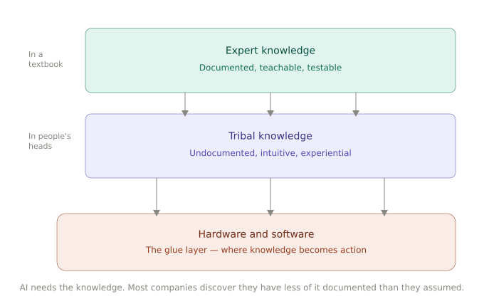
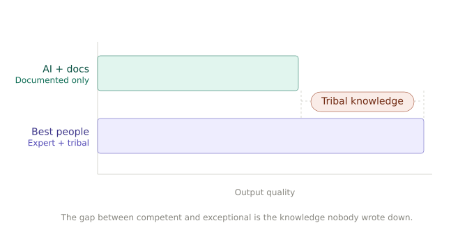

Ask any executive what their company does and you'll get an org chart, a mission statement, maybe a slide deck about culture and values. Ask AI to figure it out and you get something simpler.

AI is stripping companies down to three things. Not three departments. Not three product lines. Three categories of knowledge that determine whether the company actually works.

Expert Knowledge. Tribal Knowledge. And the Hardware and Software that stitches them together.

That's it. Everything else is scaffolding.

The reason this matters now is that AI doesn't need the scaffolding. It needs the knowledge. And most companies, when they go looking for it, discover they have far less of it documented than they assumed.

## What you know how to do

Expert Knowledge is the vertical-specific understanding of how to operate in your domain. It's what you'd teach in a textbook if the textbook existed. How to underwrite a loan. How to design a bridge truss. How to diagnose a failing compressor. How to price a derivatives contract.

This is the kind of knowledge that industries build certification programs around. It's teachable, testable, and increasingly available to AI. If your expert knowledge lives in published standards, regulatory frameworks, or well-documented procedures, a foundation model can learn it. Not perfectly. But well enough to shift the value curve.

McKinsey's 2025 State of AI report found that 88% of organizations now use AI in at least one function. The knowledge that used to differentiate a senior hire from a junior one is increasingly embedded in the tools both of them use. If it's in a textbook, it's in a model. The moat has to come from somewhere else.

AI makes this visible because it's the first thing companies try to feed it. They point a model at their documented procedures and get decent results fast. Which feels like progress until they realize AI just commoditized the layer they thought was their advantage.

The interesting question isn't whether AI can access your expert knowledge. It's whether your expert knowledge is all you have.

## What nobody wrote down

Tribal Knowledge is the other kind. It's the fuzzy grey details that exist in people's heads, in Slack threads, in the way a senior engineer configures a deployment differently from the documentation, in the reason one sales team consistently outperforms another selling the same product in the same market.

This is the knowledge that is poorly documented because it's hard to articulate. It lives in intuition built over years of pattern matching. The machinist who can hear when a tolerance is off. The underwriter who knows which data points actually predict default versus the ones the model says should. The project manager who understands which stakeholder needs to be looped in before a decision sticks.

The California Management Review called tacit knowledge your next competitive moat. They're understating it.

This is where performance dispersion lives. Two companies in the same vertical, same market, same tools, same certifications. One consistently outperforms the other by 20, 30, 40 percent. The spreadsheet can't explain why. But the people inside both companies know. The difference is that one company has tribal knowledge distributed across its teams. The other lost it when three senior people left and nobody thought to ask them how they actually did the work.

AI exposes this layer by subtraction. Companies deploy a model, feed it their documented knowledge, and the output is competent but generic. The gap between what the AI produces and what the best people produce is tribal knowledge made visible. It's the delta you can suddenly measure but can't yet close.

And two converging forces are making this urgent: AI integration is exposing the gaps, and mass retirements are draining the institutional expertise that filled those gaps invisibly for decades. The knowledge walks out the door, and the org doesn't even know what questions to ask about what it lost.

## The glue layer

The third element is Hardware and Software. The CRM, the ERP, the custom internal tools, the spreadsheets nobody admits are running critical processes, the deployment pipelines, the communication platforms. This is where knowledge becomes action.

AI is embedded in this layer now. It's dramatically better glue. It can stitch Expert and Tribal Knowledge together faster, more consistently, and at a scale that wasn't possible when the glue was entirely human coordination.

Deloitte's 2026 State of AI report found that 66% of organizations report productivity gains from enterprise AI adoption. But look at where those gains come from: faster information retrieval, better routing of decisions, more consistent application of known procedures. The knowledge itself didn't change. The speed at which it could be applied did.

The companies seeing transformational results did something different. McKinsey found that high performers are 3.6 times more likely to pursue transformational change, and 55% fundamentally rework their workflows when deploying AI. They're not upgrading the glue layer. They're rebuilding it around their documented knowledge.

That's a different thing entirely.

## What happens when you document both

If Expert Knowledge and Tribal Knowledge are both well documented, something changes. You can rebuild how you do work.

Not optimize. Not automate a few steps. Rebuild.

The progression is straightforward. First you structure the knowledge into forms AI can consume: fine-tuned models, knowledge graphs, retrieval systems. Then you convert it into decision frameworks. Then AI can execute multi-step workflows independently. But the whole chain breaks at step one if the knowledge doesn't exist in a form that can be structured.

When a company understands both what to do (Expert Knowledge) and how it's actually done, including the judgment calls, the exceptions that everyone knows but nobody wrote down (Tribal Knowledge), it can redesign its processes from first principles. This is what most AI transformation projects miss. They start with the tools. They buy an AI platform, connect it to their data, and then wonder why the outputs are generic, hallucinated, or irrelevant to how the business actually operates. The issue isn't the AI. The issue is that nobody documented the knowledge the AI needs to be useful.

The organizations that have done this work are seeing results that look like a different category. The California Management Review cited a case where regulatory evaluations in the cosmetics industry scaled from hundreds to over 40,000 per month with full accuracy and repeatability. Expert workload dropped by roughly 80%. But that only worked because both the expert knowledge (regulatory frameworks) and the tribal knowledge (how experienced evaluators actually interpret edge cases) were codified before the AI was deployed.

Companies with established knowledge layers deployed new AI applications in weeks because more than half of their semantic structure could be reused across use cases.

This isn't optimization. This is reconstruction. Same company, same people, fundamentally different capability.

## More people, not fewer

Here's the part that most people get wrong.

The assumption is that documenting knowledge and adding AI means you need fewer humans. The math seems obvious. If AI handles the execution, why hire people to do it?

But that's not what happens in practice. What happens is the bottleneck moves.

When Expert and Tribal Knowledge are well documented and AI handles the execution layer, the constraint shifts to judgment. Not the routine judgment that can be encoded in decision trees. The novel judgment. The edge cases. The strategic calls. The situations nobody anticipated when the knowledge was written down.

Judgment doesn't scale without people.

A company that has documented its knowledge well can hire faster because onboarding changes. Instead of spending six months absorbing tribal knowledge through osmosis, sitting next to the senior person, learning the unwritten rules, a new hire can get to the judgment layer in weeks. The documented knowledge accelerates them to the point where they can start making meaningful decisions sooner.

This is a growth argument. Companies with well-documented knowledge can absorb more people because each person reaches productive judgment faster. The documented knowledge is the scaffold. The humans provide the judgment. You need more of them because the opportunity space expands when the knowledge bottleneck clears.

Both things are probably true. AI will eliminate some roles where the work is pure execution against well-known procedures. And AI will create demand for more people in organizations where documented knowledge reveals how much novel judgment is actually required to operate well.

The companies that understand this will grow faster. The ones that treat documentation purely as a cost-cutting exercise will find they've automated the easy part and hollowed out their capacity for the hard part.

## The rebuild

Every company looks complex from the outside. Org charts, processes, culture, technology stacks, decades of accumulated decisions layered on top of each other.

Strip away the scaffolding and there are three things. What you know how to do. What nobody wrote down. And the tools you use to stitch them together.

AI didn't create these layers. It revealed them. And the companies that understand what they're actually made of are the ones that can remake themselves.

The rest are still optimizing something they can't describe.