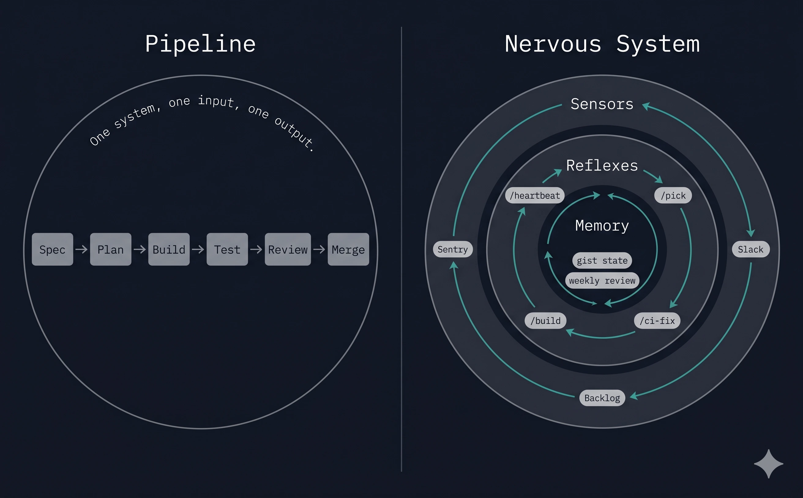
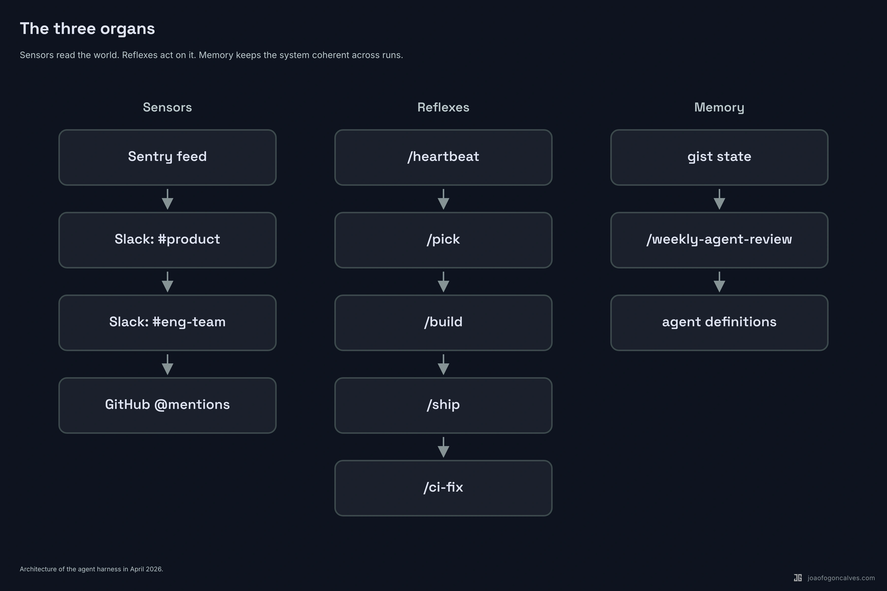
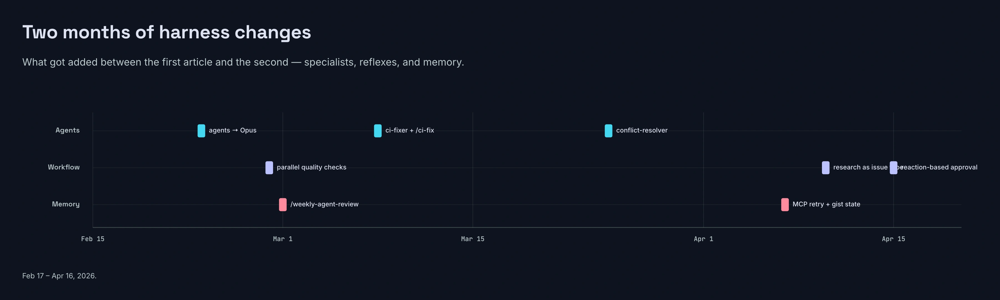
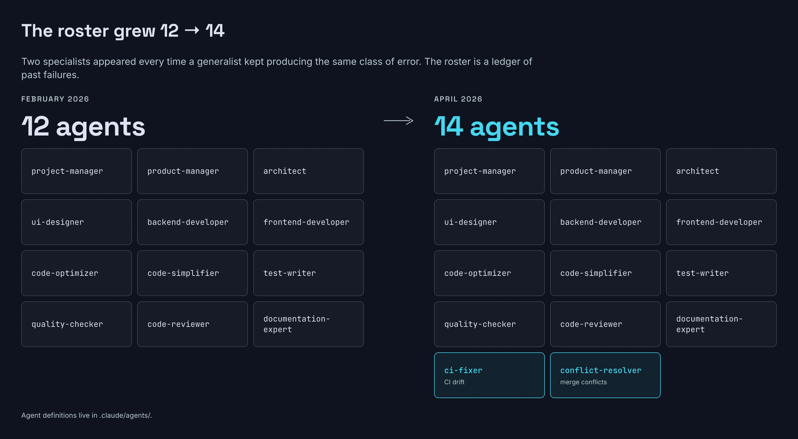
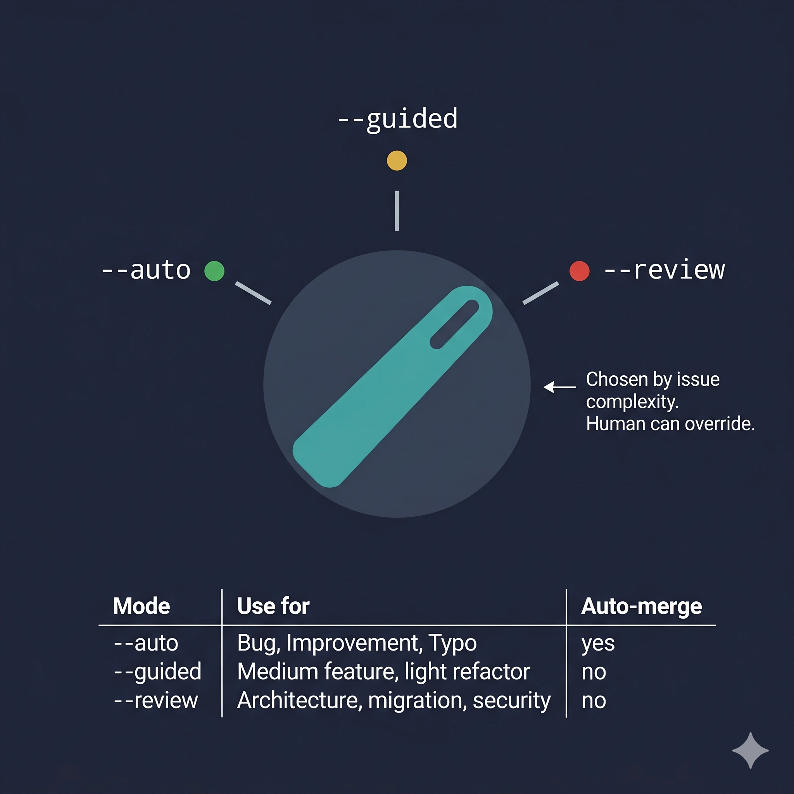
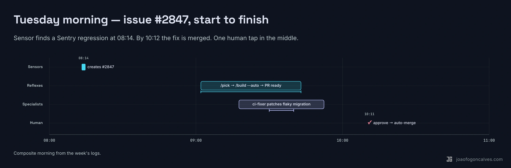
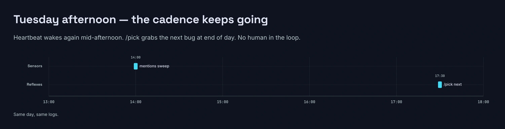

## 1. A different Tuesday

In February, I wrote about watching a project manager agent spawn three planners in parallel, wait, sequence a backend pass, then a frontend pass, then optimization, tests, review, docs. An hour of work, no human touching the keyboard, one PR at the end.

That was the story: a pipeline. Feature in, code out.

Two months later, there is no start button anymore.

On a Tuesday in April, my laptop is closed. A Sentry alert fires at 10:17. An autonomous loop picks it up within sixty seconds, reads three Slack channels for context, finds a related thread from last week, creates a GitHub issue linked to both. Ten minutes later, a different skill scans the backlog, claims the top-priority bug, announces the claim in #eng-team with a reply to the original report, and kicks off a build. CI goes green at 11:02. Labels advance. A human hits approve with a thumbs-up reaction on Slack. Merge. Deploy.

I read the whole thing from my phone at lunch.

The pipeline still exists. It's just one organ of something bigger now.

## 2. Pipelines deliver. Nervous systems sense and act.

The thesis of the first article was that coordination is the real problem, and a team of specialized agents with gates between them beats a single giant prompt. That's still true. It's also insufficient.

A pipeline assumes an input. Someone hands it a spec. It delivers code. When the spec runs out, the pipeline stops. It has no idea what's happening in Sentry, in Slack, in the backlog, in the last week of merged PRs. It can't notice things. It can't follow up. It can't review its own past work and change its future behavior. It is, in the most literal sense, passive.

A nervous system is always on. It senses. It reacts. It remembers. It adapts.

The shift I didn't see coming in February is that once you have specialized agents that can deliver a feature, the next hard problem isn't making the delivery smarter. It's everything *around* delivery: deciding what to build, knowing when something breaks, handling follow-ups while five other things are in flight, noticing that the same mistake keeps happening and fixing the mistake-maker instead of the mistake.



## 3. The three organs

The system grew three distinct subsystems since February. None of them existed in the original article.

**Sensors.** A skill called `/heartbeat` runs on a schedule. It polls Sentry for new or escalating errors. It reads four Slack channels: #product, #product-monitoring, #eng-team, #product-development. It handles @mentions in-thread. It follows up on pending threads waiting for clarification or approval. It asks questions when feedback is ambiguous. When it finds something worth acting on, it creates or updates a GitHub issue and links the Sentry event to it. Then it writes everything it learned to a persistent gist so the next run knows what it already handled.

**Reflexes.** A skill called `/pick` runs against the backlog. It sorts by priority, claims the top unassigned bug or improvement or research issue, announces the claim in Slack as a reply to whoever reported it, and invokes `/build --auto`. The build skill then runs the old pipeline: plan, implement, test, review, merge. Same shape as February. Now it runs without a human kicking it off.

**Memory.** Two pieces. The gist state keeps the sensor's context across runs (last-read timestamps, pending threads, per-user nudge budgets so the bot doesn't pester the same person twice in an hour). And a skill called `/weekly-agent-review` that reads the last seven days of agent work, compares it against human corrections on PRs, and proposes updates to the agent definitions themselves.

::: wide

:::

The last part is the one that surprised me. The system reviews itself and edits its own source.

::: wide

:::

## 4. Specialization is evolution, not a destination

The February roster was twelve agents. I thought it was complete.

It wasn't. The roster now sits at fourteen, and the additions tell you exactly where the previous version was thin.

`ci-fixer` showed up in March. The old system trusted the quality-checker to catch everything locally. In practice, CI failed for reasons the local check couldn't reproduce (flaky tests, migration conflicts, version drift between environments). A human kept jumping in to fix CI. So the agent that reads CI logs, diagnoses the failure, and applies a minimal fix became its own thing.

`conflict-resolver` showed up the same week. Same pattern. Merge conflicts during long feature branches kept requiring human judgment. Now an agent that understands both sides of a conflict and applies the correct resolution strategy handles most of them.

`github-actions-expert` is the security specialist. It pins action versions, sets OIDC auth, enforces least-privilege permissions. That work used to be whoever merged the PR. Now it has an owner.

`tester` is the subtle one. There was already a `test-writer` — it planned test coverage. But planning and writing were the same agent, which meant in practice the planning was rushed because the model wanted to get to the writing. Splitting them produced better tests.

::: wide

:::

The lesson isn't that twelve was wrong. Twelve was right for what the system was doing in February. The lesson is that you add a specialist every time a generalist keeps producing the same class of error. The roster is a ledger of past failures.

## 5. Autonomy is a dial, not a switch

The February system had one mode: run the pipeline end-to-end. Reviewing the plan before implementation was optional and manual.

The current `/build` has three modes, and by default it picks one based on the complexity of the issue:

```
--auto       No prompts. Auto-merge on green CI. Default for Bug / Improvement.
--guided     Checkpoints before implementation and before merge.
--review     Full checkpoints: plan review, implementation, merge.
```

The dial matters because the cost of a wrong auto-merge is not symmetric with the cost of a slow merge. A one-line fix to a typo doesn't need three human checkpoints. A refactor touching thirty files does.

The system reads the issue type, estimates complexity from the spec length and the files it expects to touch, and sets the mode. The human can override. Most of the time, nobody does.



This is the piece that most teams skip. They pick a single autonomy level for everything and then fight about whether it's too much or too little. The answer is almost always: it depends on the work.

## 6. What a real day looks like

The pipeline view, in February, was a single feature flowing through stages. The nervous-system view is harder to draw because there is no single flow. There are dozens of partial ones, overlapping, all the time.

Here's a compressed Tuesday:

```
08:14  heartbeat wakes, reads Sentry, spots a new 500 on payroll export
08:14  cross-references #product-monitoring for complaints — finds one from last week
08:15  creates GH issue #2847, links Sentry group, replies to Slack thread
09:02  /pick claims #2847, announces in thread: "on it"
09:04  /build --auto starts. Bug path: skip planning agents, go straight to fix
09:19  backend fix committed, tester writes regression test, both pass locally
09:21  PR opened, CI running
09:33  CI fails on a flaky migration check
09:33  ci-fixer reads the log, identifies a race in the test fixture, patches it
09:41  CI green
09:42  code-reviewer approves, no critical issues
09:43  PR marked ready for review, slack notification posted
10:11  human taps thumbs-up on the slack message
10:12  auto-merge fires, deploy pipeline takes over

14:00  /heartbeat wakes again — different mentions, different context
17:30  /pick wakes, picks the next bug, cycle repeats

Friday: /weekly-agent-review reads the week,
        notes that ci-fixer handled 6 of 7 CI failures without human touch,
        notes that the 7th required a human because of a secret rotation,
        proposes adding a "secrets expert" specialist to next week's roster
```

Three things stand out when you compare this to the February version.

First, no human kicked off #2847. The system created the ticket, assigned it, fixed it, and queued it for review. The human role collapsed to a single thumbs-up reaction at 10:11.

Second, the CI failure at 09:33 would have stopped the February pipeline until a human intervened. Now a specialist handles it.

Third, the Friday step is the one that would have sounded like science fiction two months ago. The system audits its own output and proposes changes to itself. I approve or reject the proposal. The system applies the change. Next week's version of the system is not the version I wrote.

::: wide

:::

::: wide

:::

## 7. What the nervous system still can't do

Every honest piece about an agent system needs this section, so here it is.

The weekly-review loop is only as good as the signal it reads. It's good at catching "the same class of error keeps happening." It's bad at catching "this entire approach is wrong." Strategic drift doesn't show up in PR diffs. You still need a human who reads broadly and notices that the system is efficiently going in the wrong direction.

The autonomy dial makes smart defaults, not correct ones. A simple-looking bug that turns out to have load-bearing consequences will sail through `--auto` and cause exactly the outage the old pipeline would have avoided, because there was no plan-review step. The dial reduces friction on the common case at the cost of making the uncommon case more dangerous. Both things are true.

Persistent state via gist is fragile. It works. It's also a system that stores critical coordination data in a single markdown file on a third-party service, and I have not yet had the failure mode where that file goes bad. When it happens, the whole nervous system goes blind for a cycle.

The new specialists (ci-fixer, conflict-resolver) are narrow. They handle the shape of failure they were built for and nothing else. Every new class of failure is a new specialist or a human. There is no general-purpose "something went wrong, figure it out" agent that works at this quality level yet.

And the bill is higher. A nervous system that runs continuously costs more tokens than a pipeline that only runs when you ask it to. The work it does has to be worth the ambient cost of it running at all. For a product team shipping daily, it is. For a side project that ships twice a month, it isn't.

## 8. Back to Tuesday

In February, the point of the article was that the gap between "AI writes code" and "AI delivers features" is a systems design problem. The models were capable enough. What was missing was the organizational layer: who does what, in what order, with what inputs, through what gates.

Two months later, there's a bigger gap on the other side of the pipeline.

The gap between "AI delivers features on request" and "AI runs a product development loop" is also a systems design problem. Same shape. Different scope. What's missing is the sensing layer, the memory layer, the self-review layer. The organs that make a system aware of itself and its environment.

You don't need to build all of this to start. Start with one sensor. A skill that watches one channel. A reflex that claims one kind of work. A weekly review that reads the last seven days and tells you what it noticed.

Grow it when you hit a specific failure mode. Same principle as the February article, applied one level up.

The pipeline gets you features. The nervous system gets you a company that ships while you're at lunch.

The next time you watch an AI agent deliver a feature, ask yourself: who told it to? If the answer is still "a human, every time," you have a pipeline. That's fine. It's just not the end of the road.
