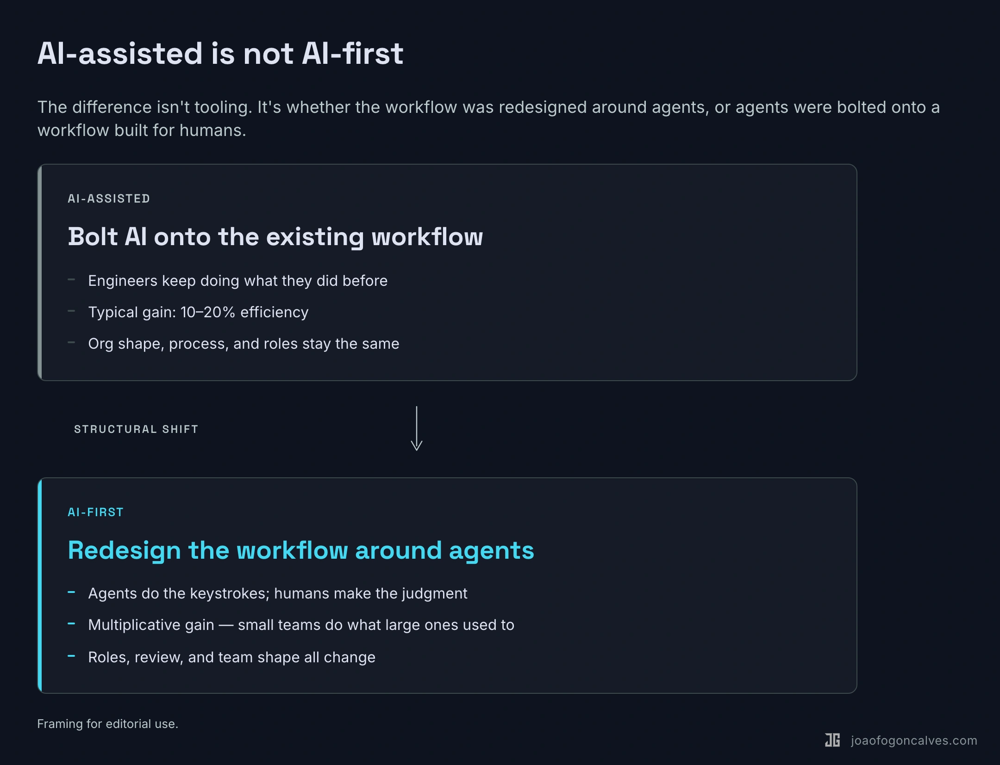
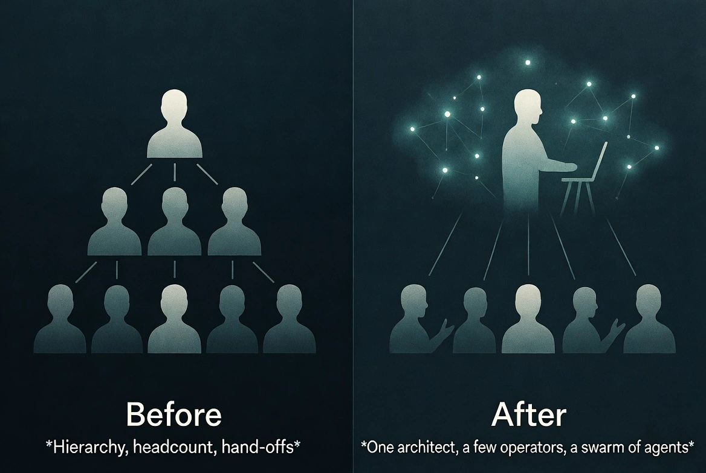

Most of the production code merged at BRIDGE IN this quarter was written by AI. I opened a bug against our onboarding emails yesterday morning. Diagnosis, fix, regression test, PR, CI, merge: done before my second coffee. Three months ago that loop was a sprint.

We didn't get here by adding AI to our editors. We took the engineering process apart and rebuilt it around agents. We changed how we plan, how we implement, how we review, how we ship. We changed the shape of the team.

Three engineers, one monorepo, roughly fifteen specialized AI agents threaded through every phase of the workflow. I started the team earlier this year, and a couple of months in, I restructured the entire build-and-review flow around the assumption that agents do the keystrokes and people do the judgment.

One note before the rest. BRIDGE IN isn't public yet. The numbers here are build velocity, not customer-shipping velocity. Whether the product lands with users is a bet still in flight. What the harness has already done is collapse the time between a decision and code that reflects it. At our size and runway, that is what decides whether we launch this year or next.

OpenAI published a concept earlier this year that captured what we'd been doing. They called it harness engineering: the primary job of an engineering team is no longer writing code. It is enabling agents to do useful work. When something fails, the fix is never "try harder." The fix is: what capability is missing, and how do we make it legible and enforceable for the agent?

We'd been doing that for months before it had a name.

## AI-First Is Not the Same as Using AI

Most teams bolt AI onto their existing process. An engineer opens Cursor. A PM drafts a spec with ChatGPT. A tester experiments with AI-generated test cases. The workflow stays the same. Efficiency goes up ten to twenty percent. Nothing structurally changes.

That is AI-assisted.

AI-first means you redesign your process, your architecture, and your team around the assumption that AI is the primary builder. You stop asking "how can AI help our engineers?" and start asking "how do we restructure the work so AI does the building, and engineers provide direction, judgment, and review?"

The difference is multiplicative.

I see teams claim AI-first while running the same sprint cycles, the same planning meetings, the same manual code reviews, the same weekly status calls. They added AI to the loop. They didn't redesign the loop.

A common version of this is what people call vibe coding. Open the editor, prompt until something works, commit, repeat. That produces prototypes. A production system has to be stable, reliable, secure, maintainable. You need a system that guarantees those properties when AI writes the code. You build the system. The prompts are disposable. The harness is the asset.

## Why We Had to Change

When I took over, I watched how the team worked and saw three bottlenecks that would have killed us.

**The spec bottleneck.** Planning a feature took a week. Writing it took two hours. When build time collapses from weeks to hours, a multi-day planning cycle becomes the constraint. It doesn't make sense to think about something for a week and then build it before lunch. Product thinking had to move at the speed of iteration or step out of the build cycle.

**The review bottleneck.** Agents can open a pull request faster than a human can meaningfully read one. If an engineer ships a feature in a morning, hand-review by three people becomes the new wait state. Either you compress review (dangerous) or you automate part of it alongside human judgment (harder, but survivable).

**The headcount bottleneck.** Competitors in our space run engineering teams many times larger than ours. We couldn't hire our way to parity. We could, maybe, redesign our way there.

Three things needed to operate at agent speed: design, implementation, and review. If any one of them stayed manual, it would constrain the whole pipeline.

## The Bold Decision: One Repo, Legible Everywhere

I fixed the codebase first.

BRIDGE IN's product lives as a single monorepo: backend, frontend, infrastructure, design system, docs, scripts, agent definitions. A human engineer can touch everything in one session. But the real customer of this shape is the agent.

A fragmented codebase is invisible to an AI agent. A unified one is legible. The more of the system you pull into a form the agent can inspect, validate, and modify, the more leverage you get. One repo. One test matrix. One typed contract between backend and frontend, regenerated from the OpenAPI schema with a single command. One set of CLAUDE.md files that codify, at every level, what "good" looks like.

I spent weeks designing the harness: the agent roster, the skills, the CI gates, the pre-commit hooks, the project board automations, the integrations into our existing observability and chat tools. Then I started asking the agents to rebuild the parts of the harness themselves.

BRIDGE IN is building an operations platform. We use our own harness to build the platform that will run the operations.

## The Shape of the Harness

The details of the stack matter less than the shape. A few principles hold it together.

One monorepo. Backend, frontend, infrastructure, design system, docs, agent definitions, all in one place. Types regenerate from backend to frontend with a single command, so the contract between them is enforced, not documented.

One CI pipeline. Every PR runs the same gates: format, lint, types, migration checks, tests, coverage floor. No optional phases. No manual overrides. Deterministic, so agents can predict outcomes and reason about failures.

A roster of specialized agents, each with a narrow remit, each constrained by what it is *not* allowed to do. The architect cannot write code. The project manager cannot implement. Boundaries come from prohibitions, not instructions.

Skills that compose agents into workflows (feature delivery, bug triage, CI repair, dependency PRs) so that an engineer tagging an issue kicks off a sequence of planning, implementation, testing, and review without manual orchestration.

Pre-commit hooks and branch protection as the last line of defense. Nothing lands on master without a human reviewer and CI both agreeing.

The shape is what matters: one repo, one pipeline, specialized agents, composable skills, enforced gates. How an issue moves through that shape (who plans, who implements, what happens when CI fails) is a longer story I'll tell separately.

## The Results

| Metric | Before | After |
|---|---|---|
| Code written by AI | Minority | Majority |
| Time from issue to merged PR | Days to weeks | Hours |
| PRs merged per week | A handful | 20+ |
| Dependency updates processed | Manual, backlogged | Automated, green on merge |
| Human time spent on CI failures | Hours | Minutes |

Over a recent two-week stretch we merged more than a hundred pull requests. A year ago that pace would have been physically impossible.

People assume you trade quality for speed. We didn't. We ship more tests than we used to. We catch more regressions before they hit production. We have stricter lint, type, and coverage gates than before. The feedback loop is tighter. You learn more when you ship daily than when you ship monthly.

## The New Engineering Org

Two kinds of engineers will exist.

The Architect. One or two people. They design the standard operating procedures that teach AI how to work. They build the testing harness, the review skills, the triage flows, the CLAUDE.md files. They define what "good" looks like for the agents.

This role requires deep critical thinking. You criticize the AI. You don't follow it. When an agent proposes a plan, the architect finds the holes. What failure mode did it miss? What security boundary did it cross? What technical debt is it quietly accumulating?

The ability to criticize AI is more valuable than the ability to produce code. Producing code is the commodity. Critical judgment is the scarce skill.

This is also the hardest role to fill.

The Operator. Everyone else. The work still matters. The structure is different. The triage system finds a bug, surfaces the diagnosis, assigns it to the right person. The person investigates, validates, directs the agent, approves the fix. AI opens the PR. The human reviews whether there is risk. The work is bug investigation, UI refinement, accessibility fixes, PR review, verification. It requires skill and attention. It does not require the architectural reasoning the old model demanded every day.

I haven't written a line of production Python by hand in weeks. I spend my time building the harness, reviewing what agents produce, and deciding what we build next.

## Who Adapts Fastest

I noticed a pattern I didn't expect. Junior engineers adapted faster than senior engineers.

Junior engineers with less traditional practice felt empowered. They had access to tools that amplified their impact. They didn't carry a decade of habits to unlearn. They treated the agent as a collaborator they had to manage, not a tool that had to prove itself.

Senior engineers with strong traditional practice had the hardest time. Two months of their best work could collapse into an hour of agent output. That is a hard thing to accept after years of building a rare skill set.

Both things are probably true. Accumulated skill still matters. You cannot criticize what an agent produces without understanding what it produces. But in this transition, adaptability matters more than the skill you accumulated before it started.

## The Human Side

I won't pretend this was smooth.

Management flattened. A few months ago, a third of my time was in alignment meetings. Discussing trade-offs. Debating priorities. Disagreeing about technical decisions. Those conversations are necessary in a traditional model. They are also draining.

Today I still talk to my team. We talk about other things. Design. Product direction. What the agents keep getting wrong. Why a junior engineer shipped three features before the senior finished reading the plan. We get along better because we stopped arguing about work that can be resolved by running a skill.

Uncertainty is real. When I stopped doing line-by-line review every day, some people felt uncertain. What does the lead engineer not reviewing my code mean? What is my value in this new world? Reasonable concerns. I don't have a clean answer for them. The transition creates anxiety.

The one principle I hold: we don't fire an engineer because they introduced a production bug. We improve the review process. The same applies to AI. When an agent makes a mistake, we build better validation, clearer constraints, stronger observability. The mistake is a signal about the harness, not a verdict on the agent.

Relationships got better, not worse. Less arguing about trade-offs that the system can resolve. More conversation about what matters.

## Beyond Engineering

I see teams adopt AI-first engineering and leave everything else manual.

If engineering ships features in hours but marketing takes a week to announce them, marketing is the bottleneck. If the product team still runs a monthly planning cycle, planning is the bottleneck. If one function operates at agent speed and another at human speed, the human-speed function constrains everything.

Our weekly engineering reviews are AI-generated from repo activity, error data, and team chat. Release notes draft themselves from merged PR titles. Analytics summaries surface the same day the data does. The goal is simple: every function runs on the same kind of harness the engineers run on, or it becomes the new bottleneck.

Engineering was the first domino. It is not the last one.

## Three Things That Hold

Three principles have survived every iteration of the harness.

**Velocity is capped by the slowest function.** Once engineering ships in hours, anything still operating in days becomes the constraint. Speed is a pipeline property, not an engineering one.

**Re-engineer, don't bolt on.** Adding AI to your existing process gets you ten or twenty percent. Redesigning the process around AI is multiplicative. The difference is whether you touched the shape of the work.

**Adaptability beats accumulated skill.** The engineers adapting fastest are not the ones with the deepest traditional practice. They are the ones willing to let the agent do the keystrokes and redirect their judgment elsewhere.

## What This Means

For engineers. Your value is moving from code output to decision quality. The ability to write code fast is worth less every month. The ability to evaluate, criticize, and direct is worth more. Product taste matters. Can you look at a generated UI and know it is wrong before the user tells you? Can you look at an architecture proposal and see the failure mode the agent missed? Those skills compound.

For engineering leaders. If your planning cycle takes longer than your build time, that is the first thing to fix. Build the testing and review harness before you scale agents. Fast AI without fast validation is fast-moving technical debt. Start with one architect: one person who builds the system and proves it works. Onboard others into operator roles after the system is running. Push AI-native into every function. Expect resistance.

For the industry. OpenAI, Anthropic, and multiple independent teams have converged on the same principles: structured context, specialized agents, persistent memory, execution loops, hard gates. Harness engineering is becoming a standard. Model capability is the clock driving this. Most of what works at BRIDGE IN today was not possible six months ago. The next generation of models will push it further.

## We're Early

Most engineering leaders I talk to still operate the traditional way. Some are thinking about making the shift. Very few have actually done it.

The tools exist. Nothing in our stack is proprietary. The competitive advantage is the decision to redesign everything around the tools, and the willingness to absorb the cost. The cost is real: uncertainty among engineers, a lead spending more time building systems than managing people, senior engineers questioning their value, a stretch where the old system is gone and the new one is not yet proven.

We absorbed the cost. The pipeline speaks for itself.

We're building an operations platform. We're running our own operation like one.
