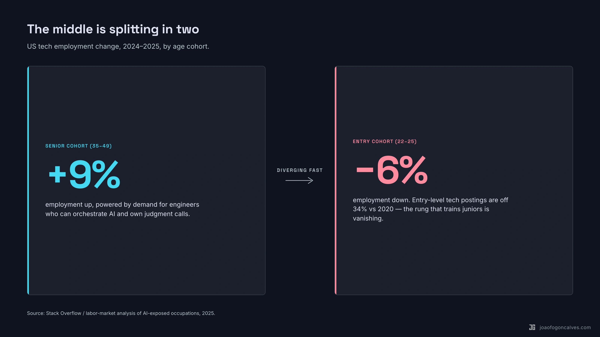
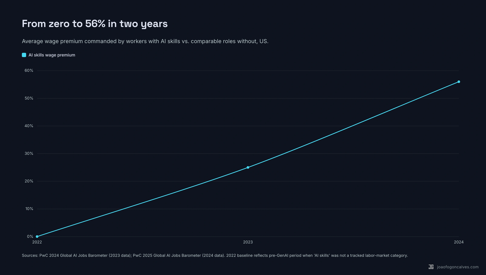
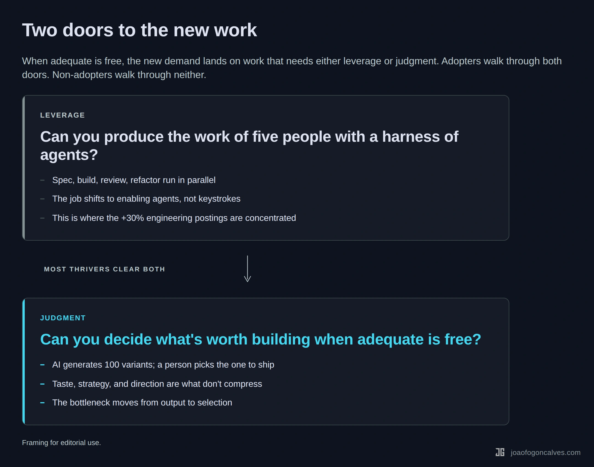
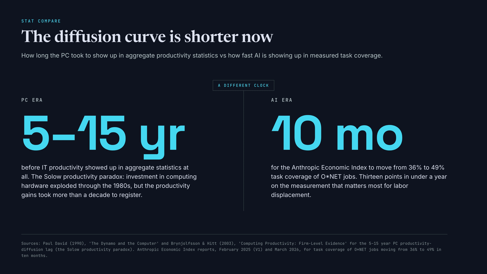

## The paradox has two sides

In January 2025, Satya Nadella [posted](https://x.com/satyanadella/status/1883753899255046301) a link to the Wikipedia article on Jevons paradox. The timing was deliberate. DeepSeek had just released a model that made frontier AI cheaper overnight, and the market was wobbling. Nadella's one-line commentary: "Jevons paradox strikes again. As AI gets more efficient and accessible, we will see its use skyrocket, turning it into a commodity we just can't get enough of."

He was right. A year later, the data is lopsided in his favor. US engineering job listings are [up 30% in 2026](https://www.metaintro.com/blog/software-engineer-job-listings-spike-2026-ai-demand). [PwC's 2025 Global AI Jobs Barometer](https://www.pwc.com/gx/en/services/ai/ai-jobs-barometer.html) reports that revenue per employee in AI-exposed industries has nearly quadrupled since 2022. The total labor pie is growing, and it's growing fastest exactly where people predicted it would shrink.

This is the take that crushed on my LinkedIn last month. Cheaper software means more software. More software means more work. Nothing about it is false.

But pointing at the total and calling it good news hides what the totals are actually made of.

## Quick detour: what Jevons actually said

In 1865, an economist named William Stanley Jevons noticed something counterintuitive about steam engines. They were getting dramatically more efficient. Each ton of coal produced more work than the year before. Everyone expected coal consumption to drop. Efficiency should save fuel.

It didn't. Coal consumption went up.

The reason was straightforward once Jevons explained it. Cheaper energy opened uses that weren't economical before. Factories expanded. New industries started. Railroads extended. The total demand for coal grew faster than efficiency reduced it.

That's [the paradox](https://en.wikipedia.org/wiki/Jevons_paradox). When you make something more efficient, you don't necessarily use less of it. You often use more of it, because cheaper access unlocks demand that was previously priced out.

It's been applied to electricity, fuel economy, bandwidth, and now AI. The logic is the same every time: when the cost of a thing drops, demand for that thing tends to grow faster than the savings. The pie expands.

## The part everyone quotes

If you read only the top-line numbers, Jevons looks airtight.

Engineering postings are up 30% year over year despite two years of layoffs. AI-related roles are up even more. PwC reports the AI wage premium jumped from 25% in 2023 to 56% in 2024, meaning roles requiring AI skills now pay 56% more than otherwise comparable roles that don't. Their barometer shows AI-exposed occupations saw 27% revenue growth per employee and 16.7% wage growth, and productivity growth in AI-exposed industries [nearly quadrupled](https://www.pwc.com/gx/en/news-room/press-releases/2025/ai-linked-to-a-fourfold-increase-in-productivity-growth.html) — from 7% (2018–2022) to 27% (2022–2024). Total coal consumption went up when steam engines got efficient, and total demand for software is doing the same thing.

The 2023 panic about AI replacing coders hasn't played out, at least at the aggregate level. Claude Code ships code. Engineers ship more code. Companies ship more software. The market absorbs more software than it did last year. Nothing about the shape of the industry suggests contraction.

[Mr Phil Games wrote a piece](https://www.mrphilgames.com/blog/jevons-paradox-software-development-ai-more-developers) on exactly this called *Jevons' Paradox and AI: Why It Means More Developers, Not Fewer*. The argument is straightforward. Software was never a fixed pie. The cost of writing it dropped. The volume being written went up. The ceiling on useful software is much higher than we ever acknowledged, because the constraint was always the cost of building, not the demand for it.

This is correct. I've said it myself, in almost these exact words.

The trouble is that the same dataset tells a different story if you read it from the bottom up.

## The part nobody prices in

The totals are growing. The composition isn't. [Stack Overflow's 2025 analysis](https://stackoverflow.blog/2025/12/26/ai-vs-gen-z/) and the broader labor data tell the same story from three angles. Entry-level tech postings are off 34% vs 2020. Senior postings are off only 19%. In IT and software engineering employment, the 22–25 cohort is down 6% year over year, while the 35–49 cohort is up 9%. Same industry. Opposite directions.

That 56% wage premium for AI skills? It doubled in a single year. A 25-point gap became a 56-point gap. Two years before that, the category didn't really exist. The financial reward for AI fluency isn't leveling off. It's accelerating.

PwC's data, read carefully, says the same thing in a less comfortable way. AI-exposed roles are growing revenue per employee 3x faster than non-exposed roles. That's a widening gap between the boats that move and the boats that don't.

The [Anthropic Economic Index from March 2026](https://www.anthropic.com/research/economic-index-march-2026-report) adds a quieter datapoint. Roughly 49% of jobs now have at least a quarter of their tasks performed using Claude. Computer and math work is the largest category of that usage. But the spread between what AI can do and what workers actually do with it is wide, and the distribution is separating along that spread.

The pie is growing. The line at the door is getting longer.

## Why both things are true

Both readings are correct. They aren't describing different economies. They're describing different halves of the same one.

Jevons says: when a thing gets cheaper, more of it gets made. Software gets cheaper, more software gets made, more people get hired to make it. That's the first-order effect and it's real.

The second-order effect is the one nobody quotes. When the marginal cost of adequate output drops to near zero, the new demand skips past adequate entirely and lands on work that requires something adequate can't deliver. Leverage. Judgment. Taste. The ability to orchestrate five agents toward one outcome. The ability to decide what's worth building in the first place.

Matt Gray said it in a tweet last week: the person doing adequate work at adequate speed is in trouble, because adequate is now free.

The middle of the skill distribution isn't being squeezed by less work. It's being squeezed by work it can't do. Jevons creates the demand. Adequate-is-free determines who that demand reaches.

Both things are true. They just measure different parts of the same shift.

## Who gets the new jobs

There are two doors. Most people who will thrive in the next five years walk through both. Almost everyone who doesn't will be locked out by one.

The first door is leverage. Can you produce the work of five people with a harness of agents? A senior backend engineer I work with ships three features in the time her team used to ship one, because she runs Claude agents in parallel on the review, the migration, and the documentation pass. Her day-to-day isn't typing. It's queuing, checking, correcting. The engineers whose postings are up are the ones building that kind of harness on themselves.

Leverage isn't free on day one. [METR's 2025 study](https://metr.org/blog/2025-07-10-early-2025-ai-experienced-os-dev-study/) of experienced open-source developers found something uncomfortable: when early-2025 AI coding tools were allowed, those devs took 19% longer to complete real tasks than when they weren't. They felt 20% faster. They were 19% slower. METR's own [February 2026 follow-up](https://metr.org/blog/2026-02-24-uplift-update/) concedes the tools have since improved and the gap is likely closing, but the lesson stands: the leverage door doesn't open by installing Copilot. It opens after the dip, for the people who pushed through the first painful months when every prompt felt slower than just typing the code. Most people never clear the dip. The ones who do are the ones getting paid 56% more.

The second door is judgment. When adequate code is free, the bottleneck moves to deciding what to build, what to kill, what good looks like. Product teams that used to draft one spec a week now see ten variants before lunch. The PM's value is no longer writing the spec. It's triaging the ten. Most PMs don't yet have the muscle for that kind of picking. The ones who do are about to get paid for it.

Adopters get both doors. Non-adopters get neither. The people in the middle, doing careful, correct, adequate work at a pace that used to be valuable, are discovering that neither door opens for them anymore.

## But isn't this just reskilling panic?

The skeptical reader's objection writes itself. Every general-purpose technology produced this same narrative. Electricity was going to end factory labor. The PC was going to kill middle management. The internet was going to kill retail. The labor share didn't collapse. People upskilled. New roles appeared. The economy absorbed the change.

It's a fair objection. It may still be right.

But two things make this wave harder to pattern-match to the prior ones.

First, the adequate-is-free dynamic is categorically different. In past waves, a technology made a narrow skill obsolete: a specific typewriting task, a specific filing job. The worker's broader capability still had a market. AI collapses "producing adequate output at adequate speed" as a general category. That's a much wider zone of the distribution to reroute.

Second, the pipeline problem. If the first rung of engineering, writing mediocre code under supervision for four years, is the rung vanishing, how does the industry make senior engineers in 2030? The seniors using AI for leverage today didn't train under AI supervision. The next cohort will. What they turn into is not obvious, and nobody is running the experiment deliberately.

The people betting on historical adaptation aren't wrong. They're betting on a pattern that may hold. But prior adaptation windows were measured in decades, not quarters. The best-studied parallel, the PC, took [fifteen years](https://economics.mit.edu/sites/default/files/publications/computing%20inequality%201998.pdf) for computer-user wage premiums to creep from near-zero in 1984 to roughly 15% by the late 1990s. AI cleared that same climb in two years, and kept going. If adaptation is happening, it's happening at a pace that leaves most of the workforce behind it.

::: wide

:::

## Why this is hard to hear

The obvious response to all this is: fine, tell people to adopt. Run the training. Hand out Copilot licenses. Mandate the tools.

It doesn't work that way. I wrote about this in an earlier piece called *Pain Gets You In The Door. Curiosity Builds Everything Else*. The research on corporate AI adoption is clear and uncomfortable. Mandate-driven adoption crowds out intrinsic motivation. The people who adopt because they're told to don't build the deep fluency that adopters-by-curiosity do. A 2026 study in [Frontiers in Psychology](https://www.frontiersin.org/journals/psychology) pegged intrinsic motivation as the single strongest predictor of creative and frequent AI use. Ahead of training. Ahead of org support. Ahead of everything else.

The workers most exposed to the adequate-is-free shift are also the ones most likely to get the framing that guarantees they won't close the gap. "Just use AI." "Upskill." "Get with the program." These are the phrases of the adoption pattern that doesn't stick.

If you're waiting for your company to pull you through this shift, your company is statistically the worst-positioned actor to do it.

## The paradox has a door policy

Jevons is real. AI will create more jobs. That was never the question.

The question was who gets to do them.

The top-line data says the pie is growing. The bottom-line data says the growth is concentrated above adequate. Both halves of the story are true. Nadella was right. Matt Gray was right. The engineers shipping 10x with Claude Code and the designers watching their adequate-tier competitors get priced to nothing are living in the same economy, describing the same shift from different sides of the door.

If you're already through both doors, leverage and judgment, the next five years are the best window you'll see in your career.

If you're not through yet, the move isn't to wait for your company to train you. It's to build leverage on your own time this week. Pick one task in your job that today takes you four hours. Rewire it so an agent does the first pass and you do the judgment pass. Ship it. Do the same thing next week with a different task.

The door is still open. It's just getting stricter every quarter.
