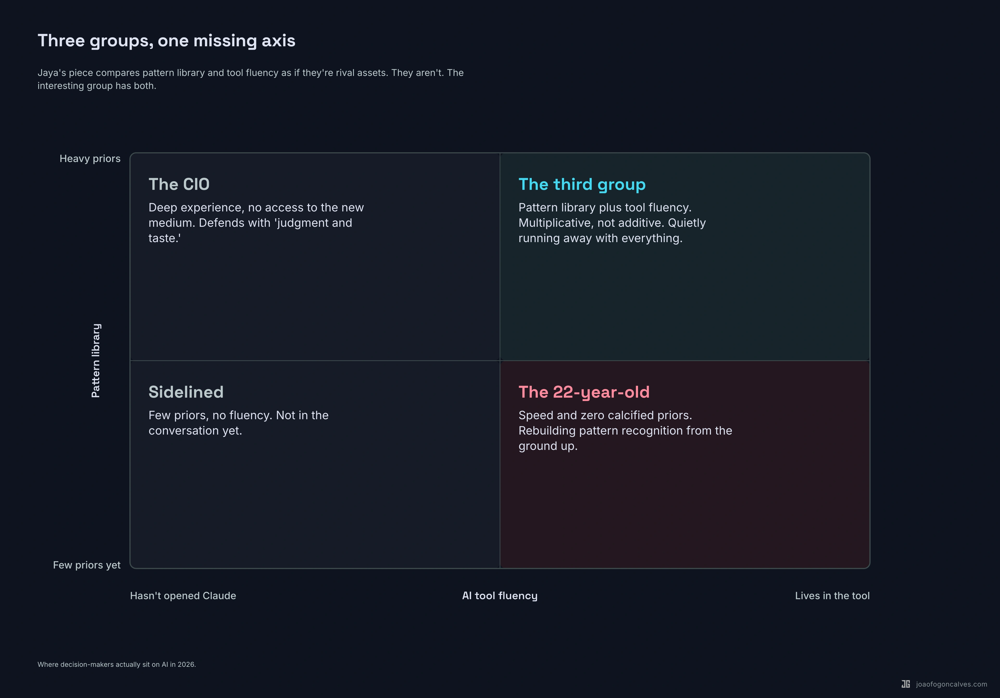

## What Jaya got right

There's a piece going around called ["Experience is now a tax."](https://x.com/JayaGup10/status/2047508230813917600) It went up a couple of days ago and has been doing the rounds. [Jaya Gupta](https://x.com/JayaGup10) wrote it. If you haven't read it, the setup is this. Somewhere right now there's a CIO at a Fortune 500 firm who has never opened Claude, can't explain what a Claude skill is, and still asks his reports to print documents and leave them on his desk. He is the person making the decision about his firm's AI ROI.

Meanwhile, a 22-year-old is writing production code in an afternoon and turning a napkin sketch into a working prototype before lunch.

Jaya's argument is that these two people are having different experiences of the same technology, and the cultural conversation hasn't caught up. The senior cohort defends its seat with two words: judgment and taste. Things AI cannot replicate. Things that take decades to develop. Things, conveniently, that the person making the argument has spent a career accumulating.

She then walks through three decision-making algorithms the brain runs constantly, and shows how AI just collapsed the cost of each one.

*Try something new, or stick with what's working.* Trying used to be expensive. Now a PM can generate five competitive positioning memos by end of day. The bias toward sticking used to have a structural excuse. Now it doesn't.

*Carry knowledge in your head, or offload it.* Senior people built careers on having the right analogy ready. AI compresses that retrieval advantage from decades to minutes. What replaces carrying as the scarce skill is structuring, which has almost nothing to do with years of experience.

*Commit slowly, or reverse fast.* The cost of commitment used to be high because the cost of reversal was high. For more and more decisions that isn't true anymore. The skill is no longer weighing every option before choosing. It's choosing fast, learning fast, and not attaching your identity to the last version of yourself who made the previous choice.

Then she lands the punch. Experience is no longer a moat. It's starting to look like a tax. Senior people reverse slowly because they've spent careers learning that reversing is admitting they were wrong. Young people haven't learned to attach identity to their decisions yet. Reversal feels like iteration to them. Her closer is aimed at young readers: if you can still think clearly without a filter, leave the environment that's training you not to.

The diagnosis is right. I see it every week. Some of the smartest engineers I know are the slowest to ship because they're protecting an old version of themselves that knew the answer before AI changed what knowing the answer means.

But the prescription has a hole. There's a third group Jaya didn't write about, and they're the ones quietly running away with everything.

## The group she didn't write about

Jaya's piece sets up a binary. The CIO who never opened Claude. The 22-year-old who lives in it.

There's a third group. Smaller than either. Growing faster than either.

Experienced operators who actually use the tools. Daily. Fluently. They have the analogies a career builds and the new algorithms a fluent user runs. When they show up in a room, they eat both ends of the spectrum.

The 2026 data is starting to confirm this, and it's not showing the pattern Jaya's piece implies. It's showing something closer to the opposite.

A poll of 4,000 US and UK workers this year found [senior staff adopting AI faster than junior peers, not slower](https://www.metaintro.com/blog/ai-adoption-gap-high-earners-workers-2026). Top earners have better access to paid tools, more dedicated training time, and the autonomy to experiment. By 2025, 73% of director-level workers had adopted AI, compared to 65% of individual contributors. Among regular AI users, leaders are far more likely to report strong productivity gains. 21% of leaders say AI has had an extremely positive impact on their productivity, against 13% of individual contributors.

92% of the C-suite is now actively [cultivating what one report calls "AI elite" employees](https://www.grantthornton.com/services/advisory-services/artificial-intelligence/2026-ai-impact-survey), and most leaders report these super-users are at least 5x more productive than colleagues who aren't. Roles requiring demonstrated AI skills are commanding 15 to 30 percent salary premiums.

Read the studies side by side and a different shape emerges. Adoption isn't bottlenecked by age. It's bottlenecked by access, intent, and the willingness to put hours into something the person didn't grow up with.

Some senior people put in the hours. Most don't. The ones who do are the third group.

That's the group worth writing about. Not the people losing the race. The ones quietly winning it.

::: wide

:::

## Why the third group has the actual moat

The cognitive offloading research is where this gets interesting.

Studies from MIT, Harvard, and Microsoft over the last year have shown that AI boosts short-term output by 14 to 40 percent while [eroding the critical thinking it's supposed to augment](https://www.frontiersin.org/journals/psychology/articles/10.3389/fpsyg.2025.1699320/full). Workers who relied most heavily on AI showed reduced engagement in deep, reflective thinking. They felt confident the AI would handle the hard part.

There's a finding inside that finding. The verification burden is real, and not everyone pays it equally.

When AI produces an output, you have to evaluate it. Hold the claims against what you know. Spot the hallucinations. Decide whether to revise or regenerate. That work is cognitively demanding. The research shows experienced professionals catch errors quickly because they have deep domain knowledge to compare against. Novices pay a verification tax that sometimes cancels out the efficiency gains entirely.

This is the part Jaya undersells.

A 22-year-old can ship faster than the CIO. Nobody's arguing that. But she's also rebuilding pattern recognition from the ground up. Every time the model produces something subtly wrong, she has fewer hooks to catch it on. She'll catch the obvious bugs. She might miss the ones that look right and aren't.

The senior person who's never used the tool can't ship anything in the new medium at all.

The third group has both. Pattern library plus tool fluency. Not additive. Multiplicative.

I see this directly in software. The senior engineers I work with who use Claude daily are shipping more than they were a year ago, by a lot. The junior engineers using Claude daily are shipping faster, but the seniors catch a category of issues the juniors didn't see was a category.

Both things are happening at once. The kids are right that experience without fluency is being taxed. The seniors who got fluent are right that experience with fluency is the new moat.

The actual gap isn't between old and young. It's between fluent and not.

## What the third group does differently

It isn't judgment and taste. That phrase is exactly the defensive crouch Jaya named.

The third group does specific things. Patterns I notice over and over working with senior operators who are pulling ahead.

They run their own experiments. They don't delegate the prompt to a junior and review the output. They sit with the tool. They paste their own context, read their own raw output, fix their own broken prompts. They've put in the same kind of hours they put into mastering a previous craft, and they're past the awkward part.

They reverse without ego. The third group treats their last decision as a hypothesis, not a stake. When the data comes back wrong, they don't relitigate. They commit again. The reversal feels cheap because they've trained themselves to make it cheap.

They use AI to attack their own priors. This is the move that separates them from everyone else. Most people use the tool to confirm what they already think. The third group uses it to find the strongest counter-argument to their position, the cleanest version of the case against, the data point that breaks the model. They've made the tool adversarial on purpose.

They've stopped leading with "in my experience." That phrase used to be a gear shift. Now they treat it as a flag. They might still have the analogy. They might be right. But they've noticed that "in my experience" arriving early in a meeting often shuts the conversation down before anyone has tested whether the analogy actually fits this case.

They pattern-match live. Instead of pulling examples from memory, they pull them from a tool that has more examples and less ego. The senior person who used to win the room with "I've seen this before" now does that work in real time, with citations.

I run this loop at BRIDGE IN. We're an early-stage company. The team is small. I'm using Claude on my own code daily, not as a search engine, as a thinking partner that argues back. The shape of my own output is unrecognizable from where it was a year ago. Not because I got smarter. Because the tool got better and I stopped treating it as something I delegate to.

The third group is identifiable by behavior, not by years on a CV. That's the part Jaya's binary obscures.

## The real tax is identity, not age

Jaya gets close to this, then walks past it.

She frames identity-attachment as something that accumulates with age. The longer you've been doing the thing, the more decisions you've defended, the more reputation rides on those decisions, the harder it gets to reverse. Eventually you stop having thoughts your nervous system has learned aren't worth having.

That's true. It's also a choice.

The thing being taxed isn't experience. It isn't age. It's the version of you that needs to be right.

The CIO isn't slow because he's old. He's slow because he can't afford to be visibly wrong. He spent thirty years building a self that was correct, and the cost of admitting that self is now operating in a medium it doesn't understand is higher than the cost of pretending the medium doesn't matter.

The 22-year-old isn't fast because she's young. She's fast because her identity is in motion. Nothing she's said publicly has the gravitational mass of three decades of correct calls. She can change her mind cheaply.

That's the real variable. Not chronological age. Identity weight.

Some senior people have built careers without putting much weight on any single call. They reverse easily because they never made reversal the expensive thing. They're indistinguishable from the kid in motion, except they have more analogies.

Some 22-year-olds are already attaching identity to their first big decision. You can see it in the way they double down on a take that didn't land. The tax is showing up in them too, just earlier.

The decade of life isn't doing the work. The decade of identity-protection is.

This is reversible. Most people don't reverse it. The third group did, somewhere along the way. They figured out that holding your previous self lightly is the only way to keep clarity past the age it's supposed to expire.

## What this means if you're in the seat

For experienced operators: the move isn't to defend judgment and taste. It's to use the tools enough that you have new things to be experienced about.

The thirty years you have are an asset only if you keep them in motion. The moment they calcify into "in my experience" as a closer, they become the tax Jaya described. Use them as hypotheses. Run the experiment with the tool. See what breaks.

For young operators: the people you should be learning from aren't the loudest in your meetings. They're not the ones quoting their thirty years. Find the third group. They tend to be quiet. They're not selling the experience because they're using it. They've internalized that the kid in the room might be right, and they're willing to be wrong in front of you.

Those people will teach you more in six months than the credentialed ones will teach you in a career. They've kept the thing you have right now and built around it.

For organizations: stop running AI adoption like a workshop problem. The third group is identifiable by behavior. Who's running their own experiments? Who's reversed publicly in the last quarter? Who's using the tools in their actual workflow and not just their demo? Find those people. Remove the constraints. Stop putting them in committees with the people who haven't opened Claude.

The 5x productivity number from the survey isn't an average. It's a distribution. In every organization there are people producing at that level and people producing at the old level, and the gap is widening every month. The leadership job is to make sure the producers aren't being slowed down by the protectors.

## The discipline of staying clear

Jaya closes her piece with a message to young readers. If you can still think about a problem without first running every thought through "yes but what would my boss or the world say," use that ability now. Use it while you have it. The window narrows faster than you think. If you're in an environment that punishes the clarity you currently have, leave.

That's true for the toxic environments. It isn't the only move available, and it isn't the deepest reading of her own argument.

Clarity isn't an asset of being young. It's a discipline.

Some 22-year-olds will lose it inside ten years if they let the next decade teach them that being right is a personality. Some 50-year-olds never lost it because they refused to learn that lesson. They built environments around themselves where reversal stayed cheap. They kept the tool they had at 22 and added thirty years of analogies to it.

That's the third group. They aren't winning because they're old. They aren't winning because they were lucky enough to be young at the right moment. They're winning because they figured out that holding your previous self lightly is the only sustainable way to think.

Experience is only a tax if you treat it as a fixed asset. As a moving one, it compounds.

The actual moat isn't experience or youth.

It's the willingness to be wrong out loud, faster than the next person. And the patience to keep doing that for thirty years.
