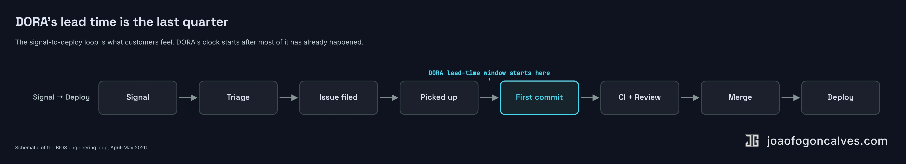
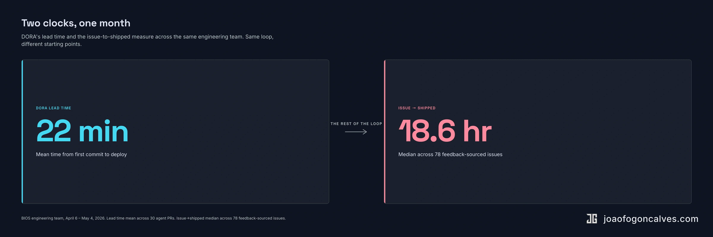
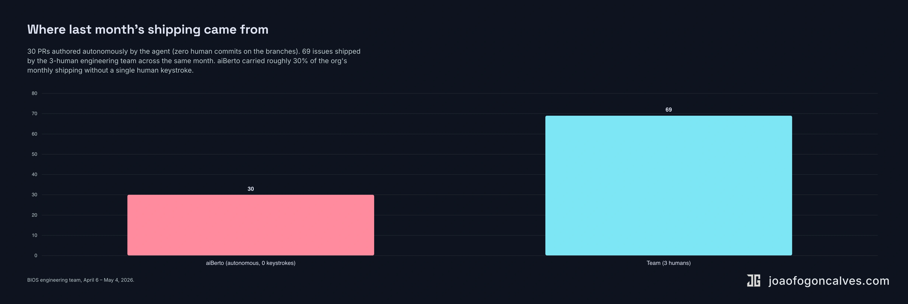

## The wrong half

Most engineering teams measure how fast a PR ships. Almost none put it on the same slide as how fast a user complaint becomes a deployed fix.

The first number is the easy half. The second is the one customers feel.

I've seen the easy-half metrics circulate at our team and at every other team I've worked with. Three hundred and thirty-four PRs in a month. A twenty-two-minute mean lead time. Ninety-eight percent of PRs merged in under a day. Found-a-bug-yesterday, fixed-it-today. All real, all flattering, all measuring the half that begins after the work has already been noticed, scoped, prioritized, and started.

Report to deployment is what's left after you cut that half off. Ours last month was 18.6 hours from issue filed to in production, across 78 feedback-sourced issues. The DORA-style lead time on the same work was 22 minutes. Two clocks on the same loop, fifty times apart.

## We built ours at a tenth the size

Shopify has been writing about an AI agent it built called River. [Tobi Lütke's post on it](https://x.com/tobi/status/2053121182044451016) is the clearest description I've read of the design choice we made too. River lives in their company Slack. She doesn't take direct messages. If you DM her, she politely asks you to open a public channel and try again. The thing I keep coming back to in their writeup is the constraint: every conversation River has is searchable, watchable, and editable by anyone in the company. About one in eight pull requests merged into their main codebase last week was authored by her.

I read about it the same week our team was halfway through building ours.

Ours is called aiBerto. He has a hoodie, a moustache, and headphones.

He lives in our Slack. He picks the next bug off our project board every couple of hours, builds the fix, opens a PR, runs CI, fixes failing checks, asks for a human review when he's stuck. He triages Sentry. He reads our user-feedback channels, files GitHub issues for the unhandled threads, replies in the thread when the issue lands. He does not have a DM inbox.

We are not five thousand people. We are fewer than ten.

Same constraint, scaled down.

## What the loop actually does

A user complains in our feedback channel. aiBerto reads the thread, decides whether it's a real issue, asks a clarifying question if it isn't sure, opens a GitHub issue when the picture is clear. The issue lands on the project board. `/pick` claims the highest-priority one and announces what it's working on in the team channel. `/build` writes the code, opens a draft PR, runs the tests, fixes the CI failures, marks the PR ready when it passes. A human reviews it. It merges.

Every step lives in a public channel. If `/build` gets stuck on a CI failure it can't recover from, it pings the engineering channel and walks away. If a Dependabot security update lands overnight, aiBerto either resolves it autonomously or files a ticket and escalates. If a teammate @-mentions him in a thread, he answers in the thread, with the context from the thread, never from a private working memory.

The receipt at the end of the month is one git history and one Slack archive. The two together are the operating manual.

## The other half

DORA gave most engineering orgs a default vocabulary for velocity: lead time for changes, deployment frequency, change failure rate, mean time to restore. The first one is the one everyone reaches for.

That number can look great while the company moves slowly.

Twenty-two minutes is a real measurement. We hit it. But the clock starts at the first commit, after a piece of work has already been scoped, prioritized, picked up, and written. Everything before the commit (somebody noticing the bug, somebody else reproducing it, a third person deciding it's worth fixing, a fourth person writing the issue, a fifth person finding time to start) is not in the number. In most teams, that prelude is where the days disappear.

::: wide

:::

Two teams can hit the same lead time and have wildly different report-to-deployment numbers. The first triages every user report inside an hour, runs an on-call, has a single shared queue. The second sees a Sentry alert in the morning and circulates a Slack message asking who should own it. Both teams ship in 22 minutes. One ships in six hours total. The other ships in six days.

::: wide

:::

This isn't a metric I'm inventing. It's closer to what [Mik Kersten calls Flow Time in the Flow Framework](https://flowframework.org/): the elapsed time from an idea becoming legible to it being delivered, including the planning and waiting and triage that DORA's lead time intentionally excludes. Industry-average Flow Efficiency sits around 15 to 25 percent. Work items in a typical team spend 75 to 85 percent of their lifetime waiting.

Report to deployment is Flow Time aimed at the bug-and-improvement loop, with the clock starting at the first external signal: a Sentry exception, a customer message, an internal Slack thread. It stops when the fix is in production. It counts triage, scoping, prioritization, implementation, review, and release. It's the number the customer actually feels.

You don't shrink it by shipping faster.

You shrink it by not stalling at the seams.

## What compounds in public

The most interesting thing about running the agent in a public channel isn't the PRs he ships. It's the way the team gets better at running him.

aiBerto's skills (`/pick`, `/build`, `/heartbeat`, `/fix-dependabot`, `/ship`, `/changelog`) are Claude Code custom skills: markdown files in our repo. Forty of them changed in the last month. Some got merged into others, some got deleted entirely. Most got patches because someone watched aiBerto get stuck on a specific failure mode and wrote down what he should have known.

A recent one: aiBerto's `/build` skill was occasionally merging a PR without explicitly linking it back to the originating GitHub issue. The PR closed the issue via a keyword in the body, which is enough for GitHub but not enough for our project board. A teammate noticed the same failure twice, patched `/build` with a "guarantee the PR-issue link before merging" step, and the failure mode disappeared. He didn't retrain anything. He wrote a sentence.

The sentence is in the repo now. Every future aiBerto run reads it.

My job used to be triaging Sentry. Now my job is writing the sentences aiBerto needs to triage Sentry himself.

This is the compound effect Shopify keeps describing in their public writeups about River. The agent's average correctness rises not because the model changed, but because the people closest to each kind of work added the missing piece of context. He gets better at being our team.

The shape works at five thousand engineers and at fewer than ten. What I'm less sure about is the middle. At 200 engineers, three time zones, and compliance constraints, "the public channel" stops being one channel and becomes a permission graph: legal can't see customer-PII threads, the embedded fintech team can't put session tokens in a channel that contractors join, and the review queue becomes its own chokepoint regardless of how short the front half gets. The mechanism that compounds — single shared surface, low-friction triage, willingness to make the work visible — probably scales. The single shared surface itself does not. That's where the redesign lives.

If aiBerto were a private window (a DM, a Cursor session, a chat sidebar) only one person would learn from any given interaction. The next teammate hitting the same friction would have to discover the patch from scratch. Most of the "AI productivity gain" you read about is shaped that way: an individual gets faster, the org doesn't.

Public agents move the gain to the organization. Private agents keep it on the individual.

## The receipts

For the month between April 6 and May 4, aiBerto:

- merged 30 pull requests, all of them autonomously, with zero human commits on his branches
- opened 107 GitHub issues from Sentry triage and user-feedback channels
- resolved 104 issues, mostly the ones he'd opened himself
- handled 81 Slack interactions across product and engineering channels
- processed 68 Dependabot updates, merging the safe ones and escalating the rest
- had his own skill set patched 40 times by the humans watching him work
- cost something on the order of $500 in API spend

Across the whole team that month, the median time from issue filed to in production was 18.6 hours, measured across 78 feedback-sourced issues. That's the report-to-deployment number, well under the 24-hour bar that DORA's pre-2025 reports used as the elite threshold for the much narrower lead-time-for-changes metric. Ours counts much more of the loop. Our engineering team is three humans plus the agent. The three humans shipped 69 issues that month. aiBerto's 30 PRs landed in parallel. Every one authored autonomously, with zero human commits on his branches.

::: wide

:::

A few of those numbers are flattering against industry benchmarks. The twenty-two-minute mean PR lead time clears any reasonable elite threshold. A hundred-percent autonomy rate on merged PRs is uncommon on the public record. Eighty-seven percent label coverage on PRs and ninety-nine percent on issues means almost everything is searchable along the dimensions you'd expect.

A few are honestly not. The 30% CI first-pass rate is the number I find most useful, and it isn't flattering. It says aiBerto fails the first CI run roughly seven times out of ten and then fixes himself before asking for help. Compute is dramatically cheaper than human context-switching, so I read it the other way: he's encountering the friction the linters and type-checkers were going to catch anyway, he encounters it himself before a human reviews, the cost shows up in API tokens rather than in stand-ups. The loop closes either way.

The 18.6-hour number also lives downstream of a triage step the agent runs. aiBerto reads each Sentry alert and Slack thread and decides whether it's a real issue before opening one. That filter probably tilts the denominator toward well-formed work. To falsify it I'd sample raw signal traffic for a month and re-measure. We haven't.

There's also a list of numbers we don't publish that we probably should: a clean change-failure rate, mean-time-to-restore, Flow Efficiency (the ratio of active work to wait time, which would show us where in the loop we're actually stalling). The receipts above are the work that fell out of the loop, not a full audit of the loop's quality.

The other thing those numbers don't capture is the rhythm. aiBerto starts work every couple of hours, around the clock. The merges cluster during business hours because humans approve them. The PRs that wait for review until morning are not the bottleneck.

The bottleneck is review.

That moved sooner than I expected. With one human reviewer per PR and the agent generating roughly seven PRs a week, a queue forms inside two days if nothing else changes. DORA's [2025 State of AI-Assisted Software Development report](https://cloud.google.com/blog/products/ai-machine-learning/announcing-the-2025-dora-report) found that as individual productivity rises with AI adoption, organizational delivery metrics — lead time, deployment frequency, change failure rate — often stay flat or get worse. The review queue is one of the places that gap opens up.

Three things changed in our review practice as a result. First, aiBerto opens smaller PRs by construction: one issue, one change, no opportunistic refactors. The diffs read fast. Second, low-risk categories — label-only changes, copy fixes, fully-covered backend patches with green CI — merge under our auto-merge policy without human review at all. Third, when a human does review, the question shifts. It's no longer "did you write good code." It's "is this the change we wanted." That's a different kind of review, and it doesn't get easier.

What we haven't solved is architectural drift. The agent ships a clean diff that solves the issue but misses a refactor a senior engineer would have caught. Each individual PR is fine. The fifth PR through the same area of code is the one that surfaces the pattern, and by then the previous four are merged. That's the part we don't have a metric for yet.

## Back to the channel

The easy-half metric was always going to flatter us. A team can hit an elite lead time and ship at the speed of monthly stand-ups, and nobody asks why. The number doesn't budge.

Report to deployment is the metric that breaks if any seam in the company is slow.

When the agent runs in a public channel, there's no second story to tell about how engineering is going. The Slack history is the work history. The PR diffs are the daily output. The skill changelog is the management ledger. They are what's left when the work has nowhere else to hide.

Pick one metric. Pick the one that includes the part of the loop you usually have to make excuses for.

The agent doesn't need a dashboard.

It needs a channel.
