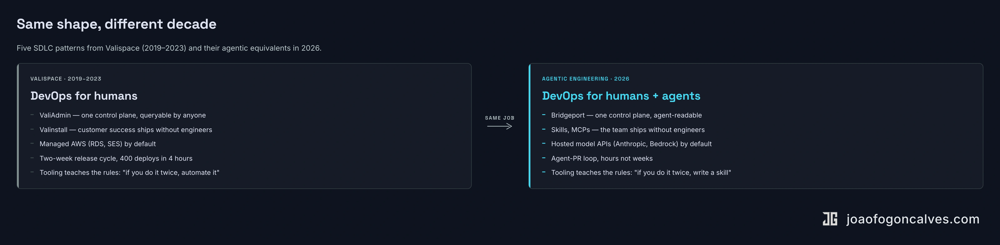

## The motto

In 2022 someone interviewed me about being Head of DevOps at <a href="https://www.valispace.com/" target="_blank" rel="noopener" style="color:#EEAF3D;font-weight:500;text-decoration:none">Valispace</a>. I said the team motto out loud, probably for the first time on camera: "building the road to production."

We didn't build the product. We didn't write the features. We built every tool the team needed so the road from idea to production stayed clear, fast, and safe. Three people, 400 customer deployments, a release every two weeks, four hours to roll the new version across the entire customer base on a Sunday night. Later in the interview I said something that still describes the work: my work is mostly well done when nobody talks about me.

I'm doing the same job again at BRIDGE IN. The road has different traffic on it now.

  <iframe src="https://www.youtube.com/embed/kDQQJfrIrdY" title="João Gonçalves — Head of DevOps at Valispace (2022 interview)" style="position:absolute;top:0;left:0;width:100%;height:100%;border:0;" allow="accelerometer; autoplay; clipboard-write; encrypted-media; gyroscope; picture-in-picture" allowfullscreen loading="lazy"></iframe>

The current playbook for adopting coding agents treats agentic engineering as a new discipline. It mostly isn't. The patterns that scaled a 3-person DevOps team running 400 cloud deployments work now to scale a small product team running an agent fleet. The unit of "builder" changed. The work mostly didn't.

Five patterns. I built or used each one between 2019 and 2023. Each one shows up again in 2026 with different vocabulary and the same shape.

::: full

:::

## One control plane

The internal tool I spent 80% of my time on at Valispace was something called ValiAdmin. It was the single place where the company described itself to itself. Customer deployments, internal dependencies, server health, version state, configuration. All in one interface, managed by code, queried by the rest of the team.

When customer success needed to spin up a deployment, they didn't page DevOps. They opened ValiAdmin. When support needed to restore a backup, they opened ValiAdmin. When a release went out at 9pm on Sunday, the orchestrator was ValiAdmin.

Three people managed 400 deployments on ValiAdmin.

We didn't have to build ValiAdmin. Terraform existed. Pulumi existed. The whole infrastructure-as-code ecosystem was there. We tried them. The shape of the Valispace problem, where every customer deployment had its own configuration permutation and the internal dependency graph between services was moving every two weeks, didn't fit the declarative model cleanly. The work to write the escape hatches was more work than just owning the abstraction. So we owned it.

The general pattern: the system has to describe itself in machine-readable form, in one place, in a way that anyone, or anything, operating it can read and act on. Otherwise the institutional knowledge lives in three engineers' heads. The team can't grow past that.

That pattern got a new vocabulary in 2026. CLAUDE.md. AGENTS.md. Rules files. MCPs. Custom skills. [Bridgeport](https://github.com/bridgeinpt/bridgeport), the deployment tool I built recently at BRIDGE IN, is the agent-era equivalent.

[Bridgeport](https://github.com/bridgeinpt/bridgeport) is a hub-and-spoke control plane for Docker-native infrastructure. One instance manages every environment (dev, staging, production), every server, every service, every container image, every encrypted secret, every config file. Deployment plans resolve service dependencies, deploy in order, verify health checks between steps, and auto-rollback the whole chain if anything fails. The state of what's running, what version, where, and who deployed it is queryable from one UI. Same job ValiAdmin did at Valispace, scaled up for Docker-native infrastructure, and built so a Claude Code agent can answer "what changed on staging in the last hour" as easily as an on-call engineer can.

The agent equivalents do the work ValiAdmin did: they tell whoever is driving how the system works, where the levers are, and what the constraints are. Engineer, agent, customer team. Same interface. Get it right, and the agent operates with the context a senior engineer would have. Get it wrong, and you spend the next six months reviewing PRs that don't know about your standards.

## Self-service for the rest of the team

The companion to ValiAdmin was Valinstall. It was how customers who insisted on on-premise deployments installed Valispace themselves. The goal was simple: get from "we send an engineer to your data center for two hours" to "you run one command and read a README."

We got it to about 80%. The remaining 20% was the long tail of enterprise customer environments, and we kept chipping at it. The reason it mattered: some customers literally could not let us see their data. ITAR-regulated defense customers ran Valispace inside their own networks with no visibility back to us. When something broke, the metaphor I used in the interview was that we were fixing an engine on a car through the tailpipe. We couldn't see the engine. We couldn't see the customer's data. We couldn't even see screenshots of what went wrong.

The only viable answer was tooling. Better diagnostics they could run themselves. Better installers. Better failure-mode docs. Push the surface outward so they could solve their own problems with our tools instead of waiting on us to teleport in.

The point of Valinstall was that DevOps didn't scale by hiring DevOps. It scaled by building tools that pushed work outward. Customer success could ship a deployment. Support could restore a backup. Sales engineers could spin up demo environments.

You don't scale a small team. You scale the surface where other people can act without you.

The agent equivalent: skills, MCPs, rules files that let product managers, customer success, marketing, and agents themselves do work that used to require an engineer in the loop. A skill that lets support triage incoming bug reports against the codebase. An MCP that lets a PM open a properly-scoped issue without a roadmap meeting. A rules file that lets an agent build the boring CRUD page without a senior engineer chaperoning.

The bottleneck moves otherwise.

## The managed boundary

In 2022 I had a clear rule for AWS services: use the managed version unless we found a specific reason not to. RDS for databases. SES for email. CloudFront for CDN. The reason wasn't ideology, it was time. The DevOps team had 400 deployments to keep running. We couldn't afford to also be the DBA team.

The one exception was a managed service that didn't match a specific requirement. We spun up our own Postgres instance. We knew exactly why. We owned it deliberately.

The same heuristic applies to AI infrastructure in 2026, but the analogy is more specific than the surface reading. Claude Code, Cursor, and Codex are developer tools, closer to using a SaaS IDE than to running RDS. The real managed-versus-custom decision sits one layer below them: hosted model APIs (Anthropic, OpenAI, Bedrock) versus self-hosted weights running on your own GPUs.

For most engineering teams, the answer is what it was for RDS. Use the managed version. The companies trying to self-host frontier models in 2026 are mostly reliving the 2019 startups writing their own Postgres replication on top of EC2. Different reward curves, same shape of decision. Build the custom path only when you have a constraint no vendor satisfies. Otherwise the engineering budget goes to the wrong work.

The carve-outs are real. Data residency. Fine-tuning on proprietary corpora. Latency or cost ceilings no hosted offering hits. ITAR-style isolation that won't ever cross a public-cloud boundary. Those justify going custom. Everything else: managed.

Manage what you can't differentiate. Build what you must.

The vendor lineup changed. The decision didn't.

The managed-versus-custom decision is downstream of a question most teams haven't answered yet: ["AI-first" or AI-assisted?](/articles/2026/04/2026-04-18-your-ai-first-engineering-org-probably-isnt/) Most orgs claiming AI-first are running the same SDLC with copilots bolted on. You can't pick the right inference layer until you've decided what shape of work the agents are actually doing.

## The cycle

Valispace shipped a release every two weeks. Forty-plus releases a year. 400 customer deployments updated in 4 hours on a Sunday night. Automated rollback if a deployment failed. Migration scripts dry-run on staging clones first. Dozens of different checks running before the deploy button was even available.

The headline metric the founder asked about was speed: how fast can you ship? The actual metric we tracked was the cost of failure. If a release broke production, what was the blast radius and how fast could we recover? Two-week cycles were possible because failure was cheap. Cheap because we'd built every fail-safe into the path before we built the path itself.

The agent equivalent of the two-week cycle is the agent-PR loop. The unit got smaller. The cadence is hours, not weeks. The operational discipline is the same. Every PR an agent opens is a small unit of change with automated tests, automated review, automated revert. The loop works only because failure is cheap.

The teams I see struggling with agent-generated code are almost always the teams that didn't have a cheap-failure SDLC before agents arrived. They were paying a bug-bash tax already. Now the tax scales with whatever speed multiplier the agents give them, and most of them treat that as an agent problem instead of an SDLC problem.

The bottleneck moved.

There's a sharper objection underneath that, though. A bad deploy is legible. The alert fires, the rollback runs, the blast radius is the customer base, recovery is measured in minutes. A bad agentic pattern is illegible. The PR passes lint and tests. The reviewer agent approves. The diff merges. Six months later you're untangling an architectural drift you can't trace to a single decision, absorbed across hundreds of PRs nobody flagged.

The "cheap failure" doctrine that made the Valispace two-week cycle work assumed failure was detectable. That assumption is the part of the discipline that doesn't survive the move to agents intact. The shape of the work is the same. The shape of the failure isn't. The teams that win the agentic cycle aren't the ones with the fastest agent-PR loop. They're the ones who built the failure-detection layer first. Evals that catch architectural drift, not just regressions. Trace correlation across agent-to-agent handoffs. Cost-per-token budgets treated as first-class production constraints.

The hardest version of the cycle problem at Valispace was internal dependency management. The core product was a monolith, but we were peeling off services that the monolith depended on. Different release cadences, different versions in flight at the same time, different customer deployments pinned to different combinations. The metaphor I used at the time: changing the tire on a moving car. The car cannot stop, because the product cannot stop, but the tire has to come off anyway.

That's the exact shape of what most engineering teams face right now. Make your codebase agent-friendly while you're still shipping features. Add the rules files. Refactor the modules that are too tangled for any agent (or honestly, any human) to reason about. Stand up the evals and the regression suites. All while the customer-facing roadmap doesn't pause.

The metrics most teams track for this are lead time, deploy frequency, the DORA staples. They measure the easy half. [The actual constraint sits upstream of all of them](/articles/2026/05/2026-05-14-lead-time-is-the-wrong-half/).

## The coaching layer

The rules I had at Valispace were short. If you do something twice, you automate it. If you don't use something for over a year, you drop it. Nothing on a personal laptop, everything in version control. No scripts living on one engineer's machine.

I didn't enforce those rules in code reviews. I didn't need to. The tooling made the rules cheap to follow. The CI made deviation expensive. After six months on the team, an engineer wouldn't think to do it the old way.

That's the part most engineering leaders miss when they talk about "AI adoption." They treat it like a training problem. Send the team to a course, show them the prompts, hand them the keyboard, and expect agentic engineering to materialize on the other side. It doesn't. The reps don't compound that way.

What does compound: putting the rules into the road itself. The CLAUDE.md that catches the bad pattern before it ships. The skill that nudges the engineer toward the right scaffold. The MCP that exposes the bug tracker so the agent already knows the team's vocabulary. The reviewer agent that says "this doesn't follow our error-handling convention" before a human ever sees the diff.

The team learns by working in the tools, not by being told about them. Same way the Valispace developers learned the release process: by living inside ValiAdmin, watching it run, occasionally asking why a check fired. Coaching wasn't a session. It was the workflow.

You can't upskill a 100-engineer org with a workshop. You upskill it by building the road so the right behavior is the path of least resistance. The team gets faster because the tooling teaches them what good looks like.

I did this in someone else's department once. Post-acquisition at Altium, I inherited an engineering org that had just doubled in size, with new leads who'd never run a release cycle and an old guard whose operational instincts lived in muscle memory nobody had written down. The leads thought their friction was tooling and headcount. It wasn't. The new half of the team didn't have a road to operate on. I spent the next year building one. 90% of the team stayed through the merger, most of them with shareholder cash on the table to leave.

## What the road has to do now

Doing something twice in 2022 meant writing a Bash script or a Python tool. Doing something twice in 2026 means writing a skill, a rules file, an MCP, an agent instruction. Same impulse. Different surface. I built [Bridgeport](https://github.com/bridgeinpt/bridgeport) because I'd done a manual deploy more than twice. I write Claude Code skills for the same reason.

The discipline rhymes with what it was. The failure modes are the part that doesn't survive intact.

The Valispace road made deployment safe enough to run on a two-week cycle. The 2026 road has to do more than that. It has to make agent-generated drift detectable, not just deployment-safe. Detectable across hundreds of PRs that nobody flagged because each one looked fine in isolation. Detectable across agent handoffs that span environments. Detectable when the diff passes every gate you built and still degrades the system by inches.

Same building discipline. New thing the road has to carry.

Someone still has to build it. Someone still has to make production safe enough that the team can ship without thinking about it. Someone still has to make the system describe itself to whoever is driving. Someone still has to be the person who's well done when nobody talks about them.

The work is the same. The traffic is louder.
