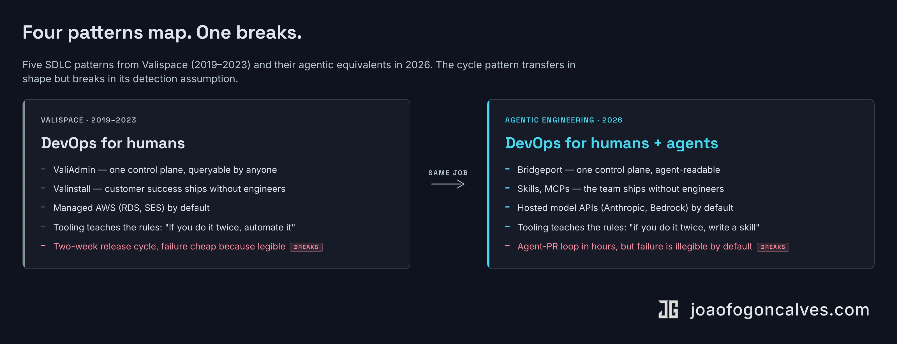

## The motto

In 2022 someone interviewed me about being Head of DevOps at <a href="https://www.valispace.com/" target="_blank" rel="noopener" style="color:#EEAF3D;font-weight:500;text-decoration:none">Valispace</a>. I said the team motto out loud, probably for the first time on camera: "building the road to production."

We didn't build the product. We built every tool the team needed so the road from idea to production stayed clear, fast, and safe. Three people, 400 customer deployments, a release every two weeks, four hours to roll the new version across the entire customer base on a Sunday night. Later in the interview I said something that still describes the work: my work is mostly well done when nobody talks about me.

I'm doing the same job again at BRIDGE IN. The road has different traffic on it now.

  <iframe src="https://www.youtube.com/embed/kDQQJfrIrdY" title="João Gonçalves — Head of DevOps at Valispace (2022 interview)" style="position:absolute;top:0;left:0;width:100%;height:100%;border:0;" allow="accelerometer; autoplay; clipboard-write; encrypted-media; gyroscope; picture-in-picture" allowfullscreen loading="lazy"></iframe>

The current playbook for adopting coding agents treats agentic engineering as a new discipline. The shape mostly isn't new. The SDLC patterns that scaled a 3-person DevOps team running 400 cloud deployments transfer cleanly to a small product team running an agent fleet. The unit of "builder" changed. The work — mostly — didn't.

Mostly. Four patterns map. One assumption underneath them breaks, and the break is the whole point of this piece. Teams building the four without confronting the fifth are paying a tax that won't show up in any dashboard they own for another two quarters.

::: full

:::

## One control plane

The internal tool I spent 80% of my time on at Valispace was something called ValiAdmin. It was the single place where the company described itself to itself. Customer deployments, internal dependencies, server health, version state, configuration. One interface, managed by code, queried by the rest of the team.

When customer success needed to spin up a deployment, they didn't page DevOps. They opened ValiAdmin. When support needed to restore a backup, they opened ValiAdmin. When a release went out at 9pm on Sunday, the orchestrator was ValiAdmin.

Three people managed 400 deployments on ValiAdmin.

The general pattern: the system has to describe itself in machine-readable form, in one place, in a way that anyone — or anything — operating it can read and act on. Otherwise the institutional knowledge lives in three engineers' heads and the team can't grow past that.

That pattern got new vocabulary in 2026: CLAUDE.md, AGENTS.md, rules files, MCPs, custom skills. Those are the *informational* half — the documentation an agent reads to ground itself in your team's standards. They map onto the rules and runbooks ValiAdmin's UI made obvious. They're necessary and they're not sufficient.

The *operational* half — the thing that knows the current state of every service, every container, every secret, every dependency, and can act on it — is the part most teams haven't built. [Bridgeport](https://github.com/bridgeinpt/bridgeport), the deployment tool I built recently at BRIDGE IN, is the agent-era equivalent of that operational half. One instance manages every environment, every server, every service, every container image, every encrypted secret, every config file. Deployment plans resolve service dependencies, deploy in order, verify health checks between steps, and auto-rollback the whole chain if anything fails. The state of what's running, what version, where, and who deployed it is queryable from one UI — and from one MCP, which means a Claude Code agent can answer "what changed on staging in the last hour" with the same authority as the on-call engineer.

The split matters. CLAUDE.md tells the agent what good looks like. The control plane tells it what's actually true. Most teams I see have invested heavily in the first and almost not at all in the second. The result is agents that know the standards but can't observe the state — and which therefore confidently hallucinate it.

## Self-service for the rest of the team

The companion to ValiAdmin was Valinstall. It was how customers who insisted on on-premise deployments installed Valispace themselves. The goal was simple: get from "we send an engineer to your data center for two hours" to "you run one command and read a README."

We got it to about 80%. The reason it mattered: some customers literally could not let us see their data. ITAR-regulated defense customers ran Valispace inside their own networks with no visibility back to us. When something broke, the metaphor I used in the interview was that we were fixing an engine on a car through the tailpipe.

The only viable answer was tooling. Better diagnostics they could run themselves. Better installers. Push the surface outward so they could solve their own problems with our tools instead of waiting on us to teleport in.

The agent-era version of this pattern is shaped the same way but aimed at a different audience. Valinstall pushed surface to customers we couldn't see. Skills, MCPs, and rules files push surface to internal teams an engineer used to chaperone — a PM opening a properly-scoped issue without a roadmap meeting, support triaging a bug report against the codebase, an agent building the boring CRUD page without a senior engineer in the loop.

The audience is different. The shape is identical: the small team scales by widening the surface where other people (or other agents) can act without it. You don't scale a small team. You scale the surface.

The bottleneck moves otherwise.

## The managed boundary

In 2022 I had a clear rule for AWS services: use the managed version unless we found a specific reason not to. The DevOps team had 400 deployments to keep running. We couldn't afford to also be the DBA team.

The same heuristic applies to AI infrastructure in 2026, but the question has shifted under it. Self-host vs. hosted was the 2024 framing. By 2026 the real CTO-level question is which abstraction you commit to: single-vendor hosted (Anthropic, OpenAI direct), multi-provider routing (a fallback-aware, cost-aware layer on top), or platform abstraction (Bedrock, Vertex). All three are "managed." The decision is governance posture, not build-vs-buy.

The silent constraint underneath all three is cost-per-team accounting. Most orgs in 2026 don't have token budgets that map to teams. They have a single bill that grows quarter over quarter and nobody owns it. That's the same DBA-team problem in new clothing — the thing you delegate still needs an owner, even when the owner is delegating the implementation.

The carve-outs for going custom (self-hosted weights, your own GPUs) are real and narrow. Data residency. Latency or cost ceilings no hosted offering hits. ITAR-style isolation that won't ever cross a public-cloud boundary. Everything else is managed, and the engineering decision is the layer above it.

This decision is downstream of one most teams haven't answered: ["AI-first" or AI-assisted?](/articles/2026/04/2026-04-18-your-ai-first-engineering-org-probably-isnt/) You can't pick the right inference layer until you've decided what shape of work the agents are actually doing.

## The coaching layer

The rules I had at Valispace were short. If you do something twice, you automate it. If you don't use something for over a year, you drop it. Nothing on a personal laptop, everything in version control.

I didn't enforce those rules in code reviews. I didn't need to. The tooling made the rules cheap to follow. The CI made deviation expensive. After six months on the team, an engineer wouldn't think to do it the old way.

That's the part most engineering leaders miss when they talk about "AI adoption." They treat it like a training problem. Send the team to a workshop, show them the prompts, hand them the keyboard, expect agentic engineering to materialize. It doesn't. The reps don't compound through content.

What does compound: putting the rules into the road itself, as enforcement, not as documentation. The CLAUDE.md that the reviewer agent is wired to reject diffs against. The pre-commit hook that runs the eval suite on agent-generated changes. The MCP that exposes the bug tracker so the agent grounds an issue in your team's actual taxonomy instead of inventing one. Guardrails as code, not training as content.

The team learns the rules by living inside them. Same way Valispace developers learned the release process — by working in ValiAdmin, watching it run, occasionally asking why a check fired. Coaching wasn't a session. It was the workflow.

I did this once in someone else's department. Post-acquisition at Altium, I inherited an engineering org that had just doubled in size. The leads thought their friction was tooling and headcount. It wasn't. The new half of the team didn't have a road to operate on — no enforcement, no shared scaffolds, every engineer reinventing the basics. I spent the next year building one. 90% of the team stayed through the merger, most of them with shareholder cash on the table to leave.

You can't upskill a 100-engineer org with a workshop. You upskill it by making the right behavior the path of least resistance.

## The one thing that doesn't transfer

Valispace shipped a release every two weeks. Forty-plus releases a year. 400 customer deployments updated in 4 hours on a Sunday night. Automated rollback if a deployment failed. Migration scripts dry-run on staging clones first. Dozens of checks running before the deploy button was even available.

The headline metric the founder asked about was speed. The actual metric we tracked was the cost of failure. If a release broke production, what was the blast radius, and how fast could we recover? Two-week cycles were possible because failure was *cheap* — cheap because we'd built every fail-safe into the path before we built the path itself.

The agent-PR loop wants to be the same shape. The unit got smaller, the cadence went from weeks to hours, but the discipline transfers: every PR an agent opens is a small unit of change with automated tests, automated review, automated revert. The teams I see struggling with agent-generated code are almost always the teams that didn't have a cheap-failure SDLC before agents arrived. They were paying a bug-bash tax already. The agents just scaled it.

That much rhymes. Here's the part that doesn't.

A bad deploy is **legible**. The alert fires, the rollback runs, the blast radius is the customer base, recovery is measured in minutes. The Sunday-night release that broke would be visible by Monday morning. Cheap because *detectable*.

A bad agentic pattern is **illegible**. The PR passes lint and tests. The reviewer agent approves. The diff merges. Six months later you're untangling an architectural drift you can't trace to a single decision, because no single decision caused it — it accumulated across hundreds of PRs that each looked locally fine. The metaphor I'd use now: it isn't a fire. It's mineral deposit in the pipes. By the time anything is restricted enough to notice, the system has been quietly degrading for two quarters.

The "cheap failure" doctrine assumed failure was detectable. That assumption is the part of the discipline that breaks.

The deeper reason is that the unit of work shifted from deterministic to non-deterministic. ValiAdmin was a deterministic control plane: same input, same state, same output. Terraform plans diff, infrastructure converges, rollbacks are exact. Agent code generation isn't deterministic. Same prompt, different output. Same review criteria, different judgment from one run to the next. Same MCP, different decisions about which tool to call. The variance is baked in. You can clamp it. You can't remove it.

So the architecture has to invert. The old discipline was: instrument the *path* so any single failure is detectable and recoverable. The new discipline has to be: instrument the *pattern-space*, because no individual diff is the failure — the failure is the cumulative drift of hundreds of diffs that each looked locally fine. The old detection layer found regressions. The new one has to find *trends* across diffs that don't individually regress anything.

Concretely, the agent-era detection layer has at least four parts most teams haven't built:

- **Architectural-drift evals.** Not unit tests. Periodic structural checks against the dependency graph, AST-level pattern adherence, abstraction-leak detection. The question they answer isn't "does this PR work" but "is the codebase getting worse, slowly, in a direction nobody chose."
- **Trace correlation across agent handoffs.** The most expensive failures span a planner agent, an implementer agent, and a reviewer agent. None of them individually fails. The handoff loses context and the output is wrong by a step nobody owns. OpenTelemetry-style correlation, but for multi-agent loops.
- **Token-spend budgets as first-class production constraints.** Not finance reports after the fact. Real-time per-team budgets that page when they're breached, the same way you'd page on infra cost. The teams without this have a single corporate AWS-style bill that grows quarterly and nobody owns.
- **Pattern-level regressions in the eval suite.** Not "does this answer match the golden?" but "is the model getting worse at the kind of judgment we care about?" Run on a corpus, scored on direction not on individual answers, treated as a release gate.

The metrics most teams track for the agent loop are lead time and deploy frequency, the DORA staples. They measure the easy half. [The actual constraint sits upstream of all of them](/articles/2026/05/2026-05-14-lead-time-is-the-wrong-half/) — and for the agent-PR loop specifically, the actual constraint is whether the failures the loop produces are the ones the loop can see.

The Valispace cycle worked because the failure was loud. The agent cycle works only when the failure is made loud by design.

## What the road has to do now

Doing something twice in 2022 meant writing a Bash script or a Python tool. Doing something twice in 2026 means writing a skill, a rules file, an MCP, an agent instruction. Same impulse. Different surface. I built [Bridgeport](https://github.com/bridgeinpt/bridgeport) because I'd done a manual deploy more than twice. I write Claude Code skills for the same reason.

The discipline rhymes with what it was. The failure model is the part that doesn't survive intact.

The Valispace road made deployment safe enough to run on a two-week cycle. The 2026 road has to do more. It has to make non-determinism *legible*. Detectable across hundreds of PRs that each looked fine in isolation. Detectable across agent handoffs that span environments. Detectable when the diff passes every gate you built and still degrades the system by inches.

If you run engineering, the move tomorrow morning isn't to hand out more Copilot licenses. It's to audit your failure-detection layer and ask whether it was built for legible failures or illegible ones. If it was built for the old shape — alerts on broken deploys, regressions on shipped diffs, dashboards that show the last hour — you're under-instrumented for the cycle you're already in. The cost will show up six months from now, in a backlog of architectural drift you can't trace to any single decision.

Same building discipline. New thing the road has to carry.

My work is mostly well done when nobody talks about me. That part hasn't changed.
