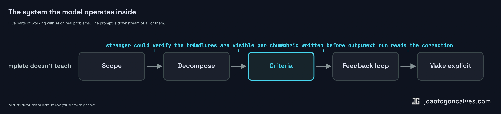
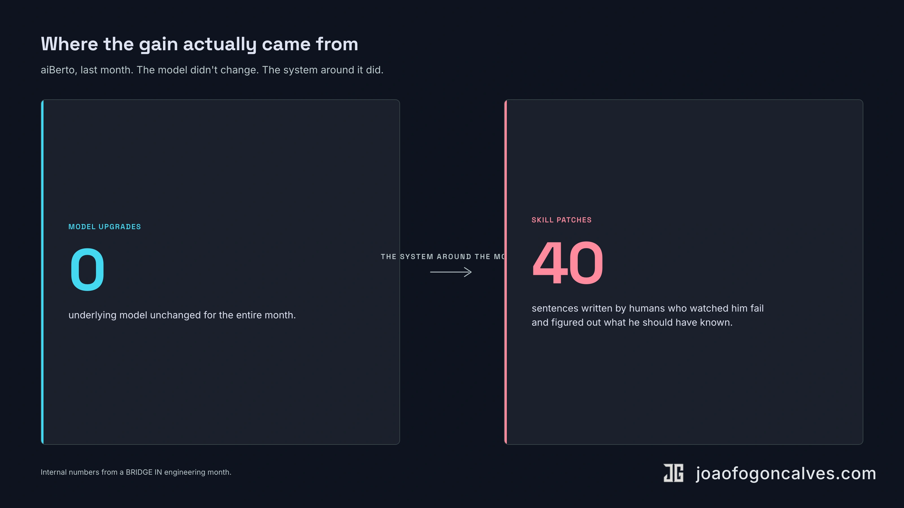

I sat through one of these last quarter. Over twenty people on a video call (the "conference room" was a Zoom grid), a slide deck with the OpenAI logo cropped slightly wrong, a vendor walking everyone through a prompt template for writing emails. *Subject*: marketing campaign for Q3. *Tone*: professional, friendly. Paste. Hit return. ChatGPT produced six bullet points. A few thumbs-ups landed in the chat. The vendor moved to slide forty-one.

Everyone left feeling productive.

The training was real, the slides were fine, the prompt template worked. None of it taught anyone how to use AI on anything that mattered. The visible surface is the part that sells as a course. The skill is one layer down.

I [wrote a short version of this argument](/posts/2026/04/2026-04-26-most-ai-trainings-meet-people-where-they-are/) last month. This is the longer one, with the receipts.

## 01 — The visible surface

There is a default shape to AI literacy training in 2026. Show the demo. Hand out a prompt template. Have people paste it into ChatGPT and rewrite an email. Maybe a tool tour at the end: here is Claude, here is Gemini, here is your Microsoft Copilot license.

The format is legible. It demos well. It fits a slide deck. You can sell it as a half-day course and book it through procurement. None of those things are accidents. The category exists because someone needed to put a line item on next year's budget and "AI literacy training" was the line item that closed.

The U.S. Department of Labor [published a literacy framework in February](https://www.dol.gov/newsroom/releases/eta/eta20260213) listing five foundational content areas and seven delivery principles. Columbia is running its own [advanced track for administrators](https://ai.columbia.edu/events/ai-literacy-advanced-training-may-2026). DataCamp's 2026 state-of-AI-literacy report says [59% of enterprise leaders now report a skills gap](https://www.datacamp.com/blog/the-state-of-data-and-ai-literacy-in-2026-definitions-statistics-and-the-ai-skills-gap) despite most of them already investing in training. The gap is not from lack of training. The training, mostly, teaches the wrong thing.

A prompt template gets you a generic output. That is what a prompt template is for. The problem is that working with AI on anything real does not look like that. It looks like breaking a problem into pieces small enough to fail at visibly, knowing what good looks like before the model writes anything, telling it what is wrong with what it gave you, and iterating until it isn't. None of that is in the slide deck. All of it is now the actual work.

The prompt is the artifact. The skill is upstream.

## 02 — The system the model operates inside

What people are reaching for when they say "prompting" is, almost always, a different and older skill. It has five rough parts.

**Scope.** You name the problem precisely enough that a stranger could tell whether the output solves it. Not "help me with the deployment pipeline." Something like: walk me through each step from commit to production, flag the steps that take longest, suggest where we could parallelize. The first one is a wish. The second one is a question.

**Decomposition.** You break the work into chunks small enough that the failure modes are visible. The model is going to fail. Your job is to design the work so that the failures are caught, not absorbed. A single mega-prompt that says "build me a marketing site" hides every decision the model is making. Six small prompts each producing a verifiable artifact does not.

**Criteria.** You write down what good looks like before the model writes anything. In measurable terms. Three bullet points. Two paragraphs of source material cited. No hedging language. No marketing-speak. The rubric is not optional. If you can't write it, you don't know what you want, and the model is going to make a confident guess on your behalf.

**Feedback loops.** You have a way to tell the next iteration what the last one got wrong. This is the part the templates skip entirely. It is also the part that compounds.

**Making the implicit explicit.** Every time you correct the model in your head and don't write the correction down, you are training nobody and nothing. The correction lives in your skull until you forget it. Put it in a system prompt, a skill file, a project doc. The next run reads what the last one learned.

::: wide

:::

Five things. None of them are about the model. All of them are about the design around the model.

This is not new. It is project management with a token-pricing system in the loop. The senior PMs and ops leaders who got good at it twenty years ago are good at it now. The vocabulary changed. The skill did not.

## 03 — Why non-technical leaders quietly win

I have been running prompting sessions with people on my team for over a year. The pattern is consistent and slightly embarrassing for the industry that sells AI training.

The non-technical senior people are usually faster than the technical junior ones. Not because they understand the model. They do not, usually. Because they have already spent fifteen years scoping work for other humans, writing requirements, and reading output to decide whether it is what they actually asked for.

Same tool. Same model. Completely different output.

A head of operations I worked with started a session with "I want to understand our deployment pipeline." Fifteen minutes later, with two questions from me, she had written the version I quoted above. She did not learn a prompt. She remembered how to write a brief. She has been writing briefs for vendors and consultants her entire career. The model is just the newest contractor.

The pattern works in both directions. People who already know how to describe work in measurable, scoped, criteria-bearing terms can use almost any model fluently within an hour. People who never built that muscle bounce off the template, get a passable answer, and call it a day.

The transferable skill turns out to be org design. The prompt is the latest interface to a category of work that was never about syntax.

This is the thing the literacy training industry has gotten backwards. The customer is buying a workshop because they think the gap is technical. The gap, almost always, is structural. The person who runs a tight quarterly planning process is going to be a competent agent operator inside a week. The person whose meetings end in "let's circle back" is going to be a confused one for a long time.

You cannot fix that with a prompt library.

## 04 — Why technical leaders lose if they skip this

The trap on the engineering side is more interesting, because it looks like depth and is the opposite.

Technical literacy is a head-fake. Knowing the stack makes it tempting to skip system design and just write the code yourself. AI made that trap deeper, not shallower. The engineer who used to write a function in 30 minutes now writes it in 90 seconds with Claude. The gap from spec to output is almost entirely verification. If you can't articulate what good looks like before the model produces it, your verification reduces to "looks right." That ships your blind spots faster, with more confidence, in larger volume.

I wrote about this in [AI as the Great Filter](/articles/2026/05/2026-05-04-ai-as-the-great-filter/). The short version: engineering depth used to be a nice-to-have. Now it is the variable that decides who survives. The engineers who already had the muscle (architecture decisions, code review, design docs, naming a failure mode before someone hits it) compound. The ones who treated cheap AI as a substitute for that muscle ship fluently-broken code at scale.

The literacy training pitched at engineers is, in many cases, doing the opposite of what it claims. It is training them out of the skill that actually matters. A two-hour prompt-engineering workshop teaches the model interface. It teaches nothing about how to know whether the output is wrong. The engineer who could already eyeball a design and say "this won't work under load" gets faster. The engineer who could not, gets a paste-bin of plausible code and a working keyboard.

A 2026 [Folio3 analysis of 140 enterprise AI implementations](https://writer.com/blog/enterprise-ai-adoption-2026/) found 77% of failures came down to strategy, governance, and change management, not model performance. McKinsey's number is that [only a third of enterprise AI pilots reach production](https://www.ciodive.com/news/why-enterprise-ai-pilots-fail/808751/). MIT's headline number is sharper: [95% of generative AI pilots produced no measurable P&L impact](https://wizr.ai/blog/why-enterprise-ai-apps-fail-and-how-to-fix-them/) inside six months. The model is not the variable that broke those pilots. The system around the model was.

The technical leaders who notice this are redesigning their engineering processes around it. The ones who don't are buying a Copilot license and calling it done.

## 05 — aiBerto, the receipt

We have an AI engineering agent at BRIDGE IN. His name is aiBerto. He lives in our Slack, picks the next issue off our project board every couple of hours, opens a PR, runs CI, fixes failing checks, asks for review when he's stuck. Last month he merged 30 PRs autonomously, opened 107 GitHub issues, resolved 104, and handled 81 Slack interactions.

He didn't get smarter last month. The underlying model didn't change.

He got 40 skill patches.

Forty sentences, written by humans who watched him fail at something specific and figured out what he should have known. Every patch sits in a markdown file in our repo. Every future run reads the file. The failure mode stops happening.

A recent one: aiBerto's `/build` skill was occasionally merging a PR without explicitly linking it back to the originating GitHub issue. The PR closed the issue via a keyword in the body, which was enough for GitHub but not enough for our project board. A teammate noticed the same failure twice, patched the skill with a one-line "guarantee the PR-issue link before merging" step, and the failure mode disappeared. He did not retrain anything. He wrote a sentence. The sentence is in the repo.

None of those forty sentences are prompts in the popular sense. They are pieces of system. *Before merging, link the issue.* *When CI fails on lint, run the linter locally first.* *When triaging Sentry, dedupe by stack hash before opening tickets.* Each one is a piece of organizational knowledge made explicit, written down, and put on the model's read-path.

The model is the same. The system around it got better. The agent's effective intelligence rose because the people closest to each kind of failure added the missing piece of context. That is system design. That is also what AI literacy looks like at scale, when you stop teaching people to talk to the model and start teaching them to design the system the model is operating inside.

I wrote [the longer version of this story](/articles/2026/05/2026-05-14-lead-time-is-the-wrong-half/) earlier this month, with the metrics. The shape that matters is this one: forty sentences moved more output than any prompt-template handout ever could.

## 06 — What a real curriculum looks like

If I were running an honest AI literacy program, the agenda would look almost nothing like the one I sat through.

Pick a real problem the team actually has. Not a sample case study, not a "draft this email" exercise. Something currently broken or currently slow.

Before anyone opens a model, write down what done looks like. In measurable terms. Three bullets. A rubric you would use to evaluate a vendor's output if they handed it to you on Monday morning.

Break the problem into the smallest unit the AI can fail at visibly. If the unit is too big to verify, it is too big to delegate. Split it.

Write the evaluation rubric yourself. Not the one the model suggests. The model will suggest a flattering rubric. That is what models are tuned to do.

When the output is wrong, write the missing sentence the next run would need to read in order to not be wrong in the same way. Put it in version control. Now you have a system.

Do this for four weeks. The deliverable is not a slide deck. It is a markdown directory of sentences a team's worth of people wrote because they watched something fail and figured out what it should have known. That directory compounds. The slide deck does not.

This is, of course, [the engineering-org version of the same argument](/articles/2026/04/2026-04-18-your-ai-first-engineering-org-probably-isnt/). Bolting Copilot onto a workflow is not AI-first. Bolting prompt templates onto a workforce is not AI-literate. Both confuse the artifact for the work.

The skill is older than the model. The model is just the latest reason to teach it.

## Back to the conference room

The twenty-plus people on that call are not at fault. The vendor is not, mostly, dishonest. The slide deck and the prompt template are not wrong. They are the visible surface, and the visible surface is what most training programs are equipped to teach. The category exists because procurement understands it.

The leaders who are pulling ahead are not the ones with better prompt libraries. They are the ones who noticed that the work they used to do with vendors, contractors, and junior reports has a new interface and roughly the same shape. They scope. They decompose. They write rubrics. They make the implicit explicit. They run feedback loops. They put the corrections in version control.

The honest version of AI training is system-design training.

It always was.
