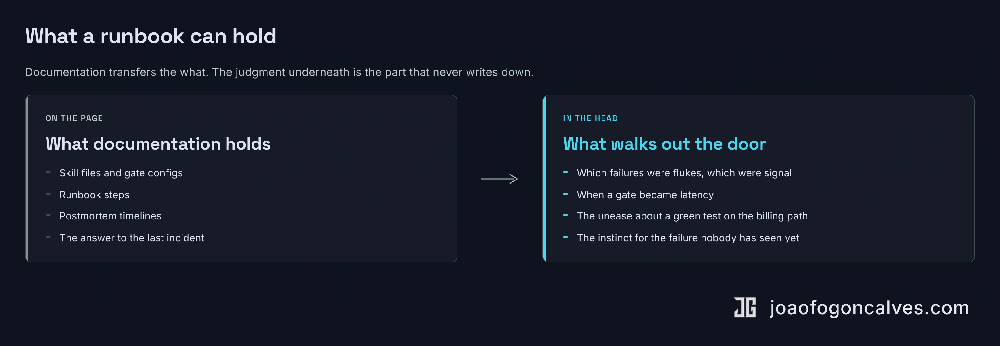

Part two ended somewhere uncomfortable, though it read like a win. The moat is not the harness, and it is not the skill files either; both depreciate and both copy. What is left, the part a competitor cannot lift out of your repo, is the judgment of the people who were there when the system broke. [It lives in the team, not the repo.](/articles/2026/06/11-rent-the-loop-build-the-moat/)

That is also the one a company can least protect.

Look again at what the series has been calling durable. The model is rented, and it improves on someone else's schedule. The harness is owned, and [it rots on yours](/articles/2026/06/2026-06-08-the-harness-is-the-moat/), shedding a gate every time a model release makes one redundant. Both of those change slowly and predictably. The moat we landed on does neither: it does not depreciate on a roadmap or get productized by a vendor. It resigns. It takes a better offer. It burns out in Q3 and goes quiet until spring.

The one thing you cannot rent and cannot buy turns out to be the one that can leave on its own.

So the question part two left open is the one that actually keeps you up. How do you own a moat that has legs?

## Write it down, then

There is an obvious answer, and a whole industry sells it: capture the tribal knowledge and kill the bus factor. A runbook for every gate, a postmortem for every incident, a wiki page for every decision, and the knowledge stops living in one person's head.

For most of what a team knows, that is right. Write it down. The architecture, the runbook steps, the config, the timeline of what actually happened all belong on a page, and a team that skips that work is not guarding a moat, it is just undocumented.

But the series has already walked us into the problem with it. The thing we are trying to preserve here is not a fact. Facts you write down and you are done. This is judgment, and the most you can write down about judgment is the answer it reached last time.

Write a piece of it down completely enough to hand over, and what you have captured is a snapshot: what was true against one model, one architecture, one quarter's failure surface. The harness depreciates, and a frozen record of why you built it depreciates faster, because it cannot tell you which of its reasons still hold. The week a model ships, the page explaining last year's gate is worse than no page. It reads as current when it is not.

So far this is the case against the wiki, and every engineer nodding along has already made it. But it shows something narrower than it looks. Judgment can be written down; plenty of it can. The trouble is that what you write down is last release's answer, and the model does not hold still. Part one already named the real asset and part two sharpened it: the moat was never the harness you have, it is how fast you rebuild it when the model moves. The moat is a rate.

A rate does not live on a page, and it does not survive in a single head either. It fails two ways, and they are not the same problem with the same fix. Left unused, it slows: the senior who had it, then moved off the surface and stopped re-deriving anything, is back to reading last year's answers like everyone else. Lodged in one person, it is a rate with a notice period, which is the failure the title is about.

So the question part two left open splits in two: keep the rate exercised so it does not slow, and spread it so it cannot walk out.

## What a runbook can't hold

This is not an argument against writing things down. It is an argument about what writing things down can hold.

Michael Polanyi named it sixty years ago, in a line that has outlived most of what surrounded it: we can know more than we can tell. A diagnostician cannot fully explain the read that took thirty years to build. A senior engineer cannot fully explain why a passing test on the billing path still makes them reach for a second look. They can give you the rule. They cannot give you the thousand cases that taught them when the rule does not apply. The economist David Autor gave the idea a name for the automation age, Polanyi's Paradox: the work hardest to hand to a machine is the work whose rules we cannot fully state, because we never held them as rules.

Documentation catches the what: the skill file, the gate config, the runbook step, the postmortem timeline. All of it real, all of it worth having. What it cannot catch is the rate, the speed at which someone reads a new release and re-decides which of those entries still hold, which guard has quietly become latency and which is still load-bearing.

A model ships and you audit the gates. The runbook for the billing path was updated last release, so it is not stale: this gate routes billing diffs to a human because the model could not grade them safely. Then the new model lands and the billing evals come back greener than they have ever been. Now the page is a question rather than an answer. Does the gate still earn its place, or did the release just pay it off? The page cannot tell you, because it records what was decided, not how to decide it again. Answering means re-running the reasoning against the new model: was this gate about the model's weakness, which a better model voids, or about the cost of being wrong on billing being asymmetric, which no release touches? That distinction is not hard to state. It is hard to redraw every release, fast, before you either cut a gate that still matters or keep one that has quietly become latency. The asset is not the sentence in the wiki; it is the speed of drawing the line again.

::: wide

:::

Your [ledger of incidents](/articles/2026/06/11-rent-the-loop-build-the-moat/) records the answer to the last failure. It cannot record the instinct for the next one, the failure nobody has seen yet, the one that matches no entry in the book.

This is where the AI-era objection lands, and it deserves a straight answer. The model can read the whole ledger in a way no engineer can, and a frontier model does more than recite it back, it generalizes past the entries. Autor named exactly this in the paper that named the paradox: modern machine learning is the project of overcoming Polanyi's Paradox, inferring from enough examples the rules we apply but cannot state. So won't the model just learn the judgment and hand it back?

Use it. It will help you re-derive faster, and you should let it. But the same model lands in your competitor's repo the same week, improving on a schedule neither of you sets. What it gives you both is a better engine; what it cannot give either of you is the rate at which your team turns that engine on your own novel failures and redraws your own lines before a customer finds them. The ledger and the model are inputs to that rate, not the rate itself. Autor, who named the paradox as the thing machine learning was trying to dissolve, looked straight at that project and concluded the work demanding judgment was the part that held. The reason is narrow and it is ours: the next failure matches no entry yet, so meeting it is not retrieval, it is re-derivation, done in the moment against a model that just moved under you.

So the asset is not the instinct sitting in someone's head, which is just another snapshot. It is the rate at which the people working the surface keep redrawing the line as the model moves. They are not a documentation gap waiting to be closed; they are the moat, in the only form it takes: judgment in motion, fast enough to keep up.

## Onboard into the incident

A rate is not a fact you can hand someone. It is a skill, and you build a skill the way this one got built in the first place: through exposure to failure.

That sounds soft. It is the most concrete thing in this piece.

When the next incident hits, the move most teams make is to send in whoever can fix it fastest. Of course they do; the system is down. But the fix is the cheap part, and the person doing it already has the rate. The expensive, durable thing is the reps, and most teams let them evaporate. Put someone newer on the call, to hold the pen and make some of the calls rather than to watch or take dictation, while the one who is fast says why this and not that and what to look at next. They are not memorizing your answer; that would be the snapshot again. They are building their own speed at finding it. The outage is the curriculum, and you will not build one this good on purpose.

The same logic runs through the re-derivation itself. Auditing the harness when a new model lands, deciding which gates to cut and which to keep, is the work that sets the rate. It is also usually done fast, alone, by the one person who can, which is how you get a bus factor of one on the exact capability the series called the moat. Rotate the pen. Make the audit something two people do together, and change who leads it each release. It is slower the first few times, and it is how the rate ends up in more than one head.

There is a problem with learning from incidents, and a skeptic names it fast: on a healthy system they are rare. You cannot keep a second person sharp by waiting for the next high-severity failure on the expensive path, because if you are running well, one may not arrive for a quarter. So you stop waiting, and the ledger changes job. Stored as a record, it is a filing cabinet nobody opens; run as a drill, it is the closest thing you have to a flight simulator. Re-run an old incident with someone who was not there, let them make the calls, and only then show them where the real one went. Pilots rehearse the engine failure they will probably never see, on purpose, on the simulator. The entry was paid for once, and nothing says you can only spend it once.

None of this scales to every engineer and every incident, and it is not meant to. Most tickets are routine, and routine is what the runbook is for. The high-touch version is reserved for the part that earns it: the non-deterministic core, the harness audit the week a model lands, the high-severity incident on the path where being wrong is expensive. That is a thin slice of the work, and the slice that is the moat. The point is not to slow everything down so juniors can watch; it is to stop spending the rarest work in the building on an audience of one.

## Hire for the slope

This is where the argument cashes out, because hiring is the one decision that sets your rate for years, and it cuts against how most teams write the job description.

You cannot hire someone who already holds your judgment. Nobody has it. The incidents that built it happened in your production, against your data, with your customers finding the failure modes only your product has. The most experienced engineer on the market arrives with deep judgment about systems that are not yours. That is worth a lot, and it is not the same thing.

So the trait that matters is not how much a candidate already knows about harnesses. It is how fast they can take on an incident they never lived through and start producing judgment of their own. Absorption rate, not inventory.

This is the same direction [the filter has been moving](/posts/2026/06/2026-06-11-software-engineering-has-always-filtered-people/) for a while now. As models close the gap on syntax, the thing that separates engineers is system-wide reasoning, the ability to hold the whole system in their head and reason about where it breaks. You are not hiring for the code anymore. You are hiring for the slope: how quickly someone goes from not having your context to having it. That slope is what turns a new hire into part of the moat instead of a standing drain on the people who already are.

The trouble is that slope does not show up on a résumé, and most interview loops are built to measure inventory. You can measure it directly, but not by asking a candidate to guess at a system they have never seen. Give them enough to reason with: a redacted incident writeup from your own history and the slice of the current harness around it, the gates, the retries, what routes to a human and what does not. Then ask what they would look at first, which gate they would re-examine after a model change, and the single question they would put to the on-call to decide whether it still holds. You are not scoring the answer; it is your system and they cannot know it. You are watching how they build the question: what they reach for, which failure modes they suspect, whether they can reason about where this breaks without having lived in it.

What you are listening for is specific. Do they surface the unstated assumption behind the old gate, the business fact it was really protecting, in the first few minutes, or do they argue from the eval numbers in front of them? Do they reach for the past incident least like the current symptom and rule it out, or pattern-match to the nearest one? And watch the confound: a candidate who has run a system like yours will look fast because they are recognizing their old one, not re-deriving yours. Probe a part deliberately unlike anything on their résumé, where speed has to come from reasoning and not memory.

The proof comes in the first ninety days, which is also how you learn whether your interview read slope or fooled itself. The measure is not how much they shipped; it is how soon they could lead a harness audit without a chaperone, take the pen on a real incident, and have it go well.

The engineer who can absorb your ledger in a month and the one who needs a year are not the same hire, even with identical résumés. One compounds the moat. The other borrows against it.

## Nobody is paid to do this

Everything above is correct and almost no one does it, and that is not because managers are careless. It is because every one of these moves bills the wrong account at the worst possible time.

Putting a newer engineer on the incident slows the fix while the system is down. Rotating the audit hands it, half the time, to the slower of the two people who could run it. Re-running an old case spends senior hours on a problem that is already solved. Each cost is immediate, visible, and lands this quarter. The payoff is a bus factor you do not need until someone leaves, which is exactly the benefit a quarterly review cannot see. Sending the best person in alone to fix it fast is not a lapse; it is what optimizing for this week returns, every week, and a bus factor of one is what it compounds into.

There is a second cost, quieter, and it explains why this cannot be solved by decree. The person who holds the moat knows it is a moat. Asking them to spread it is asking them to make themselves more replaceable, deliberately, for an institution that does not always return that kind of favor. That only happens when the spreading is seen and valued as the senior work it is, not booked as overhead between real tasks. A moat moves to a second head when the first head has a reason to let it.

## The moat has legs

So walk the whole series back out.

The model is rented. It gets better on someone else's schedule, and you take the upgrade when it lands. The harness is owned. It rots on yours, and the work is keeping it from rotting. And the moat underneath both of them, the judgment that decides which gate to cut and which to keep, lives in people, which means it has legs. It can quit.

You do not protect it by writing it down, though you should write down what you can. The page holds last release's answer and the model holds everyone's; neither holds the rate at which you redraw the line when the ground moves. You protect a rate the two ways any practice is protected: you keep it exercised so it does not slow, and you spread it so it does not live on one person's calendar. That means treating every incident as a curriculum and not only a fix, every model release as a drill and not only a sprint, every hire as a question of how fast someone reaches your speed. None of it is free, and all of it loses to this quarter unless someone decides it will not. The moat does not last because you locked it in a document, or because one person guards it. It lasts because more than one person is fast, and because the next one is getting faster.

A better offer takes a person. It takes the moat only if you let the moat ride out the door in one head. The harness, you can lose to a better model. The judgment, you can only lose to a worse manager.
