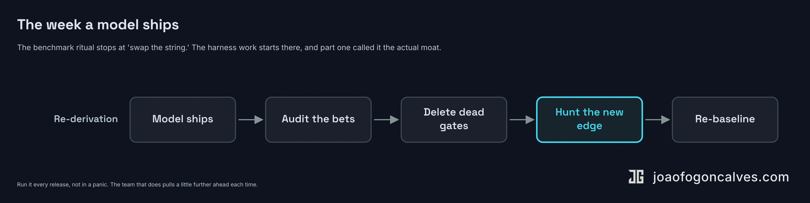

Part one ended on a line that is easy to nod at and hard to act on: the moat is not the harness you have, it is how fast you can rebuild it when the model moves. True. Also useless on a Monday.

Nobody ships "how fast you can rebuild it." They ship a decision about what to write themselves and what to pull off a shelf, then they live with that decision for a year. So this is the part [the argument](/articles/2026/06/2026-06-05-the-harness-is-the-moat/) skipped. Where the line goes.

## Draw the line

The build-versus-buy question got loud this year. There is a small industry of decision frameworks for it now, most shaped the same way: buy a platform for ninety percent of cases, build only when the agent's logic is a real moat. The advice is not wrong. The cut is.

It treats the agent as one object you either purchase or assemble. That object does not exist. What exists is a loop with a harness around it, and the two belong on opposite sides of the line.

The loop is generic. A model decides the next step, a tool runs, the result comes back, the model decides again. Around that: a sandbox to run in, a session log to remember what happened. None of it is specific to you, and the people who build the model will now run all of it for you. The [Claude Agent SDK](https://code.claude.com/docs/en/agent-sdk/overview) lets you run the same loop that powers Claude Code inside your own process. [Managed Agents](https://www.anthropic.com/engineering/managed-agents) runs the loop, the sandbox, and the session log on Anthropic's machines for eight cents a session-hour. Their own framing for it is decoupling the brain from the hands. Rent the hands. They are a commodity, and they are someone else's problem now.

There is a clean test for which side of the line a thing sits on. If it is knowable from outside your company, rent it. If you only learned it by being in your own production when something broke, build it. The loop is knowable from outside. Your deploy gates are not. The permission boundary drawn around your blast radius is not. The verification that knows what correct means in your product, on your data, against the way your customers actually use it, is not. No SDK ships with any of that, because none of it is visible from where the SDK was written.

Most of what an agent system costs over its life is not the build. It is the maintenance, and most of the maintenance is chasing the model as it shifts under you. The frameworks file that under cost and warn you about it. Part one filed the same fact under moat. The maintenance is not the tax you pay for owning the harness. The maintenance is the thing you own.

Rent the loop. Build the harness. The line runs exactly where your domain starts.

## The evaluator you can't rent

If you build one thing, build the part that decides whether the work is good.

It is the part everyone underbuilds, because the lazy version is one line: ask the model if the work is good. The model says yes. Anthropic [watched this in their own harness](https://www.anthropic.com/engineering/harness-design-long-running-apps) and named it without flinching. Models "tend to respond by confidently praising the work, even when the quality is obviously mediocre." The thing grading the work is the thing that made it, and it is agreeable by construction.

So the evaluator has to be separate, and it has to grade like a compiler instead of a manager. A compiler does not care how confident the submission is. It runs the check and returns pass or fail. The distinction that makes it real: the evaluator interacts with the running system instead of reading the diff. It clicks the button, hits the endpoint, reads the actual error. A diff that looks correct and a feature that works are different claims, and only one of them ships. [The whole loop rests on that](/articles/2026/05/2026-05-20-building-the-road-to-production-again/): a failure you can detect is the only kind the system recovers from on its own.

In practice this is the least glamorous code in the system and the part I trust most. My agents fail their first CI run roughly seven times in ten, read the red build, and fix themselves before a human looks. [That thirty-percent first-pass rate](/articles/2026/05/2026-05-14-lead-time-is-the-wrong-half/) is not a number I am proud of, and it is not supposed to be. It is the evaluator earning its keep. The gate catches the confident, plausible, wrong output and sends it back, and the loop closes in tokens instead of in a stand-up.

The gate that matters most is the one that refuses to grade itself at all. A green diff that touches the billing path does not merge on a passing test. It routes to a human. Not because the model is dumb. Because the cost of being wrong there is asymmetric, and the asymmetry is a fact about my business that no model knows. That rule is a few lines of config and it is pure harness. It will be true on the next model, and the one after that.

## Skills are a ledger of failures

People ask about the twenty-seven custom skills the way they ask about prompts. What's in them. What's the trick.

There is no trick. Each skill is an incident.

The system did something wrong once, in a specific way, on a specific kind of work, and instead of writing a cleverer prompt, someone wrote down what it should have known and made that knowledge load-bearing. The skill for resolving merge conflicts exists because two agents corrupted each other's work. The skill that triages a Sentry exception before filing anything exists because the system once opened a handful of issues for one root cause. [The agent roster grew the same way](/articles/2026/04/2026-04-16-from-pipeline-to-nervous-system/): every specialist is a generalist that kept making one class of mistake until the fix earned its own definition.

This is the part that is genuinely yours, and it is yours for a reason that has nothing to do with secrecy. A competitor can read every skill file in the repo. They cannot read the outage that taught you to write it. The file is the answer. What you own is the question it answers, and you only got the question by being in production when it broke.

The skills are a ledger. Every entry was paid for once.

## The week a model ships

Here is the cadence the benchmark ritual replaces with a single API call.

A new model drops. The cheap move is the one most teams make: swap the string, run the eval, ship. The move that compounds takes about a week and looks like maintenance, which is exactly why it gets skipped.

::: wide

:::

You read your own harness as a list of bets. Every gate, every retry, every reset is a written-down assumption about something the model could not do on its own. A better model just paid out some of those bets and voided others. Anthropic's [own harness](https://www.anthropic.com/engineering/harness-design-long-running-apps) is the cleanest example on the public record: the context resets that Opus 4.5 needed became dead weight on 4.6, so they deleted them. The harness got smaller because the model got better, and someone had to notice.

So you audit. The gates I delete are almost always the ones I added to compensate for a model that couldn't hold a plan or keep its context straight. The newer model holds both, and the gate that used to be a guardrail is now just latency. Deleting it is the work most teams skip, because a gate that no longer does anything still reads as safety.

Then you go looking for the new failure surface, because there always is one. A model that writes better code fails in subtler ways. It is confidently wrong about more sophisticated things. The gate that caught last year's mistakes will not see this year's. Finding the new edge before your customers do is the whole game, and it is not panic. It is a routine you run every release, and the team that runs it pulls a little further ahead each time from the team relearning it from their first outage.

## It lives in the team, not the repo

So what is the asset, exactly.

Not the harness. Part one already conceded that one: it depreciates, the model eats pieces of it, the leaner version next quarter is the better one. Not the skills files either. Those are copyable, and a competitor with your repo has all of them.

The asset is the judgment that decides which gate to delete and which to keep. That judgment does not live in the repo. It lives in the people who were there for the incidents, who know which failures were flukes and which were the model telling them something, who can read a new release and re-derive the harness in a week instead of relearning it over a quarter of outages.

You could hand a competitor the entire system and they would still be behind, because what you built was never the code. It is a team that knows where this specific system breaks, and how fast it stops breaking that way.

The model is rented, and it gets better on someone else's schedule. The harness is owned, and it rots on yours. The work is keeping it from rotting. The people who can do that work the week the model moves are the only part of this that was ever a moat.
