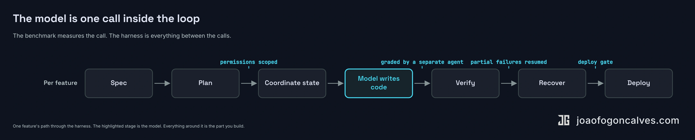
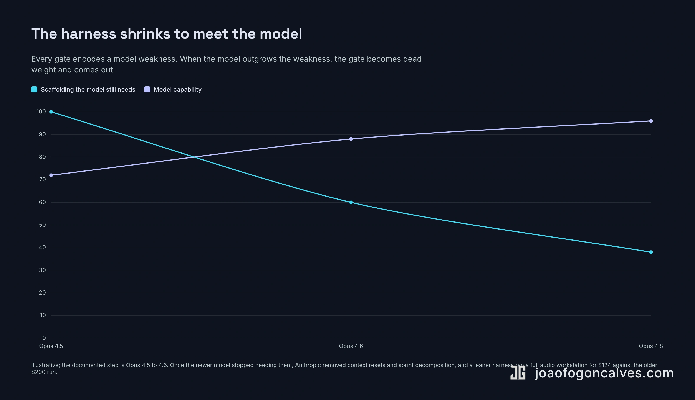

There is a ritual that runs in most engineering orgs right now. A new model drops. Someone reads the benchmark card, runs it against an internal eval, posts the delta in a channel, and files a ticket to swap the API string. The model is treated as the variable. Turn the knob, get more capability, ship better agents.

The teams actually running agents in production barely touch that knob.

They are not indifferent to the model. They will take the better one when it lands. But they know something the benchmark ritual hides: the model was never the thing standing between them and a working agent. The thing standing between them was everything around the model. The state coordination, the permission boundaries, the failure recovery, the verification gates, the deploy path. The unglamorous layer that turns one good completion into a system you can leave running overnight.

That layer has a name. Anthropic calls it the harness, and they put it in the title of an [engineering post](https://www.anthropic.com/engineering/harness-design-long-running-apps) about long-running agents. The name is worth keeping, because once you have it, the part of the work that actually decides whether an agent ships comes into focus.

The model is the commodity. The harness is the moat. Both halves of that sentence need defending, and the second half is more slippery than it looks.

## What a harness actually is

A harness is not a prompt and it is not a framework you install. It is the running system that lets a model do useful work without a human holding its hand through every step.

Concretely, in the system I run, the harness is the part that does this. It coordinates state across parallel working directories, so four agents can edit the same repo at once without writing over each other. It handles permissions and isolation, so an agent that goes off the rails can't touch production credentials or delete a branch it shouldn't. It recovers from CI failures, reads the red build, diagnoses the cause, and pushes a fix without waking anyone. It gates output behind verification, so nothing merges that hasn't passed a check the model didn't get to grade for itself. It recovers from partial failures, picks up a feature that died halfway through three agents ago. And at the end, it deploys.

The model is one call inside that loop. An important call. Not the loop.

::: wide

:::

This is the part the benchmark card cannot show you, because the benchmark measures the call and the harness is everything between the calls. Take the biggest model jump on the board right now. Opus 4.8 landed in late May about ten points clear of the field on SWE-bench Pro, one of the hardest coding benchmarks in current use. That is a real gain, the kind worth swapping the API string for. It also does not coordinate worktrees. It does not know your deploy gates. It does not remember that the last agent left the migration half-applied. The model improves along one axis. Your agents fail along a different one. The two barely intersect.

That orthogonality is the whole argument.

## The model improves. The breakage doesn't move.

Look at where the frontier actually sits. The benchmarks the industry leaned on two years ago are [saturated](https://medium.com/@nairmilind3/llm-evaluation-in-2026-e631a78c67dc). MMLU clusters in the low 90s across every serious model, close enough that the gaps read as noise. On the chat arena leaderboards the top models sit within a point or two. The newer, harder benchmarks still spread out, Opus 4.8 opened a real lead on SWE-bench Pro this spring over GPT-5.5 and Gemini 3.1 Pro, but look at what that lead buys you. A model that codes better on its own still does not coordinate worktrees, still does not know your deploy gates, still does not remember the half-applied migration. The gain lands on an axis that does not touch the one where your agents actually fail.

Now look at where production breaks. The failures are specific, and almost none of them are the model being dumb. I have spent real time diagnosing harness failures in Claude Code itself, the tool I build on. A git worktree that follows its `.git` pointer back to the main repo and registers every slash command twice, so the agent sees a duplicated menu and picks the wrong one ([issue #26992](https://github.com/anthropics/claude-code/issues/26992), closed as not-planned). An agent team that crashes when it hits a permission boundary mid-run instead of degrading gracefully. State tracking that loses the thread across worktrees.

It is worth being precise about what those are. Claude Code is itself a harness, one I rent from Anthropic, and those are its bugs, not the model's. A harness has layers: the loop the vendor ships, and the layer I build on top of it. Failures show up at both. The point survives the distinction. None of them are the model. The model was fine. What broke was the scaffolding, and the scaffolding is where the work lives.

The data says the same thing at scale. By some estimates [around 80% of AI projects](https://www.pertamapartners.com/insights/ai-project-failure-statistics-2026) fail to deliver value, and when you read the postmortems the cause is rarely that the model wasn't smart enough. It is abandoned before production, completed but worthless, can't justify the cost. Practitioners writing honestly about agents converge on the same diagnosis: they fail in production [because orchestration got treated as an afterthought](https://medium.com/ai-mindset/why-most-ai-agent-systems-fail-ee06c35f2ba2), and teams end up rebuilding session state, memory, and tool routing every couple of months as the model shifts under them.

That last detail is the one to hold onto. The harness is not a fixed asset you finish and own. It moves under you. Which reads like an argument against everything I just said, until you follow it one step further.

## Grade the output like a compiler, not an employee

The hardest part of a harness is the part people skip, because it is the least fun to build and the easiest to fake.

Verification.

Here is the trap. You ask the model whether the work is good, and the model tells you it is good. Anthropic ran straight into this building their own harness and named it plainly: models "tend to respond by confidently praising the work, even when the quality is obviously mediocre." Self-assessment does not work, because the thing doing the assessing is the thing being assessed, and it is agreeable by construction.

So the harness cannot trust the model's self-report. It has to grade the output the way a compiler grades code, not the way a manager grades an employee. A compiler does not care how confident the submission is. It runs the check and returns pass or fail. The harness needs a separate evaluator that interacts with the running system, clicks the button, reads the actual error, and fails the work when the work is wrong, regardless of how good the diff looked. [I've written before about why detectable failure is the assumption the whole agent loop rests on](/articles/2026/05/2026-05-20-building-the-road-to-production-again/): the patterns that scaled human teams transfer cleanly to agents, except the one that quietly assumed a human would notice when something broke.

The economics of getting this right are not subtle. In Anthropic's own comparison, a single model run cost nine dollars and produced a broken application. The multi-agent harness, with a separate planner, generator, and evaluator, cost two hundred dollars and produced one that worked. Twenty times the spend, and it was the cheap option, because a broken app costs more than two hundred dollars to discover in production.

That is the discipline in a sentence. You are not building around what the model does well. You are building around what it does badly, and every gate you add is a place you decided not to trust it.

## The hard part was never the prompt

Let me put my own receipts on the table, because the argument is cheap without them.

At BRIDGE IN I run a fourteen-agent orchestration system that ships full-stack features end to end. It plans, implements, tests, and delivers. It triages Sentry exceptions and opens its own issues when it finds a real one. It recovers from CI failures on its own, and that one is not a flourish: it fails its first CI run about seven times in ten, then reads the red build and fixes itself before a human looks. The thirty-percent first-pass rate is the least flattering number I track and the one I point to first, because it is the recovery harness doing precisely the job the model cannot do for itself. It merges its own pull requests, most months with no human commits on the branch. It deploys to production. The whole thing runs through twenty-seven custom skills I wrote, each one a small contract for a specific job the system needs done reliably.

People ask what prompts I use. It is the wrong question. The prompts took an afternoon. The system took months, and almost none of those months went into prompting.

They went into the harness. Into figuring out how three agents share a repo without corrupting each other's work. Into deciding what an agent is allowed to do without a human in the loop and what it is never allowed to do. Into the verification gates that catch the confident, plausible, wrong output before it reaches a customer. Into the recovery paths for when an agent dies mid-feature and the next one has to figure out where it was. [The orchestration problem](/articles/2026/02/2026-02-17-coordinating-ai-agents-is-the-actual-hard-part/) was the actual hard part long before the model was good enough to make it worth solving.

This is also why ["what's the best prompt" is the wrong frame entirely](/articles/2026/05/2026-05-26-the-real-ai-skill-isnt-prompting/). The skill that matters is designing the system the model operates inside. The prompt is a line in a config file. The system around it is the part that compounds.

## Won't the model just eat the harness?

Here is the strongest objection, and it comes from the same Anthropic post I keep quoting. Every component of a harness, they write, "encodes an assumption about what the model can't do on its own, and those assumptions are worth stress testing, both because they may be incorrect, and because they can quickly go stale as models improve." Read the second half slowly. A harness is, in part, a list of the current model's weaknesses written down in code. Models get better. Some of those entries expire on the next release.

This is not hypothetical, and they show their own work on it. They built context resets into their harness because Opus 4.5 got anxious as its context filled up. Opus 4.6 mostly stopped doing that, so they deleted the resets entirely. The scaffolding that was load-bearing in one version was dead weight in the next. The same post has a sequel to the two-hundred-dollar run, too: on the newer model they built a full audio workstation for a hundred and twenty-four dollars, sustaining hours of coherent work after stripping out the structure the older model had needed. The model improved and the harness shrank to meet it.

::: wide

:::

It is not only the model side. The labs are now selling the harness directly. Anthropic shipped [Managed Agents](https://www.anthropic.com/engineering/managed-agents) in April, a hosted service that runs the agent loop, the sandbox, and the session log on their infrastructure for eight cents a session-hour. The generic orchestration layer, the part everyone was writing from scratch a year ago, is becoming something you rent.

So if the components depreciate and the plumbing commoditizes, where is the moat?

Not in any single gate. In two things the next model release cannot touch and the hosted runtime does not ship.

The first is the part of the harness that encodes your domain instead of the model's limits. Your deploy gates. Your permission boundaries. The verification that knows what correct means in your product, on your data, against the way your customers actually use it. Managed Agents will run the loop. It will not know that a green diff touching the billing path still needs a human, or that your migrations have a failure mode the last three agents already hit. You earned that knowledge in production, and no model upgrade ships with it preinstalled.

The second is the one that compounds. Because the harness depreciates, the durable skill is not owning the right harness. It is re-deriving it faster than anyone else every time the model moves: knowing which assumptions just went stale, which gates to delete, which to keep, where the new failure surface opened up. That is not an artifact you build once. It is a capability that lives in the team, and it sharpens with every release while everyone still treating the model as the variable is learning the new failure modes from their first outage.

::: wide

:::

## What you actually own

AI made writing code cheap. When the cost of one thing falls that far, the value moves to whatever is now scarce, and what is scarce is everything the cheap part still can't do for itself: coordination, verification, knowing what to build and proving it works without a human watching. That is a description of a harness, not a better model.

So take the upgrade when the model drops. It is free capability and you should want it. Then go back to the part that was actually keeping your agents out of production, and stop thinking of it as a thing you finish. The model you rent improves on someone else's roadmap. The harness you own decays on yours, and the work is keeping it from decaying: pulling the gates the new model made redundant, finding the new failure surface before your customers do.

The model is the commodity. The moat is not the harness you have today. It is how fast you can rebuild it when the model moves.
