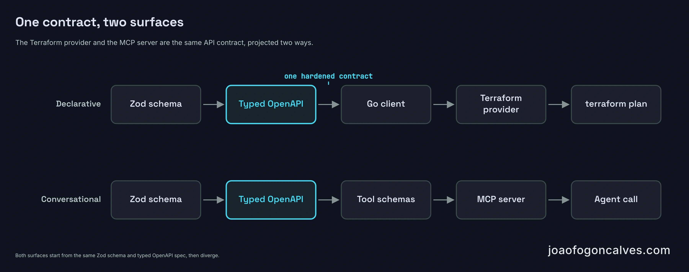

[BridgePort 3.0](https://bridgeport.bridgein.com/changelog/#v3-0-0) has two headline features: a Terraform provider and an MCP server. They were built as separate efforts, in separate epics, and they look unrelated. One is infrastructure-as-code. The other is what people usually mean by "adding AI" to a tool.

They turned out to be two clients of the same thing: BridgePort's HTTP API. The Terraform provider drives it from a file in version control, and the MCP server drives it from an agent in an editor. They expose different slices of it, one declaring configuration and the other running operations, but neither had to build its own validation, permissions, or audit trail. Both inherited that from the API. Most of the release didn't go into either feature. It went into making the API stable enough to be that dependency.

The release before this one, [2.0, was about speed](/posts/2026/06/07-bridgeport-2-0-what-got-faster/). The slowest production transaction dropped from a p99 over 8 seconds to 46 milliseconds. 3.0 is about the API surface instead. Less visible, same general idea: make the control plane something other software can rely on.

::: wide

:::

## What "hardening the API" meant

The phrase is vague until you list the work, and most of it is the kind that doesn't show up in a demo.

The spec came first. BridgePort was already generating `/openapi.json` dynamically from its registered routes, but the document was nearly empty of contracts. Of roughly 251 route definitions, three declared a request or response schema, and those three were response-only, added for serialization speed. The real request contracts already existed as Zod schemas, `createServerSchema`, `createServiceSchema`, and the rest, used to validate incoming bodies. They just never reached the spec. 3.0 fed them in, converting each one with Zod 4's built-in `z.toJSONSchema()` and assembling the document with `@fastify/swagger`, so the schema that validates a request is now the schema that documents it. One definition, two jobs. A `pnpm run openapi:dump` script writes a committed `openapi.json` snapshot, a CI check fails the build when routes change without regenerating it, and a test asserts that a minimum share of operations carry full schemas. The threshold only ratchets up, so a new route added without a schema can't quietly lower the bar. It just fails the check until someone types it.

Errors got one shape at the same time. Every non-2xx response now returns `{code, message, field?, hint?, requestId?}` with a documented set of codes (`VALIDATION_ERROR`, `READONLY_FIELD`, `FORBIDDEN_SCOPE`, `IDEMPOTENCY_KEY_REUSED`, and so on). That was done with a central error handler and an `onSend` hook that reshapes responses at the framework level, so it didn't mean editing every route. `GET /api/auth/me` now returns the caller's role, environment allowlist, and derived scopes, so a client can tell whether a call will be permitted before making it and catching a 403.

Then the client. The Go client the CLI used internally was already a complete typed SDK, but it sat under `internal/` with a module path that didn't resolve, so nothing else could import it. 3.0 extracted it into a standalone module, `github.com/bridgeinpt/bridgeport/client`, released on the Go multi-module convention (`client/vX.Y.Z`). The rule attached to it matters more than the move: the client is treated as part of the API's contract surface and bumped in the same pull request as any change to a wire shape, so a consumer never has to chase the API by hand.

Then the policy. There's now a written stability and deprecation document. Breaking changes (removing or renaming fields, changing types or status codes, tightening validation) happen only in majors. Additive changes (new optional fields, new endpoints) happen in minors. A deprecated field is flagged `deprecated: true` in the spec and survives until at least the next major. The committed `openapi.json` is named as the canonical contract, and clients are told to pin against it.

The last piece was already there and became load-bearing: an `Idempotency-Key` header on mutating POSTs, Stripe-style. The same key within a 24-hour window replays the original response instead of running the work twice, and the same key sent with a different body returns a 422 with `IDEMPOTENCY_KEY_REUSED`.

The same pressure showed up lower in the stack. An API that gets driven by automation gets hit concurrently, and under concurrent writes SQLite's single writer lock could surface as an opaque 500 (`SQLITE_BUSY` and the stale-snapshot variant). The [3.0.1 patch](https://bridgeport.bridgein.com/changelog/#v3-0-1) added a Prisma client extension that retries those contended writes with jittered backoff, up to five times, and when retries run out it returns a 503 with `Retry-After` rather than a 500, which is a response a client can actually handle. The per-attempt busy timeout dropped from 5 seconds to 1 so a contended write fails fast into the async retry loop rather than blocking the event loop, and the behavior is tunable through `DB_RETRY_*` environment variables. In one repro run, eight writers hammering the same database produced 24 failed requests out of 384. A rerun after the fix, at twice the load, produced none. Those counts are a single developer repro, not a benchmark, but the behavior they show is pinned by a contention test that holds a real write lock and asserts a 503, never a 500. Idempotency makes a retry safe to send. This is what makes the failure worth retrying in the first place.

Individually these are unremarkable. Together they're the difference between an API you call and one you can build on without expecting it to move under you.

## The Terraform provider

BridgePort sits between infrastructure that's already provisioned with Terraform and the services running on top of it, which were configured by hand through the UI. That handoff was imperative: click through screens, run a script, hope it's reproducible. The provider makes the BridgePort half declarative. Environments, servers, variables, secrets, config files, registry connections, container images, services, and their per-server deployments live in version control, and `terraform plan` shows configuration drift instead of letting it accumulate quietly. It's built on terraform-plugin-framework and published to the Terraform and OpenTofu registries through goreleaser with GPG-signed assets, versioned on its own line because one provider release supports a range of platform versions.

The core design choice: configuration is declarative, runtime is not. You can declare a service and everything about how it's configured. You can't `terraform apply` a deploy. Deploys, restarts, and rollbacks stay operations you trigger directly, and runtime facts like health, live status, and exposed ports are read-only values the provider reports but doesn't manage. BridgePort already kept an internal registry of which fields are runtime versus configuration, and the provider maps onto the same split rather than inventing its own.

Secrets get the same care they get everywhere else. A secret's value is a write-only argument that never lands in Terraform state. You bump a version number to rotate it, and the plaintext stays in whatever source you pull it from:

```hcl
resource "bridgeport_secret" "db_password" {
  environment      = "production"
  key              = "DB_PASSWORD"
  value_wo         = var.db_password  # write-only: never stored in state
  value_wo_version = "1"              # bump this to rotate
}
```

The token authenticates through a `BRIDGEPORT_TOKEN` environment variable for the same reason, so it stays out of config and state. Resources and data sources are addressed by their natural keys (`environment` plus `name` or `key`), which is also what `terraform import` works off, and `plan` runs offline, diffing against the configuration you submitted rather than calling the live API.

The provider builds no HTTP requests of its own. Every call goes through the same shared Go client the CLI uses, pinned at `client/v0.4.0`, which leaves the provider code to be Terraform schema plus plan-and-state plumbing and not much else.

What keeps a separate-repo provider honest is not the repo layout. It's the contract enforced in CI. The provider's acceptance tests run against the real server image: compose up a throwaway instance, mint an operator token from the first-boot admin bootstrap, run the suite with `TF_ACC=1`, tear it down. SQLite makes each instance cheap enough to do per-run. On the platform side, a provider-compatibility job builds the server image, checks out the provider at its latest release tag, and runs that acceptance suite against the image. A red suite fails the platform's pull request. Either a change is compatible, or it ships with a documented deprecation and a provider follow-up filed before merge.

## The MCP server

The MCP server exposes a curated part of the same API as tools an AI client can call: listing the services showing drift in production, rolling a service back to its previous image, summarizing recent health-check failures. The client's model does the reasoning, and BridgePort runs the same deterministic operations it always has.

Mechanically it's a Fastify plugin mounted at `POST /mcp`, registered only when `MCP_ENABLED` is set. The flag is parsed strictly and fails closed: only `true` or `1` turns it on, and when it's off the route isn't registered at all, so `/mcp` returns a 404 rather than an authenticated-but-empty endpoint. The transport is stateless Streamable HTTP from the official MCP SDK. Each request builds a fresh server for the authenticated caller and tears it down when the response closes, with no session store. Authentication reuses the same bearer token as the REST API, and the caller's token is forwarded on every internal call a tool makes, so each tool effectively replays a real API request as that user. Role checks, scope checks, validation, idempotency, and audit logging all behave exactly as they would for the equivalent REST call. There's no second permission model to keep in sync. The whole server is about 2,200 lines of new code, and wiring it into the existing auth and idempotency layers changed those by about a dozen lines.

The decision that shaped the whole thing was what not to build. Most ways of adding AI to the project would have BridgePort calling a model itself, for log triage, or drift explained in prose, or a risk score on a deploy. Each of those means holding an API key, paying for inference, and sending logs, config, and topology out to a third-party model. For a self-hosted control plane that already stores SSH keys and secrets, that's a meaningful amount of new surface and new data leaving the box. The MCP server avoids it by not running a model at all. It serves tools, and the model lives in the operator's own client, on their own account. That trade is not free: it moves the model, the account, and the client config onto the operator, and it means BridgePort can't offer log triage or drift-in-prose as built-in features, because there's nothing on the box to generate them. For a self-hosted control plane that already holds the secrets, that reads the right way around. The usual alternative for keeping data in-house is to [self-host a model too](https://northflank.com/blog/self-hosting-ai-models-guide), which works but adds a model to serve and a GPU to keep fed. And [wiring an agent into an operational loop is a different problem than shipping a chatbot](/posts/2026/05/08-ai-is-everywhere-agents-inside-products-are) regardless.

Connecting a client is a URL and a token:

```json
{
  "mcpServers": {
    "bridgeport": {
      "url": "https://bridgeport.example.com/mcp",
      "headers": { "Authorization": "Bearer <api-token>" }
    }
  }
}
```

The safety model is mostly inherited and partly belt-and-suspenders. Read tools work with any valid token. Write tools (deploy, restart, rollback, run a backup) need a write scope, carry MCP destructive annotations so the client asks for confirmation, and derive an `Idempotency-Key` so identical calls within about a minute dedupe as retries instead of firing twice. On top of that, every tool output and resource read passes through a redactor before it leaves the server. Its denylist is generated from the Prisma schema (encrypted columns, their nonces, token hashes, raw SSH keys, agent tokens) and applied by key name, recursively, through nested objects. If a REST route ever regressed and started returning a raw database row, the redactor would still strip the secret-bearing fields, while keeping the presence-only flags like `hasToken` that the safe projections are meant to expose. The endpoint is off by default, has no UI toggle (enabling it is a deployment decision, not a database setting), and supports DNS-rebinding protection through an explicit `MCP_ALLOWED_HOSTS` list.

## Why 55 tools and not 251

The quick way to build either surface is to let the spec decide it. Point [Speakeasy](https://www.speakeasy.com/blog/generating-mcp-from-openapi-lessons-from-50-production-servers) at an OpenAPI document and it emits one MCP tool per endpoint. Point [HashiCorp's generator](https://developer.hashicorp.com/terraform/plugin/code-generation/openapi-generator) at one and it scaffolds a Terraform resource per route. BridgePort generates the tool schemas from the spec but doesn't let the spec decide the tool set. The API has around 251 routes. The MCP server exposes 55, 47 read and 8 write, and an admin page reads the live inventory out of the in-process registry so the exposed surface is auditable whether or not the server is currently enabled.

It's the same reasoning as leaving deploys out of the Terraform provider. Every endpoint as a tool is a dump of what the API can do. A smaller set is a decision about what an agent should do with it. It's a known failure mode. [The semantics matter more than the coverage](https://blog.christianposta.com/semantics-matter-exposing-openapi-as-mcp-tools/), and 251 tools is also a context-window problem: the agent spends its attention reading a menu instead of planning, and plans worse for it. Curating down is not a smaller surface dressed up as a virtue. It is the optimization. Creating resources is left to the Terraform provider, the first version of the MCP server is scoped to observing and a safe set of operations, and the safe-write set grows from there.

## The rest of 3.0

Not everything in 3.0 was about the contract. The web UI was rebuilt on a standard component library, the front-end bundle was split into lazy-loaded chunks, and a configuration audit surfaced a batch of settings that had been hardcoded and removed a few the app had been silently ignoring. Useful, unglamorous, the kind of work a major version is mostly made of.

Backups got the change that was overdue. Retention used to be flat: keep everything for N days, then delete it. That forces a bad trade, because 90 days of nightly backups is 90 files, and 7 days leaves no medium-term recovery point at all. 3.0 replaced it with grandfather-father-son rotation, the scheme borg, restic, and Time Machine have used for years: keep the last few, then thin older backups down to daily, weekly, monthly, and yearly tiers. Keeping 7 daily, 4 weekly, and 6 monthly backups spans half a year in roughly 17 files instead of 180. It ships as presets (lean, balanced, long-term) with a global default each database can override. Manual and pinned backups are exempt, a floor guarantees it never deletes down to nothing, and it prunes nothing at all until you opt in. This is table stakes for anything storing real data, and now it's in the box rather than in a cron job someone wrote once and forgot.

The documentation went live with the release, at [bridgeport.bridgein.com](https://bridgeport.bridgein.com): installation and getting-started, a guide per subsystem, a [Terraform guide](https://bridgeport.bridgein.com/guides/terraform/) and an [MCP reference](https://bridgeport.bridgein.com/reference/mcp/) for the two surfaces this piece is about, the [API stability policy](https://bridgeport.bridgein.com/api-stability/), and a full [API reference](https://bridgeport.bridgein.com/reference/api/) generated from the same OpenAPI spec the release hardened. The contract ended up documenting itself.

Once the API is a stable dependency, a new surface is mostly a curation problem, not an integration one. The CLI, the Go SDK, the Terraform provider, and the MCP server are all clients of the same definition, and not one of them had to rebuild validation, permissions, or audit. They inherited it. It's the same reason [the layer around a model usually matters more than the model](/articles/2026/06/2026-06-08-the-harness-is-the-moat/). The features are the visible part. The contract is the part that took the time.
