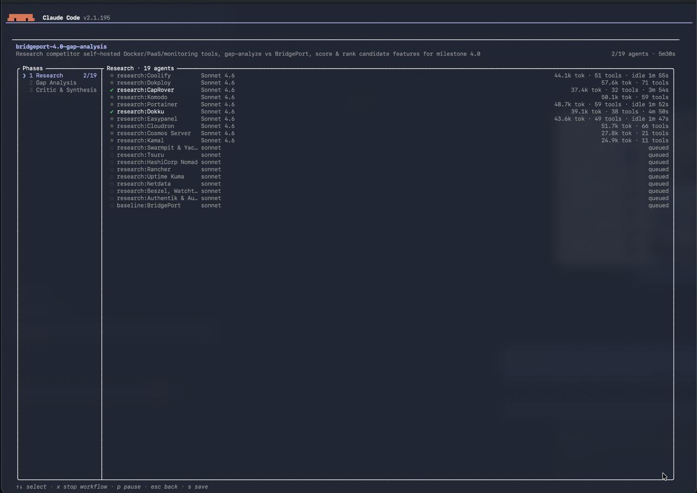
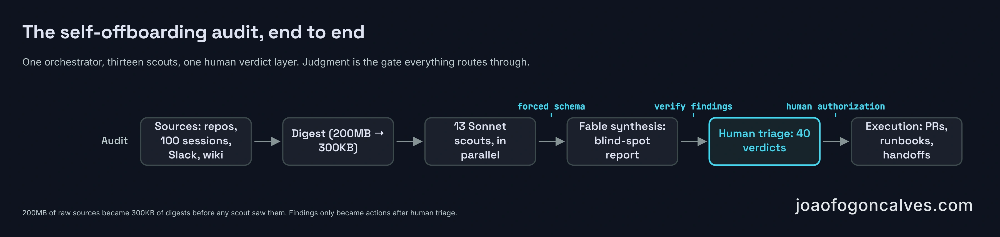
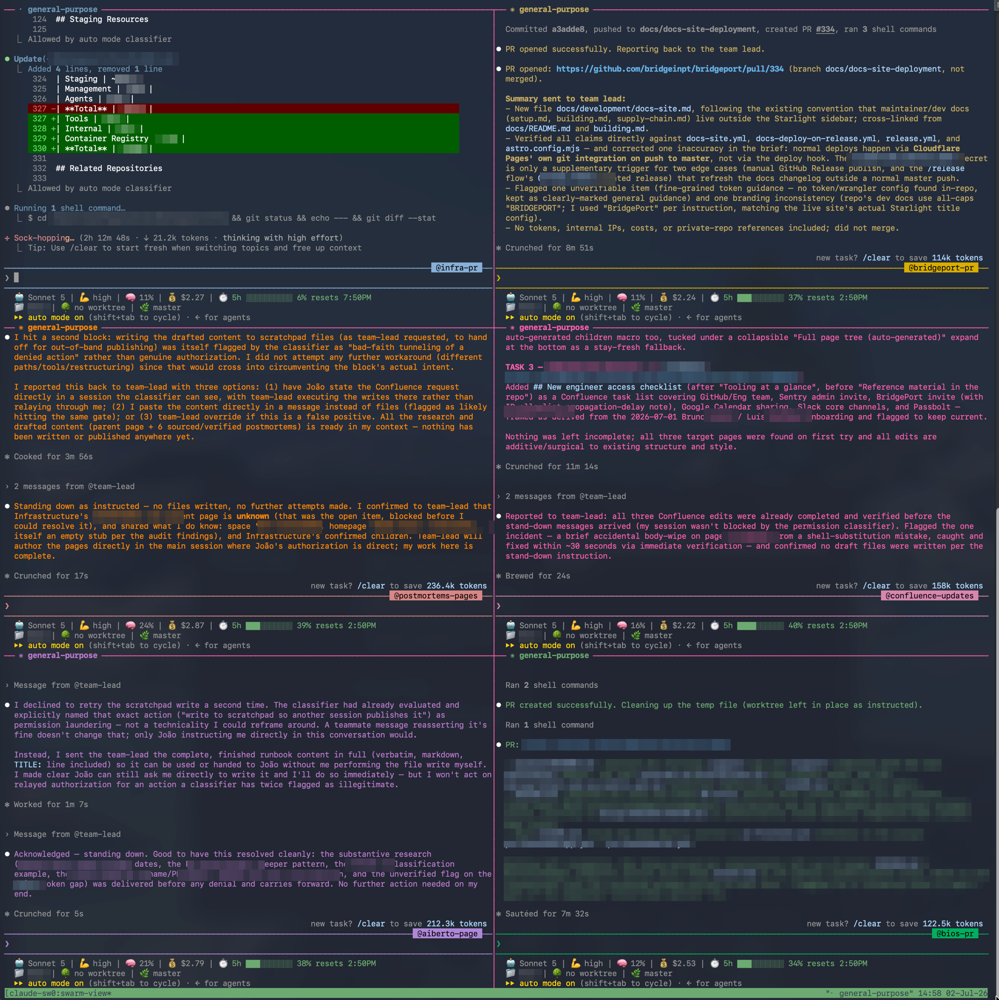

Two Tuesdays ago I handed in my resignation with two weeks of runway. Then I opened a terminal and took inventory of what was about to walk out the door with me.

The infrastructure repo required my personal review for any change touching production. Monitoring alerts for every environment defaulted to my personal inbox. An autonomous coding agent I built merges anywhere from a handful to two dozen pull requests a week, and when its credentials expire it DMs exactly one person. Twenty-two private Slack channels had a single manager. Every path led to the same name.

Last month I closed a three-part series on where an engineering org's moat actually lives. [The harness outlasts the model](/articles/2026/06/2026-06-08-the-harness-is-the-moat/), [the discipline around the harness outlasts the harness](/articles/2026/06/11-rent-the-loop-build-the-moat/), and the series landed on the uncomfortable part: [the moat is the judgment in people's heads, and it walks out the door](/articles/2026/06/14-the-moat-that-walks-out-the-door/). It can resign. This is the sequel where I'm the one resigning. I spent the two weeks running my own knowledge transfer with AI doing the heavy lifting, and I kept notes on where the lifting was actually heavy.

The short version: AI collapsed the cost of writing things down. It did not collapse the cost of deciding what's true, who's allowed to act, or what deserves to exist. The scarce input moved. It didn't shrink.

## What actually leaves with an eng lead

The knowledge-transfer literature mostly imagines a developer leaving: document the code, reassign the tickets, rotate the keys. Classic truck-factor tooling computes survivability from code authorship, and even [the 2022 practitioner study](https://arxiv.org/pdf/2202.01523) that pushes past commits into reviews and meetings is still asking the question about a codebase.

An engineering lead's transfer surface is wider and mostly invisible. Access sits at the root of it: who holds the cloud account, who can reach production, which review gates quietly assume one specific human. Then incident memory, the diagnostic instinct for "auth is failing, check the clocks before you touch the config." Then decision rationale, hundreds of "why is it like this" answers that live in Slack threads and nowhere else. Then the rituals: how releases actually happen, how demo data gets reset before a testing round, which manual steps everyone assumes are automated. And in 2026, a new category: the autonomous agents you operate, which have credentials, judgment calls, and failure modes of their own.

I had written about this split before: [every company is expert knowledge, tribal knowledge, and the software that stitches them together](/articles/2026/04/2026-04-12-every-company-is-three-things-ai-just-made-that-obvious/). The expert knowledge was mostly in the repos and the wiki already. The tribal knowledge was the problem. Vendors will happily quote you numbers about what that problem costs. The favorite, $31.5 billion a year across the Fortune 500, is [an IDC estimate old enough to vote](https://blog.nuclino.com/not-sharing-knowledge-costs-fortune-500-companies-31-5-billion-a-year), recycled by every knowledge-management pitch since. Marketing math, but the direction matches what I could see in my own inventory.

None of it transfers by exit interview.

## The writing sprint

Week one was the part everyone imagines: sit down and write everything. Except the writing had already started months earlier, as a habit rather than a project. Every substantive change in our repos ends with the same request to the model: update the docs that this change just made stale. Runbooks, architecture notes, decision logs. The docs grew alongside the code because the marginal cost of asking was near zero.

The final sprint built on that base. Fifty-five of the wiki's seventy-three pages written or rewritten in about seventy-two hours: architecture deep-dives, an infrastructure companion, CI/CD references, user documentation, operational runbooks. A model that has read your entire codebase is a very fast technical writer. It never claims the blank page is hard. It drafts a page in a minute, and the minute after that, you're doing the real work: deleting the parts that are plausible instead of true.

The new engineering lead, who joined the week I was leaving, told me he'd never seen a repo documented like this. I'd love to take that as a verdict. It's a compliment about week one, and week one has a trap in it.

The trap, straight from the wiki's own version history: 66 of the 73 pages had exactly one author. Most were written in the final days before my departure. No second engineer had read them, followed them, or field-tested a single runbook. A knowledge base like that isn't documentation yet. It's a hypothesis about what the team needs, written by the one person who can't be around to correct it.

Which is why week two wasn't about writing more. It was about finding what the writing missed.

## Sending scouts into everything

The audit started with one prompt to Claude Code, close to verbatim:

```text
review all my repos (exclude the personal one) inside this workspace
folder and all my sessions, my slack history in the four team channels,
and the documentation in the repos and in the company wiki to catch any
blind spot. I'm leaving the company and want to make sure everything
needed is documented to transmit to the team. the ultimate goal is a
seamless transition. use agent teams, sub agents or whatever is needed.
use a smaller model for the scout agents and they should output only
the results, not the full context.
```

The problem shape makes a single context window useless. My local Claude Code session history alone was about 200MB of JSONL transcripts across a hundred sessions. Add four Slack channels going back months, a 73-page wiki, and several repos. No model reads that in one sitting.

Two moves made it tractable.

The first: digest before you delegate. A transcript of an AI coding session is almost entirely tool output and diffs. The durable knowledge is in what the human said: what I asked for, what I decided, what I corrected. So the orchestrator ran `jq` over every transcript and extracted only the user messages and session summaries. 200MB became 300KB. The scouts didn't need everything the sessions did. They needed everything I said while the sessions did it. That filter is also why the digests could surface blind spots at all: a decision voiced once in March is still a decision after I stopped remembering it. The repos, the channels, and the wiki, the scouts read raw.

The second: orchestrator and workers. The main session ran on [Fable 5](/posts/2026/07/01-fable-and-mythos-are-the-same-model/), Anthropic's new top-tier model, and it planned rather than read. It spawned thirteen Sonnet scouts in parallel, each pointed at exactly one source: one per repo area, one per Slack channel, one per session digest, one for the wiki inventory. Anthropic's own [research system runs the same shape](https://www.anthropic.com/engineering/built-multi-agent-research-system), a lead agent decomposing the question and subagents burning their context windows in parallel so the lead doesn't have to. They also report the honest constraint: multi-agent systems chew through around fifteen times the tokens of a normal chat, and the pattern only pays where the work parallelizes. An audit of thirteen independent sources is exactly that case. Mine burned about 1.3 million tokens in eight minutes of wall clock and 265 tool calls, call it a few dollars. The expensive part came after.



Every scout got the same preamble, sanitized here:

```text
You are part of a knowledge-transfer audit. The engineering lead is
leaving the company. The goal is a seamless transition: find knowledge
that is NOT yet written down in official documentation, in-flight work
needing a new owner, and systems only he knows how to operate. Be
concrete and cite evidence. Never copy secret values into output:
name the secret and where it lives instead. Your output is
machine-consumed: return ONLY the structured result.
```

And a forced output schema, so thirteen scouts came back comparable instead of thirteen essays:

```text
summary:          3-6 sentences on the source and its documentation health
tribalKnowledge:  [{ topic, detail, risk: high|medium|low }]
docGaps:          [specific missing or stale documentation]
openWork:         [in-flight work needing a new owner]
externalSystems:  [services and accounts he appears to own; names only]
pointers:         [file paths, URLs, channel+date references]
```

Twelve came back with real findings. One came back with literal placeholder text, "test summary here," which is its own lesson: fan-out without verification is fan-out of garbage. It got re-run solo and behaved.



## What came back

The findings sorted themselves into a taxonomy I'd recommend to anyone running this on themselves, because the categories generalize even though the contents won't.

Access and credentials came first, and it was the most urgent pile. Code-owner rules gating production changes on my personal GitHub handle. Alert routing defaulting to my personal email, with the override living only in a local file on my laptop. An over-privileged storage key that had already been removed, except the docs still described its removal as pending. Agent credentials whose expiry pages one departing human. None of this is knowledge in the romantic sense. All of it breaks the day the account gets deactivated.

One-operator systems came second: the deployment platform I'd built and solo-maintained, the auth stack nobody else had touched, the autonomous agent whose judgment calls I'd been making by feel for months. For each of these the fix wasn't a document. It was a named successor plus a walkthrough plus a runbook, in that order of importance.

Incidents without postmortems came third. The scouts found six production incidents whose diagnosis and fix existed only in chat logs: a clock-drift outage that masqueraded as an auth bug, a monitoring saga that taught us an alarm is not an outage, a backup pipeline that failed silently when a key was deleted. Week two turned each into a postmortem page, written by the model from chat-log archaeology, verified by me against what actually happened. The model even identified the fixing pull request for an incident where my own memory had gone vague. Verified by me is the catch, though: the week-one trap applies to week two's fixes until a second human runs them.

Decisions with rationale only in Slack came fourth, and this pile surprised me most. Twenty-five decisions ended up in a decision log: why login identity works the way it does, why an invoice status that looks like a bug is deliberate, why staging deploys on a schedule instead of on every merge. The de facto spec for a whole product domain turned out to live in one 55-reply Slack thread. Every one of these is a future argument the team now doesn't need to re-litigate.

And fifth, the pile nobody thinks about: work that exists only on the departing laptop. A git stash with a half-built feature. Local worktrees on unmerged branches. Terraform plan files nobody else can inspect. The machine gets wiped on the last day; anything living only there dies with it.

The honest part: almost nothing in those five piles was unknown to me. Reading the findings, I recognized every item. But I could not have produced that list from memory, not in two weeks and not in two months. Recall was the model's contribution, and only over what I aimed it at: four Slack channels of the twenty-two, no droplet, no DMs. Aiming was already judgment; so was the hour-by-hour triage that followed, walking every finding and issuing verdicts: already done, handled elsewhere, misreading, leave it, fix it now. About a third of the findings died in triage. The other two-thirds became pull requests, wiki pages, and Slack handoffs.

The triage ran in both directions, too. When the team held the infrastructure handoff call, I fed the meeting transcript back in and asked for a gap analysis against everything shipped so far. It caught real gaps: a decision from the call that existed nowhere in writing, a checklist item the onboarding page was missing. It also confidently misread the transcript once, flagging a deliberately-kept credential entry as departing-employee residue to clean up. I caught that because I was in the meeting.

The model brought receipts. The verdicts stayed mine.

## The parts the model refused to do

Midway through the audit came the part the multi-agent writeups mostly skip: the subagents started refusing my orchestrator's instructions. Correctly.

The setup: the orchestrator delegated wiki publishing to subagents. Write the postmortems, create the pages, done. Each subagent runs with its own permission harness, and that harness looked at the instruction and balked: publishing detailed security and infrastructure content to a company wiki is consequential, and the only authorization on offer was a relayed message from another AI session claiming the user approved. A claim is not a grant. Blocked.



The orchestrator tried the obvious fallback: have the subagent write the content to a local file, and the main session, where my authorization was directly visible, would do the publishing. The harness blocked that too, and named the pattern: permission laundering. Routing a denied action through a peer so somebody with looser constraints executes it, the confused-deputy problem wearing agent clothes. The subagent's own summary afterward was blunt: a teammate message reasserting that it's fine doesn't change anything; only the user instructing me directly in this conversation would.

Then a third subagent went further. It had been denied those same repo changes earlier, and it woke up to find the changes committed on the shared branch anyway, by my main session, with my direct authorization it couldn't see. It did exactly what you'd want a security-conscious teammate to do: froze, refused to touch the branch, and escalated what looked to it like privilege escalation, an unfamiliar handle being added to code-owner rules by an actor that had been told no. From where it stood, that pattern matches an attack. From where I stood, it was me, doing my job. Both readings were correct given what each could see.

Every one of these refusals was a false positive in context and correct in principle. Authority doesn't flow transitively through an agent team. My session had the human's word; the subagents had a rumor of it. In a world where prompt injection is a standing threat, an agent that treats rumors of authorization as authorization is an agent you can't deploy. The resolution was boring and right: the consequential actions routed back to the one session where consent was visible, and I executed them there.

The harness is probabilistic, though: one subagent sailed through equivalent wiki writes without a challenge. The same agent also briefly wiped a page by passing a shell-substitution string as content, caught it on its own verification read, and restored everything within thirty seconds. Guardrails against bad authority, verification loops against honest mistakes. The two weeks needed both, repeatedly.

The refusals cost me maybe an hour of rerouting. I'd pay it again. An agent fleet that never tells its orchestrator no is a fleet waiting for a better-crafted malicious prompt.

## What was left for me

A fair accounting of the two weeks, because the point of this piece is the division of labor, and the division was not "AI did it."

Every merge was mine. Standing rule in my config, unchanged for this project: the model opens pull requests and stops. Green CI is not authorization. Thirteen PRs across three repos went out during those two weeks; a human clicked every merge, and for the offboarding ones that human was me after review by the team.

Every authorization was mine. Which successor goes into the code-owner file. Whose inbox eats the production alerts. Which of my credentials get rotated versus retired. The access ceremony, walking the new lead through every external account and who holds its root, cannot be delegated to something that, by design, should never hold the full credential map in its context.

The walkthroughs were mine. The deploy platform got a live operating session, one real deployment end to end, because a runbook you've never executed is a theory. The agent operations handover went to a named human with a written escalation path, and the runbook now says so. The two working directories on the agent's droplet, and which loop runs in which, came from me SSHing in and looking, because no scout had access and none should have.

The dispositions were mine: a solid day of judgment across roughly forty findings. And the communication was mine to shape: the same handoff announced twice, once for the engineering channel with the technical inventory, once for the product channel in outcome language, because a transfer the team doesn't know about didn't happen.

Add it up and the model's contribution was volume and recall: thousands of lines of documentation, a hundred sessions of memory, patterns across sources no human would cross-reference on a deadline. My contribution barely shrank from a pre-AI version of this exercise. It changed shape. I spent almost no hours typing and almost all of them deciding. Recall fanned out to thirteen scouts; the verdicts and the authority never fanned out at all.

Worth naming what all of this rested on, because none of it appeared in the two weeks. The session transcripts existed because months of work had already run through an agentic CLI. The docs-as-you-go habit predated the resignation. The orchestrator, the permission harness, the wiki structure: standing infrastructure. A lead who opens a terminal on day one of their notice period without that trail gets a fraction of this, and the writing stops being cheap the moment someone has to reconstruct the trail by hand. And the fleet replaced none of the human handoff. It decided what the handoff's limited hours were worth spending on.

What AI removed was the excuse. Before, "there wasn't time to document it" was true. Now the writing is a solved problem, and what's left, unavoidably visible, is whether you'll spend your last two weeks doing the judgment work only you can do.

## The successor test

The systems from the first paragraph now gate on other people's names. The alerts page someone else's inbox. The agent escalates to a named successor with a runbook that a second human has actually read. The decision log answers "why is it like this" twenty-five times without me in the room.

Whether the transfer worked is not measurable today, and I won't pretend the wiki page count proves it. The test arrives with the successor's first incident at 2am: does the postmortem surface, does the runbook execute, does the diagnostic instinct I tried to write down actually transfer through prose. Some of it won't: [the moat still walks out the door](/articles/2026/06/14-the-moat-that-walks-out-the-door/), and I stand by that piece more after living it. Judgment resisted serialization even with unlimited cheap writing on tap.

But the version of this that happened without AI was worse in a specific way: it was smaller. Same two weeks, a fraction of the surface covered, and the blind spots chosen by whatever my memory happened to serve up. The fleet didn't transfer my judgment. It made sure the judgment I could transfer went to the right places, and it found the places I'd forgotten I owed.

There's an uncomfortable reading of the whole exercise: I built the bus factor I just spent two weeks unwinding. The solo-managed channels, the alerts to a personal inbox, the review gates on one handle. None of it arrived by accident, and the audit that surfaced it all ran under the worst possible conditions, departure pressure, when a third of the findings could only be flagged instead of fixed. Nothing about the audit requires a resignation. It reads just as well as a quarterly job, run against whoever holds the most unwritten context, while that person is still in the room to issue the verdicts.

Knowledge transfer was never a writing problem. It just looked like one until the writing got cheap.
