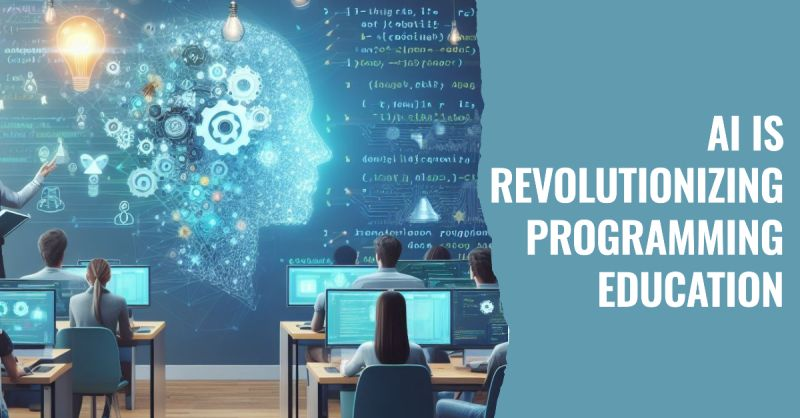

# March 27, 2024

AI is Revolutionizing Programming Education 🤖

In a world where AI is evolving at lightning speed, OpenAI 's ChatGPT has emerged as a game-changer in the realm of programming education. 

Programiz reached out to over 10,000 individuals, ranging from coding novices to seasoned experts, to understand how ChatGPT is shaping their learning narratives, career trajectories, and their visions of an AI-driven future.
(link in the comments)

Key Insights:

▪ 𝟲𝟮% turn to ChatGPT multiple times per week to bolster their programming skills. It's become their trusted companion on the learning journey.

▪ 𝟳𝟱% believe that ChatGPT has had a significant positive impact on their programming learning experience. It's more than just a tool; it's a mentor.

▪ 𝟯𝟬% feel that ChatGPT surpasses traditional college lectures, and over 36% prefer ChatGPT over Google when seeking programming knowledge.

▪ 𝟴𝟰% are of the opinion that educational institutions should adapt their programming curricula to accommodate ChatGPT. It's not just a tool; it's a revolution.

▪ Nearly 𝟳𝟱% are either actively upskilling or planning to do so in preparation for the profound impact of ChatGPT on the job market. It's a career-shaping force.

Notably, 𝗺𝗼𝗿𝗲 𝘁𝗵𝗮𝗻 𝗼𝗻𝗲-𝘁𝗵𝗶𝗿𝗱 have already experienced changes in their job roles due to ChatGPT, a testament to its real-world influence.

ChatGPT is not just a tool; it's a catalyst for change.

PS: I'd love to hear from you! How has ChatGPT influenced your programming path?👇 

hashtag
#chatGPT 
hashtag
#programming 
hashtag
#ai 
hashtag
#education
--------
-> this content useful to you, repost ♻ 
-> you want more like it, follow me João Gonçalves

**Hashtags:** #programming #ai #chatGPT #education

---

## Media

---

[View original post on LinkedIn](https://www.linkedin.com/feed/update/urn:li:activity:7121020968386379776/)