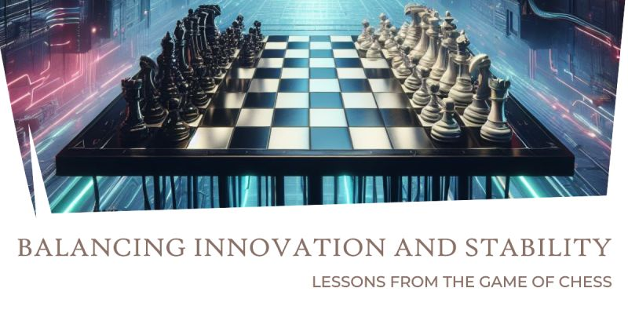

# March 27, 2024

Balancing Innovation and Stability: Lessons from the Game of Chess 👑

I've often found that leadership in software engineering is a lot like playing a game of chess. Let me explain how!

🏁 In chess, the key to victory is finding the perfect balance between offense and defense. Similarly, in the tech world, we must balance innovation and stability to succeed.

🚀 Innovation drives progress. It's about staying ahead of the curve, adopting new technologies, and taking calculated risks. But just like a chess player who overextends their pieces too soon, too much innovation without stability can lead to chaos.

🛡️ Stability is our fortress, ensuring our systems run smoothly and securely. It's the backbone that supports our innovation. But, if we only focus on stability, we risk becoming stagnant, falling behind, or missing out on exciting opportunities.

🤝 So, how do we strike this balance? Here are a few lessons from chess:

1️⃣ Plan Your Moves: Just as a chess player thinks multiple moves ahead, we should have a strategic roadmap for our tech projects. Balance short-term innovation with long-term stability.

2️⃣ Evaluate Risks: Assess the risks of each move, just as you would in chess. Innovation should be driven by calculated risks, not blind leaps.

3️⃣ Adaptability: Chess players adapt to their opponent's moves. Similarly, we must adapt to changes in technology and the market while maintaining stability.

👥 I'd love to hear your thoughts! How do you find the right balance between innovation and stability in your tech projects?

hashtag
#leadership 
hashtag
#innovation 
hashtag
#chess 
hashtag
#strategy
--------
If you like this content and it is useful to you, repost this and follow me João Gonçalves for more like it.

**Hashtags:** #leadership #chess #innovation #strategy

---

## Media

---

[View original post on LinkedIn](https://www.linkedin.com/feed/update/urn:li:activity:7115741764161875968/)