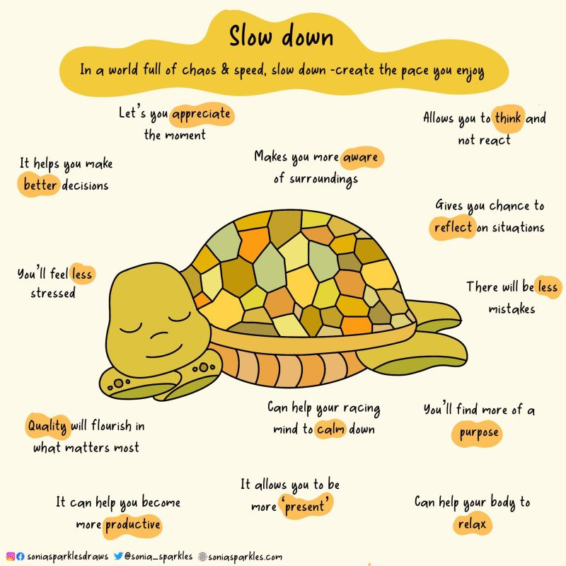

# March 27, 2024

Being “productive” all the time doesn’t mean you’re doing good quality work.

When we’re constantly focused on being productive, we can easily lose sight of quality. We may rush through tasks, make careless mistakes, and overlook important details. 
This can lead to work that is not up to our standards, or even worse, work that is unusable.

Being “busy” and constantly rushing around doesn’t always achieve results.

In fact, it can often have the opposite effect. When we’re constantly stressed and overwhelmed, we’re less able to think clearly and make good decisions. 
This can lead to missed deadlines, poor workmanship, and even burnout.

Taking it slow but consistent has many benefits.

When we take the time to do things right, we’re more likely to produce high-quality work that is free of errors. We’re also more likely to be creative, innovative, and come up with new ideas. Additionally, taking it slow can help us to reduce stress and improve our overall well-being.

It needs more appreciation in the workplace.

In today’s crazy-paced world, it’s easy to get caught up in the hustle and bustle. But it’s important to remember that slow and consistent work can be just as valuable, if not more so. When we take the time to do things right, we’re not only setting ourselves up for success, but we’re also contributing to a more positive and productive workplace culture.

PS: How do you strike the balance between productivity and quality in your work?

Image Source: Sonia Sparkles on X (twitter)

hashtag
#productivity 
hashtag
#rest
--------
-> this content useful to you, repost ♻ 
-> you want more like it, follow me João Gonçalves

**Hashtags:** #rest #productivity

---

## Media

---

[View original post on LinkedIn](https://www.linkedin.com/feed/update/urn:li:activity:7124762623337709568/)