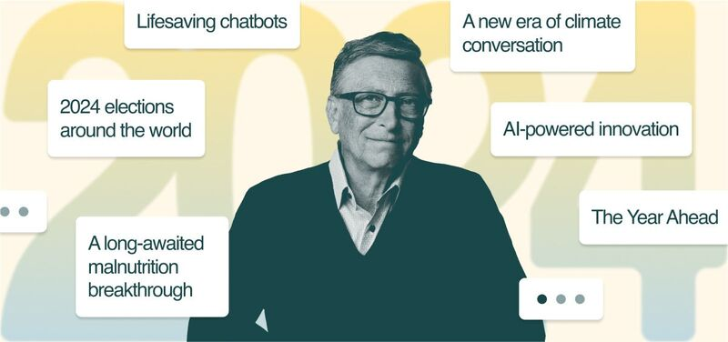

# March 27, 2024

Bill Gates' Predictions for 2024: A Turning Point for Artificial Intelligence and Global Challenges

In his annual letter, Microsoft co-founder Bill Gates has unveiled his predictions for the year ahead, highlighting the transformative potential of artificial intelligence (AI) and its impact on addressing global challenges.

Gates envisions a 2024 that marks a significant turning point, with AI poised to revolutionize healthcare, agriculture, and climate change mitigation. He predicts that AI-powered tools will become more sophisticated, enabling early detection and treatment of diseases, optimizing agricultural practices to reduce food waste, and optimizing energy consumption to combat climate change.

Artificial intelligence is about to accelerate the rate of new discoveries at a pace we've never seen before.

Gates acknowledges that AI's rapid advancement raises concerns about job displacement and ethical considerations, emphasizing the need for responsible development and equitable distribution of its benefits. He advocates for public-private partnerships to ensure that AI is harnessed for the common good, empowering individuals and communities worldwide.

His vision is a world poised for transformation, with AI as a key driver of progress, and emphasizes the potential for technology to address global challenges and improve the lives of millions.

Here are some of Bill Gates' key predictions for 2024:

- AI will make significant breakthroughs in healthcare, enabling early detection and treatment of diseases.
- AI will optimize agricultural practices to reduce food waste and improve crop yields.
- AI will be used to optimize energy consumption, helping to mitigate climate change.
- Public-private partnerships will be formed to ensure that AI is developed responsibly and equitably.
- Progress will be made in combating malnutrition, with technological advancements improving food security for vulnerable populations.
- International cooperation will lead to more effective climate change negotiations and policy initiatives.

These predictions highlight the potential of technology to address global challenges and create a better future for all. 

As we move into 2024, let us harness the power of AI and other innovations for the common good.

hashtag
#ai 
hashtag
#2024predictions 
--------
-> this content useful to you, repost ♻ 
-> you want more like it, follow me João Gonçalves

**Hashtags:** #2024predictions #ai

---

## Media

---

[View original post on LinkedIn](https://www.linkedin.com/feed/update/urn:li:activity:7143218341841739776/)