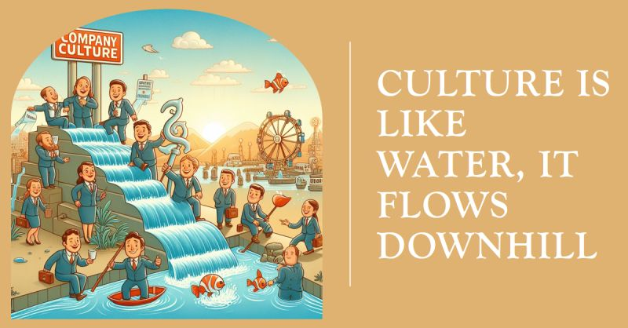

# March 27, 2024

Culture is like water, it flows downhill

Within companies, culture is often seen as a top-down phenomenon, something that is instilled by leaders and cascading down to employees. 
However, this analogy of culture as "water flowing downhill" paints a more nuanced picture. 
Just as water can find its way around obstacles and even reverse its direction, culture doesn't always flow in a straight line from the highest levels of an organization to the lowest.

𝗖𝘂𝗹𝘁𝘂𝗿𝗮𝗹 𝗶𝗻𝗳𝗹𝘂𝗲𝗻𝗰𝗲 𝗶𝘀 𝗿𝗲𝗰𝗶𝗽𝗿𝗼𝗰𝗮𝗹

While leaders play a crucial role in shaping a company's culture, it's important to recognize that cultural influence is reciprocal. Employees, too, contribute to the overall cultural landscape. Their values, behaviors, and interactions shape the way the company operates and the experiences it fosters.

𝗖𝘂𝗹𝘁𝘂𝗿𝗲 𝗶𝘀 𝘀𝗵𝗮𝗽𝗲𝗱 𝗯𝘆 𝗲𝘃𝗲𝗿𝘆 𝗶𝗻𝘁𝗲𝗿𝗮𝗰𝘁𝗶𝗼𝗻

Every interaction within an organization, from the most formal board meeting to the most casual hallway conversation, contributes to the building or erosion of a company's culture. When leaders demonstrate respect, empathy, and collaboration, they set a tone that encourages similar behavior among employees. Conversely, when disrespectful or toxic behavior is tolerated, it sends a message that undermines the desired cultural norms.

𝗟𝗲𝗮𝗱𝗲𝗿𝘀 𝗮𝗿𝗲 𝗰𝘂𝗹𝘁𝘂𝗿𝗮𝗹 𝗰𝗮𝘁𝗮𝗹𝘆𝘀𝘁𝘀, 𝗻𝗼𝘁 𝗱𝗶𝗰𝘁𝗮𝘁𝗼𝗿𝘀

Leaders can act as catalysts for cultural change, but they cannot dictate or impose a culture onto their teams. Instead, they should foster an environment where employees feel empowered to participate in shaping the company's values and behaviors. This approach requires leaders to be open-minded, receptive to feedback, and willing to adapt to the evolving needs and perspectives of their workforce.

𝗖𝘂𝗹𝘁𝘂𝗿𝗲 𝗶𝘀 𝗮 𝗹𝗶𝘃𝗶𝗻𝗴, 𝗯𝗿𝗲𝗮𝘁𝗵𝗶𝗻𝗴 𝗲𝗻𝘁𝗶𝘁𝘆

Just as water is constantly moving and adapting to its surroundings, culture is a dynamic force within an organization. It's not something that can be set in stone and left to stagnate. Instead, it requires ongoing attention, nurturing, and adaptation as the company grows and evolves.

By recognizing that culture is like water, flowing downhill but also finding its way around obstacles and interacting with its surroundings, we can approach the challenge of building a strong and enduring company culture with a more balanced and holistic perspective. 

When leaders and employees work together to shape a culture that is values-driven, inclusive, and supportive, they create an environment where everyone can thrive and contribute to the organization's success.

hashtag
#leadership 
hashtag
#culture 
--------
-> this content useful to you, repost ♻ 
-> you want more like it, follow me João Gonçalves

**Hashtags:** #leadership #culture

---

## Media

---

[View original post on LinkedIn](https://www.linkedin.com/feed/update/urn:li:activity:7150029865335898112/)