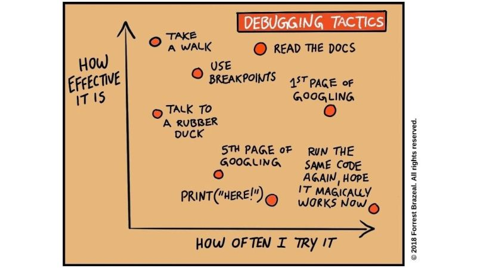

# March 27, 2024

🐛 Debugging is like being a detective in the world of coding and an essential skill.
🔍 Today, I want to share a few of my favorite debugging tactics:

1. Rubber Duck Debugging 🦆: Explaining your code problem to a rubber duck (or a colleague) often helps you find the solution as you talk it through.

2. Print Statements 🖨️: Sometimes, the good ol' print statement is your best friend. Outputting variables and data at key points can reveal where things go wrong.

3. Stack Overflow 🌐: No shame in seeking help from the Stack Overflow community. Chances are, someone else has faced the same bug.

4. Sleep On It 😴: When all else fails, step away, get some rest, and come back with a fresh mind. Solutions often pop up when you least expect them.

5. Pair Programming 🤝: Collaborating with a colleague can lead to fresh perspectives and faster debugging.

What's your go-to debugging tactic? Share your wisdom in the comments! 🙌 

image credits: Forrest Brazeal 

hashtag
#Debugging 
hashtag
#CodingLife

**Hashtags:** #Debugging #CodingLife

---

## Media

---

[View original post on LinkedIn](https://www.linkedin.com/feed/update/urn:li:activity:7102634257570787328/)