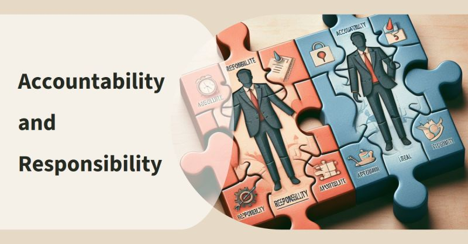

# March 27, 2024

Ever confused by accountability and responsibility? 
You're not alone! But understanding the difference is crucial for effective leadership.

Here's the breakdown:

𝗥𝗲𝘀𝗽𝗼𝗻𝘀𝗶𝗯𝗶𝗹𝗶𝘁𝘆: Owning the work itself, completing the tasks at hand. Think of it as the "doing."
𝗔𝗰𝗰𝗼𝘂𝗻𝘁𝗮𝗯𝗶𝗹𝗶𝘁𝘆: Owning the outcomes of the work, the impact and results. Think of it as the "outcomes."

Now, why does this matter?

Imagine you're a Team Lead. You delegate tasks to your team, but you're still the one accountable for the overall success (or failure). That means when things go sideways, you step up and take ownership.

But here's the good news: While you're accountable, the responsibility is shared. Your team members own their individual tasks, contributing to the bigger picture.

𝗦𝗼, 𝘁𝗵𝗲 𝗻𝗲𝘅𝘁 𝘁𝗶𝗺𝗲 𝘆𝗼𝘂 𝗱𝗲𝗹𝗲𝗴𝗮𝘁𝗲:

- Set clear expectations for both outcomes and tasks.
- Empower your team to take responsibility, knowing you're there for support.
- Be ready to step up when needed, demonstrating true leadership.

hashtag
#leadership 
hashtag
#accountability 
hashtag
#responsibility 
hashtag
#delegation
--------
-> this content useful to you, repost ♻ 
-> you want more like it, follow me João Gonçalves

**Hashtags:** #leadership #accountability #delegation #responsibility

---

## Media

---

[View original post on LinkedIn](https://www.linkedin.com/feed/update/urn:li:activity:7160215960518328320/)