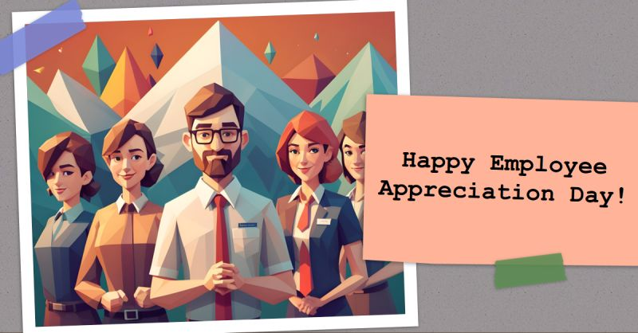

# March 27, 2024

Happy Employee Appreciation Day!

Today's a fantastic day to celebrate the incredible people who make our companies thrive. But let's be honest, appreciation shouldn't be confined to just one day.

Meaningful recognition is key. A heartfelt "thank you" or acknowledging a job well done can truly make a difference. It shows employees their contributions are valued, boosting morale and engagement.

It goes beyond just words. Consider personalized gestures, flexible work options, or even a simple team lunch.

Let's make every day Employee Appreciation Day. By fostering a culture of sincere recognition, we build stronger teams and create a workplace where everyone feels valued and motivated.

hashtag
#employeeappreciationday 
hashtag
#leadership 
hashtag
#recognitionmatters 
--------
-> this content useful to you, repost ♻ 
-> you want more like it, follow me João Gonçalves

**Hashtags:** #recognitionmatters #leadership #employeeappreciationday

---

## Media

---

[View original post on LinkedIn](https://www.linkedin.com/feed/update/urn:li:activity:7169400984450928640/)