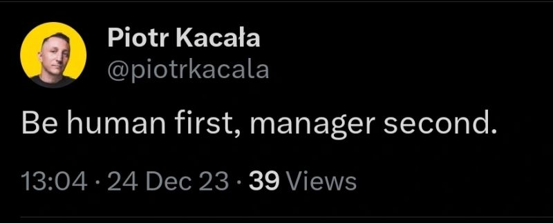

# March 27, 2024

How to be a leader in 5 words.

Great quote by Piotr Kacała 🟡 
"Be human first, manager second."

Now in 5 phrases:

- Forge leadership art by prioritizing humanity. 
- Blend managerial prowess with genuine connection. 
- Unleash compassion, recognizing each team member's humanity. 
- Navigate challenges with an understanding heart. 
- Elevate your team by acknowledging individual journeys.

Let's shape a workplace where humanity and management coexist, driving success and fulfillment.

hashtag
#leadership 
hashtag
#empathy 
--------
-> this content useful to you, repost ♻️
-> you want more like it, follow me João Gonçalves

**Hashtags:** #leadership #empathy

---

## Media

---

[View original post on LinkedIn](https://www.linkedin.com/feed/update/urn:li:activity:7145374543841341440/)