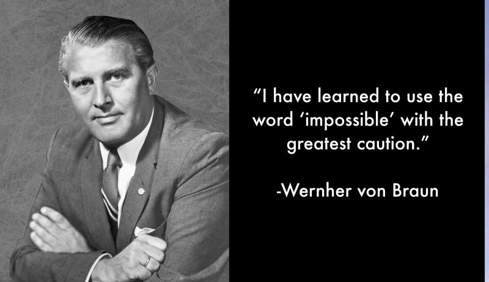

# March 27, 2024

"I have learned to use the word 'impossible' with the greatest caution." 

As a pioneer in space exploration, Von Braun understood the power of an open mind and positive attitude. His groundbreaking work was pivotal in the space race, where challenges seemed insurmountable. 

Likewise, in leading teams, embracing the possible becomes a linchpin for success. Here are three key takeaways:

1️⃣ - Challenge the Status Quo: Like Von Braun, question the notion of 'impossible' in your team's endeavors. Foster an environment where creativity thrives, and innovative solutions emerge.

2️⃣ - Positive Culture, Productive Teams: A positive attitude is contagious. Cultivate a workplace culture that fosters optimism, empowering your team to overcome obstacles with resilience and creativity.

3️⃣- Continuous Learning: Von Braun's caution against the word 'impossible' underscores the importance of constant learning. Encourage your team to embrace new technologies and methodologies, fostering personal and professional growth.

Remember, as a Leader, your mindset shapes the trajectory of your team, an open mind and positive attitude propel us beyond perceived limits.

Let's break barriers together! 🚀

hashtag
#leadership 
hashtag
#nothingisimpossible 
hashtag
#teamsuccess

**Hashtags:** #nothingisimpossible #leadership #teamsuccess

---

## Media

---

[View original post on LinkedIn](https://www.linkedin.com/feed/update/urn:li:activity:7145922518585962496/)