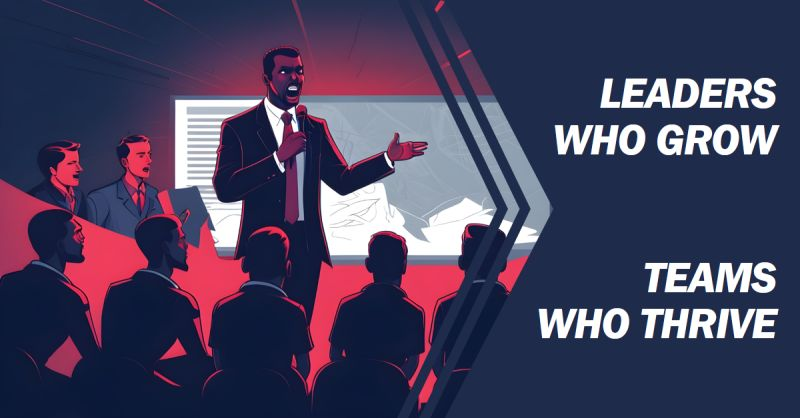

# March 27, 2024

𝗟𝗲𝗮𝗱𝗲𝗿𝘀 𝗪𝗵𝗼 𝗚𝗿𝗼𝘄, 𝗧𝗲𝗮𝗺𝘀 𝗪𝗵𝗼 𝗧𝗵𝗿𝗶𝘃𝗲

Let's face it, leading isn't always sunshine and rainbows. There are tough decisions, unexpected challenges, and moments where you might feel lost. But here's the secret sauce: 𝗲𝗳𝗳𝗲𝗰𝘁𝗶𝘃𝗲 𝗹𝗲𝗮𝗱𝗲𝗿𝘀𝗵𝗶𝗽 𝗶𝘀𝗻'𝘁 𝗮𝗯𝗼𝘂𝘁 𝗵𝗮𝘃𝗶𝗻𝗴 𝗮𝗹𝗹 𝘁𝗵𝗲 𝗮𝗻𝘀𝘄𝗲𝗿𝘀, 𝗶𝘁'𝘀 𝗮𝗯𝗼𝘂𝘁 𝗯𝗲𝗶𝗻𝗴 𝗼𝗻 𝗮 𝗰𝗼𝗻𝘀𝘁𝗮𝗻𝘁 𝗷𝗼𝘂𝗿𝗻𝗲𝘆 𝗼𝗳 𝗴𝗿𝗼𝘄𝘁𝗵.

Why? 
Because personal growth equips you with the tools to navigate those tricky situations. It helps you become:

- 𝗠𝗼𝗿𝗲 𝗿𝗲𝘀𝗶𝗹𝗶𝗲𝗻𝘁: Bouncing back from setbacks with strength and grace.
- 𝗔𝗱𝗮𝗽𝘁𝗮𝗯𝗹𝗲: Embracing change and leading your team through it.
- 𝗦𝗲𝗹𝗳-𝗮𝘄𝗮𝗿𝗲: Understanding your strengths, weaknesses, and biases (we all have them!).
- 𝗘𝗺𝗽𝗮𝘁𝗵𝗲𝘁𝗶𝗰: Connecting with your team on a deeper level and fostering trust.
- 𝗜𝗻𝘀𝗽𝗶𝗿𝗶𝗻𝗴: Showing your team that growth is possible, motivating them to strive for more.

My own leadership journey has been fueled by personal growth. Taking on new challenges, seeking feedback, and constantly learning have helped me become a better leader for myself and my team.

- 𝗜𝗱𝗲𝗻𝘁𝗶𝗳𝘆 𝗮𝗿𝗲𝗮𝘀 𝗳𝗼𝗿 𝗴𝗿𝗼𝘄𝘁𝗵: Reflect on your leadership style and seek feedback from trusted colleagues.
- 𝗖𝗼𝗺𝗺𝗶𝘁 𝘁𝗼 𝗰𝗼𝗻𝘁𝗶𝗻𝘂𝗼𝘂𝘀 𝗹𝗲𝗮𝗿𝗻𝗶𝗻𝗴: Read books, attend workshops, or take a coaching course.
- 𝗘𝗺𝗯𝗿𝗮𝗰𝗲 𝗰𝗵𝗮𝗹𝗹𝗲𝗻𝗴𝗲𝘀: See them as opportunities to learn and grow.
- 𝗦𝗵𝗮𝗿𝗲 𝘆𝗼𝘂𝗿 𝗷𝗼𝘂𝗿𝗻𝗲𝘆: Inspire others by openly discussing your own growth experiences.

The key is to find what resonates with you and commit to the journey.

hashtag
#leadership 
hashtag
#personalgrowth 
hashtag
#effectiveleadership 
hashtag
#inspiration
--------
-> this content useful to you, repost ♻ 
-> you want more like it, follow me João Gonçalves

**Hashtags:** #inspiration #leadership #effectiveleadership #personalgrowth

---

## Media

---

[View original post on LinkedIn](https://www.linkedin.com/feed/update/urn:li:activity:7161698505592299520/)