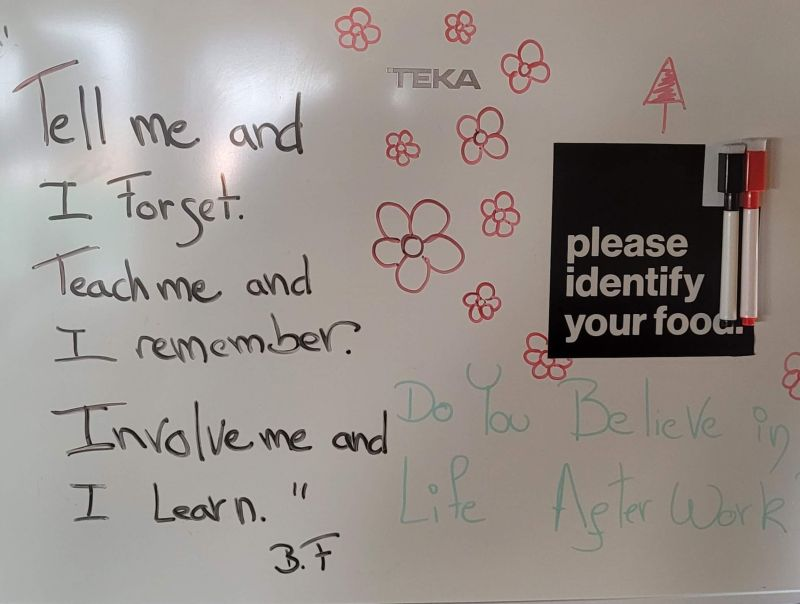

# March 27, 2024

Monday Morning inspiration !

Absolutely love this quote I stumbled upon today at Valispace (Acquired by Altium) office! 🙌 

It's a timeless gem from Benjamin Franklin: "Tell me and I forget, teach me and I may remember, involve me and I learn."

Tech leaders, isn't this what we're all about? Let's engage, inspire, and involve our teams in the learning journey. Together, we'll unlock incredible potential.

ps: yes, that is a fridge door.

hashtag
#inspiration

**Hashtags:** #inspiration

---

## Media

---

[View original post on LinkedIn](https://www.linkedin.com/feed/update/urn:li:activity:7114520653361233921/)