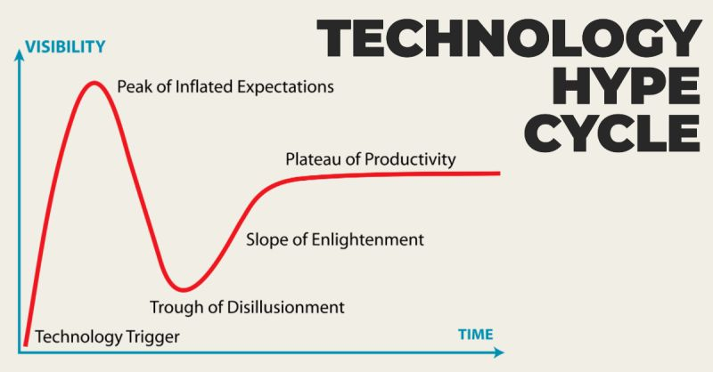

# March 27, 2024

Navigating the Technology Hype Cycle 🗺 

Mostly know as the Gartner hype cycle, understanding and recognizing it is crucial for Leaders. But first, let's break it down:

𝟭. Innovation Trigger: It all begins with a spark of innovation. A new technology or concept emerges, capturing our imagination.

𝟮. Peak of Inflated Expectations: Excitement soars! Everyone believes this tech is the silver bullet for success. But be cautious, for it's often overhyped.

𝟯. Trough of Disillusionment: The inevitable crash. Reality sets in, and disappointment follows as the technology falls short of expectations.

𝟰. Slope of Enlightenment: A glimmer of hope. We start to figure out how to make this tech work for us effectively.

𝟱. Plateau of Productivity: Finally, it becomes mainstream and delivers value. Success!

As a Leader, here's why you should care about this cycle:

𝗦𝗽𝗼𝘁 𝗢𝗽𝗽𝗼𝗿𝘁𝘂𝗻𝗶𝘁𝗶𝗲𝘀 𝗘𝗮𝗿𝗹𝘆: Recognize emerging tech trends at the "Innovation Trigger" phase. This is when potential game-changers are born. Being aware at this stage allows you to seize opportunities before they peak.

𝗔𝘃𝗼𝗶𝗱 𝗕𝗮𝗻𝗱𝘄𝗮𝗴𝗼𝗻 𝗠𝗶𝘀𝘁𝗮𝗸𝗲𝘀: It's easy to get swept up in the excitement of the "Peak of Inflated Expectations." The media and industry buzz can make any technology seem like a silver bullet. However, as a savvy Leader, you should exercise caution. Don't rush into every trend; instead, patiently wait for the "Trough of Disillusionment" before making substantial investments. This is where overhyped tech often reveals its limitations.

𝗦𝘁𝗿𝗮𝘁𝗲𝗴𝗶𝗰 𝗗𝗲𝗰𝗶𝘀𝗶𝗼𝗻-𝗠𝗮𝗸𝗶𝗻𝗴: The "Slope of Enlightenment" is where the real value emerges. This is the stage where tech matures, and successful use cases start to crystallize. As a Leader, you must make decisions based on data, not just hype. Embrace a data-driven approach, focusing on the "Plateau of Productivity," where technology becomes an integral part of business operations.

𝗧𝗲𝗮𝗺 𝗚𝘂𝗶𝗱𝗮𝗻𝗰𝗲: Mentoring your team is crucial. Equip your team members to discern real value amidst the noise. They should understand the Hype Cycle's phases and learn to differentiate between genuine innovation and passing fads. This not only empowers your team but also ensures that your organization remains competitive.

PS: How do you personally approach tech trends, and what has been your most valuable lesson? Let's share insights! 

hashtag
#hypecycle 
hashtag
#gartner 
hashtag
#leadership 
--------
-> this content useful to you, repost ♻ 
-> you want more like it, follow me João Gonçalves

**Hashtags:** #leadership #hypecycle #gartner

---

## Media

---

[View original post on LinkedIn](https://www.linkedin.com/feed/update/urn:li:activity:7126497802540449792/)