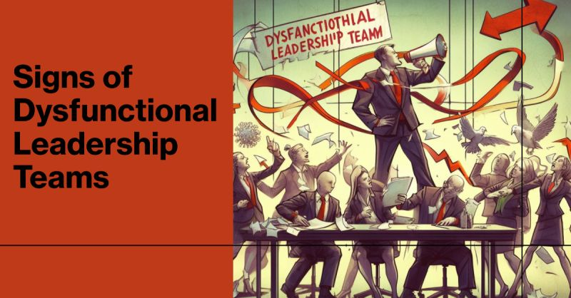

# March 27, 2024

Signs of Dysfunctional Leadership Teams

If your are leading a team of leaders, ensure you're steering your ship in the right direction, it's crucial to recognize and address potential pitfalls that could hinder your team's performance. Here are 14 common signs of dysfunctional leadership teams to watch out for and overcome.

1. 📊 "Reporting Lines" Over Shared Work:
 Is your leadership team more focused on individual tasks than collective goals? Break down silos and embrace collaboration for success.

2. 🗣️ Dominant Top Leaders:
 Effective leadership thrives on diverse voices. Encourage everyone to contribute, fostering a culture of inclusivity.

3. 🔄 Rabbit-Holing and Miscommunication:
 If your team often talks past each other, it's time to improve communication and actively listen to one another.

4. 📑 Endless PowerPoint Reviews:
 Meetings shouldn't revolve around slides. Shift the focus to meaningful discussions and actionable outcomes.

5. 🤝 Excessive 1:1 Meetings:
 While one-on-ones have their place, ensure they don't overshadow the importance of group meetings and collective decision-making.

6. 🚫 Top Leader Dependency:
 A resilient team should function independently even when the leader is absent. Avoid canceling meetings in their absence.

7. 🌟 Optics vs. Progress:
 Prioritize results over appearances. Authentic leadership is about driving change, not seeking personal gain.

8. 👑 Centralized Decision-Making:
 Share the responsibility of decision-making among team members to harness collective wisdom.

9. ⏳ Marathon of Status Updates:
 Streamline your meetings and use time efficiently, so everyone stays focused and engaged.

10. 📅 Meeting Overload:
 Recognize when a conversation can be handled asynchronously, reducing unnecessary meetings and liberating time for productive work.

11. 📋 "Wishlist" Priorities:
 Align your team around clear, achievable priorities, not endless lists of unattainable goals.

12. 🎯 Striving for Perfection:
 Embrace adaptability and risk-taking; progress often stems from learning through experimentation.

13. 🐘 Ignoring Tough Conversations:
 Address those difficult topics that have been left unspoken. It's essential for growth and resolution.

14. 👈 Blaming, Not Responsibility:
 Successful leaders take ownership of both successes and setbacks, driving improvement with a growth mindset.

Don't settle for mediocrity! Transform your leadership team into a powerhouse of collaboration, innovation, and results. Your team's success begins with effective leadership.

Which of these challenges resonates with your leadership journey? Share your thoughts in the comments and let's work together to conquer them. 

hashtag
#leadership 
hashtag
#teamwork 
hashtag
#success 
--------
-> this content useful to you, repost ♻ 
-> you want more like it, follow me João Gonçalves

**Hashtags:** #success #leadership #teamwork

---

## Media

---

[View original post on LinkedIn](https://www.linkedin.com/feed/update/urn:li:activity:7127915900833312769/)