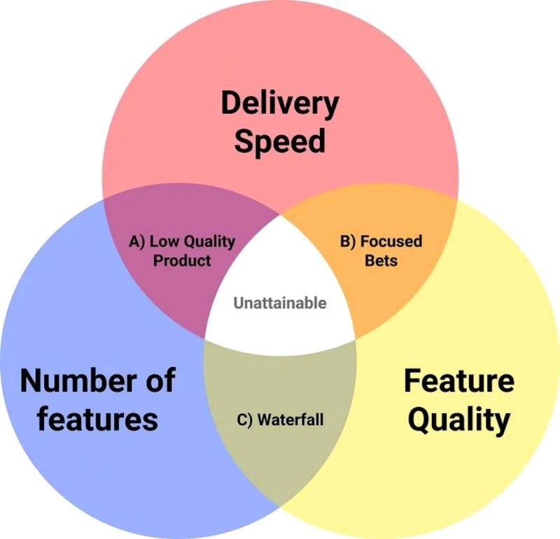

# March 27, 2024

"Software engineers expect to write clean code, extensive tests and scalable architectures.
Their managers expect them to figure out solutions to their business problems. Many times that means clunky code, no tests and pressure to "ship fast"."

From a Sergio Pereira post in X.
https://twitter.com/SergioRocks/status/1692885208083595507

The typical choose 2 but never 3, shown in the image below.

Lots of good points on that thread, but Ill add my own. 

This is the never-ending balance between business and dev teams and it is the key point to any tech lead/CTO, as it shifts between both focus during different growth stages.

Most important action a leader can take is keeping the team aligned and understanding why the focus shifts and when it's expected to shift back. Highlight advantages of each approach, explain the business constraints leading to the decision and how people should operate within the new environment.

---

## Media

---

[View original post on LinkedIn](https://www.linkedin.com/feed/update/urn:li:activity:7099376598109331456/)