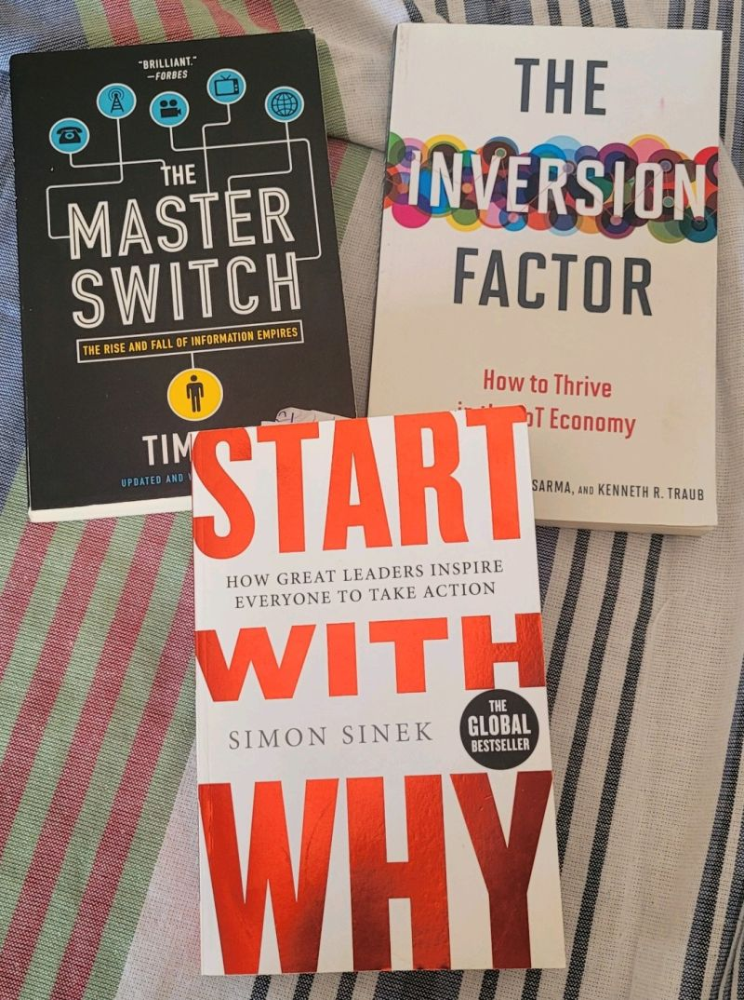

# March 27, 2024

Summer vacations reading list.

I'll try to post a review when I finish each one.

---

## Media

---

[View original post on LinkedIn](https://www.linkedin.com/feed/update/urn:li:activity:7096510681440559104/)