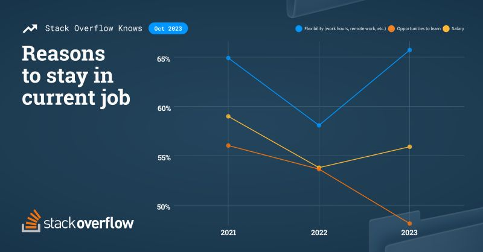

# March 27, 2024

Tech Talent Trends: Age, Flexibility, and the Future of Work

In a recent survey on developer employment, Stack Overflow discovered some eye-opening trends that could impact your career, and published the results in their official blow. Whether you're a fresh tech talent or a seasoned pro, it's time to take notice.
(link in the comments)

𝗘𝘅𝗽𝗹𝗼𝗿𝗶𝗻𝗴 𝗡𝗲𝘄 𝗛𝗼𝗿𝗶𝘇𝗼𝗻𝘀: A whopping 79% of developers are considering new job opportunities. The tech industry isn't the only game in town anymore, and it's driving a migration of developers to explore new paths. 

𝗖𝗵𝗮𝗻𝗴𝗶𝗻𝗴 𝗖𝗮𝗿𝗲𝗲𝗿𝘀 & 𝗜𝗻𝗱𝘂𝘀𝘁𝗿𝗶𝗲𝘀: Developers are switching industries, with manufacturing and supply chain companies seeing a rise in tech talent. The world is the judge, and developers from 107 countries are making their moves. 

𝗢𝗻𝗯𝗼𝗮𝗿𝗱𝗶𝗻𝗴 𝗢𝗽𝗽𝗼𝗿𝘁𝘂𝗻𝗶𝘁𝗶𝗲𝘀: Developers, like gymnasts, are embracing new positions and job opportunities. As you progress in your career, curiosity becomes a significant driver for change. It's not just about salary; it's about exploring what's out there. 

𝗔𝗴𝗲 𝗠𝗮𝘁𝘁𝗲𝗿𝘀: The reasons for seeking new opportunities shift with age. Late-career developers are driven by curiosity, alongside a better salary. Flexibility remains a top priority across all age groups. 

𝗙𝗹𝗲𝘅𝗶𝗯𝗶𝗹𝗶𝘁𝘆 𝘃𝘀. 𝗟𝗲𝗮𝗿𝗻𝗶𝗻𝗴: Flexibility is the top reason for staying in a job, while the importance of learning opportunities is decreasing. It's like mastering the balance beam – staying on is essential, but innovation matters too. 

𝗔𝗜 𝗜𝗺𝗽𝗮𝗰𝘁: Developers are becoming more involved with AI, but they might be less enthusiastic about learning opportunities as AI tools evolve. The pressure to perform is increasing, but flexibility remains vital. 

The job market is evolving, and so should your career strategy. Embrace change, explore new horizons, and keep that balance on the beam! 🤸‍♂️

PS: How do you feel about these trends? Are you open to new opportunities or happy where you are?

hashtag
#growth 
hashtag
#carrer 
hashtag
#ai 
--------
-> this content useful to you, repost ♻ 
-> you want more like it, follow me João Gonçalves

**Hashtags:** #growth #ai #carrer

---

## Media

---

[View original post on LinkedIn](https://www.linkedin.com/feed/update/urn:li:activity:7123666328065818624/)