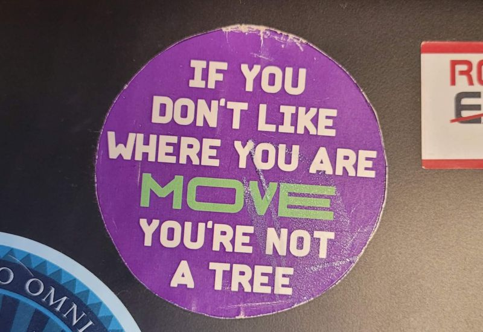

# March 27, 2024

The Laptop Sticker Wisdom

My laptop proudly carries, and it was the only one to move from my old laptop, a sticker that bears a profound message: 
"𝗜𝗳 𝘆𝗼𝘂 𝗱𝗼𝗻'𝘁 𝗹𝗶𝗸𝗲 𝘄𝗵𝗲𝗿𝗲 𝘆𝗼𝘂 𝗮𝗿𝗲, 𝗠𝗢𝗩𝗘. 𝗬𝗼𝘂'𝗿𝗲 𝗻𝗼𝘁 𝗮 𝘁𝗿𝗲𝗲." 

This isn't about quitting when the going gets tough; it's a call to action. 
It's a nuanced perspective on embracing change and steering one's destiny.
As leaders, we must be agents of change. Don't conform to surroundings that stifle growth and innovation. Instead, be proactive, challenge the status quo, and foster an environment where teams thrive.

🌿 𝗗𝘆𝗻𝗮𝗺𝗶𝗰 𝗚𝗿𝗼𝘄𝘁𝗵: Much like a tree seeks sunlight by adapting its branches, we, too, should actively pursue growth. The sticker nudges us to break free from stagnant situations, fostering an environment where innovation and progress can flourish.

🌎 𝗔𝗿𝗰𝗵𝗶𝘁𝗲𝗰𝘁𝘀 𝗼𝗳 𝗖𝗵𝗮𝗻𝗴𝗲: The analogy to a tree implies rootedness, but as leaders, we're called to be architects of change. Challenge the status quo, question assumptions, and build a dynamic ecosystem that propels both individuals and teams forward.

💡 𝗦𝘁𝗿𝗮𝘁𝗲𝗴𝗶𝗰 𝗠𝗼𝘃𝗲𝗺𝗲𝗻𝘁: "MOVE" isn't just physical relocation; it's a strategic mindset. It's about making calculated moves to align with your vision. Understand when it's time to pivot, iterate, or introduce transformative shifts in your leadership approach.

This sticker is a reminder that we're not bound by the constraints of immobility. We have the agency to shape our surroundings, inspiring positive change and cultivate environments where individuals and teams can thrive.

👏 Embrace the winds of change—move towards growth!

Let's explore the profound meaning behind these words and unlock the potential they hold for transformative leadership.

PS: Yes, I do have many sticker on my laptop, I'm that kind of nerd.

hashtag
#personaldevelopment 
hashtag
#leadership 
hashtag
#personalgrowth 
--------
-> this content useful to you, repost ♻ 
-> you want more like it, follow me João Gonçalves

**Hashtags:** #leadership #personaldevelopment #personalgrowth

---

## Media

---

[View original post on LinkedIn](https://www.linkedin.com/feed/update/urn:li:activity:7131605260531290112/)