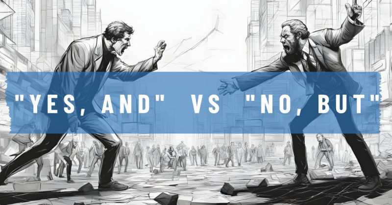

# March 27, 2024

The Power of Positive Language: Embrace the "Yes, And..." mindset

Have you ever wondered where the concept of "Yes, And..." in team management originated and why it's so crucial? Let's take a peek behind the scenes of this game-changing approach.

🎭 Meet Viola Spolin: The genius behind "Yes, And...", a theater instructor and the mother of improv comedy. She saw improv as a means to foster creativity and collaboration. In the 1950s, she introduced the "Yes, And..." exercise. Two actors would start a scene, and they could only respond with "Yes, And..." This exercise was all about accepting and building on diverse ideas.

🎭 Beyond Theater: "Yes, And..." transcended theater and ventured into diverse fields like business, education, and even psychotherapy. Its influence expanded because it's a potent catalyst for creativity, collaboration, and innovation.

🌟 Why "Yes, And..." Matters in Team Management:
✅ Creating Possibilities: Saying "Yes, And..." opens doors to fresh ideas and leverages each team member's strengths.
✅ Enhancing Creativity: By welcoming ideas without judgment, creativity thrives.
✅ Effective Collaboration: It fosters effective teamwork, leading to better problem-solving and performance.
✅ Boosting Morale: In a positive and supportive environment, team members are happier and more engaged.

👉 Practical Application:
🧠 Brainstorming Sessions: Replace "No, But..." with "Yes, And..." when discussing ideas. For example, if someone suggests a new project, respond with "Yes, And we can start small to fit our budget."
🗣️ Giving Feedback: Instead of "No, But...," be constructive. For instance, say "Yes, And you did great, and here are areas to improve."
🤝 Resolving Conflict: In disagreements, shift from "No, But my way" to finding a common solution. Propose trying both approaches to see what works best.

Embrace the "Yes, And..." mindset in your team management. It cultivates an environment where collaboration thrives, innovation flourishes, and team morale soars. It's time to say "Yes, And..." to building a stronger, more creative team.

hashtag
#teammanagement 
hashtag
#leadership 
hashtag
#positive
--------
-> this content useful to you, repost ♻ 
-> you want more like it, follow me João Gonçalves

**Hashtags:** #teammanagement #leadership #positive

---

## Media

---

[View original post on LinkedIn](https://www.linkedin.com/feed/update/urn:li:activity:7111712072777801728/)