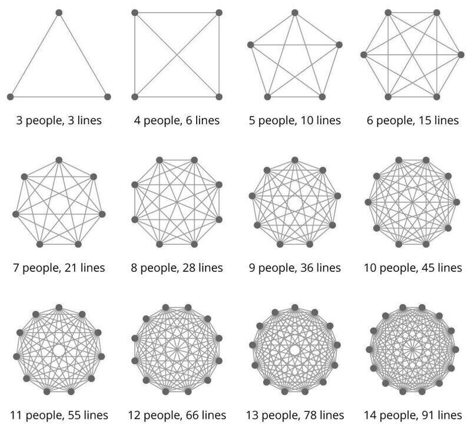

# March 27, 2024

The Power of Smaller Teams 🚀

In Malcolm Gladwell's "The Tipping Point," he explored why some ideas catch fire while others fizzle out. One key takeaway: the magic number, 150. 
This concept, known as Dunbar's Number, suggests that we can only maintain stable social relationships with around 150 people. Beyond that, things get complex. 🤯

Enter Metcalfe's Law. It states that as you add more members to a network, communication becomes trickier. Managing effective communication in large groups demands effort. Researchers advise maintaining deeper relationships with about 5 people and a few more with another 15.

Why does this matter to any team leader ?

1 - Communication: Smaller groups mean more accessible, transparent, and efficient communication. Everyone knows everyone, leading to better teamwork.
2 - Relationships and Trust: Smaller teams foster closer relationships and trust. This encourages collaboration, innovation, and shared goals. 
3 - Ownership: In smaller teams, individual roles are more noticeable, promoting personal accountability. No one can "hide in the crowd." 
4 - Agility: Smaller organizations make decisions quickly, adapting to changes and challenges. Perfect for fast-paced tech environments. 
5 - Culture: Smaller groups find it easier to establish and maintain a unified culture. Shared values and norms thrive in a tight-knit team. 

Larger groups can succeed too, but they demand different management and communication structures. The key is finding the right balance. 🤝

PS: What's your take on team size and productivity? Drop a comment and let's spark a discussion!

hashtag
#leadership 
hashtag
#culture 
hashtag
#teamwork
--------
If you like this content and it is useful to you, repost this and follow me João Gonçalves for more like it.

**Hashtags:** #leadership #culture #teamwork

---

## Media

---

[View original post on LinkedIn](https://www.linkedin.com/feed/update/urn:li:activity:7116720401744822272/)