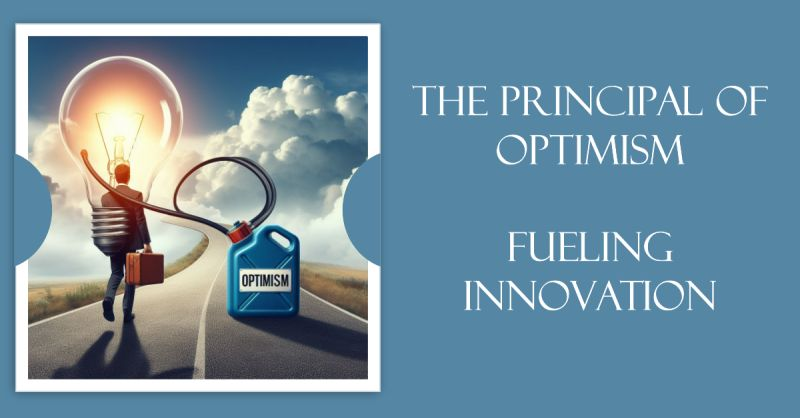

# March 27, 2024

The Principal of Optimism: Fueling Innovation

What David Deutsch calls The Principal of Optimism, which states that anything not prohibited by the laws of physics is possible given sufficient knowledge, can be s a guiding light, encouraging teams to push boundaries and explore uncharted territories.

This principle aligns seamlessly with the core tenets of rapid iteration, a methodology that emphasizes continuous learning, experimentation, and adaptation. Through rapid iteration cycles, guided by the Principal of Optimism, teams can achieve remarkable breakthroughs.

𝗘𝗺𝗽𝗼𝘄𝗲𝗿𝗶𝗻𝗴 𝗦𝗺𝗮𝗹𝗹, 𝗗𝗲𝗱𝗶𝗰𝗮𝘁𝗲𝗱 𝗧𝗲𝗮𝗺𝘀

The POO empowers small, dedicated teams to tackle seemingly insurmountable challenges. Unburdened by skepticism, these teams approach problems with a sense of boundless possibility, transforming seemingly outlandish ideas into tangible realities.

𝗔 𝗦𝗵𝗮𝗿𝗲𝗱 𝗧𝗿𝗮𝗶𝘁 𝗔𝗺𝗼𝗻𝗴 𝗧𝗿𝗮𝗶𝗹𝗯𝗹𝗮𝘇𝗲𝗿𝘀

The Principal of Optimism serves as a unifying force for pioneers across various disciplines. Whether it's entrepreneurs defying conventional wisdom or software developers pushing the boundaries of technology, they share a common trait: an unwavering belief that anything is possible.

𝗧𝗵𝗲 𝗣𝗿𝗶𝗻𝗰𝗶𝗽𝗮𝗹 𝗼𝗳 𝗢𝗽𝘁𝗶𝗺𝗶𝘀𝗺 𝗶𝗻 𝗔𝗰𝘁𝗶𝗼𝗻

It is probably best exemplified by SpaceX, through trial and error, defying the odds and revolutionizing space exploration. Similarly, software developers can achieve remarkable breakthroughs through rapid iteration cycles.

The Principal of Optimism stands as a cornerstone of rapid iteration, fostering a culture of innovation, experimentation, and unwavering belief in the power of human ingenuity. 

🌐 Embrace the unknown, iterate boldly, and let optimism drive your team's success. 

hashtag
#leadership 
hashtag
#optimism 
hashtag
#rapidIteration
--------
-> this content useful to you, repost ♻ 
-> you want more like it, follow me João Gonçalves

**Hashtags:** #optimism #leadership #rapidIteration

---

## Media

---

[View original post on LinkedIn](https://www.linkedin.com/feed/update/urn:li:activity:7137433363983794178/)