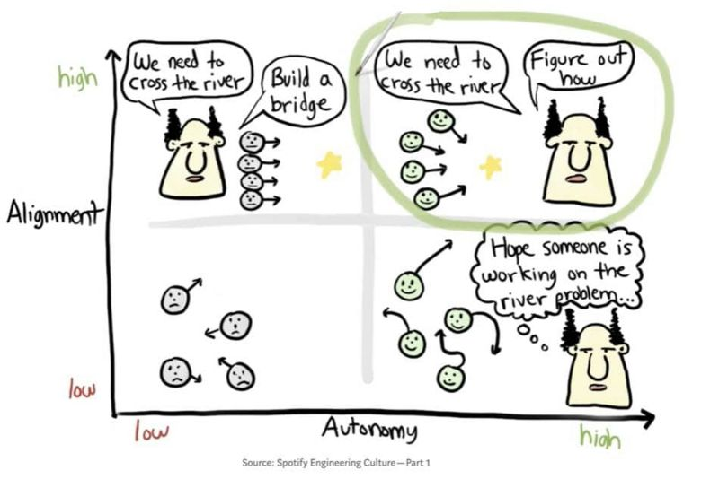

# March 27, 2024

The Spotify model of alignment vs autonomy

Finding the sweet spot between Autonomy, Alignment, and Accountability is crucial. Here's a concise take:

🎯 Autonomy: Empower teams to innovate and adapt.
🤝 Alignment: Ensure everyone's heading toward the same goal.
💼 Accountability: Be explicit, transparent, and committed.

Transparency builds trust, commitments drive results. 

There is much more to be said about Spotify's Engineering, let me know if it's something I should dive deeper.

hashtag
#alignment 
hashtag
#autonomy 
hashtag
#accountability 
hashtag
#culture 
hashtag
#leadership

**Hashtags:** #accountability #autonomy #leadership #culture #alignment

---

## Media

---

[View original post on LinkedIn](https://www.linkedin.com/feed/update/urn:li:activity:7116012880835022848/)