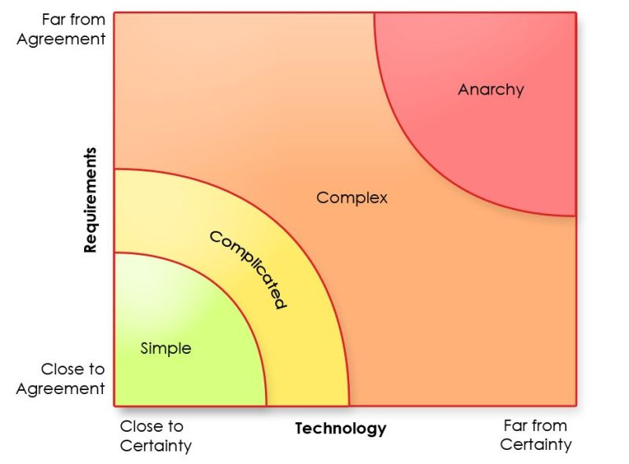

# March 27, 2024

The Stacey Matrix in Software Development

The Stacey Matrix is a powerful tool that dissects complexity, primarily hinging on two vital dimensions: certainty and agreement. It's the confluence of these factors that defines the path we must tread. 

🔷 Simple: In situations where there's high certainty and high agreement, the approach is clear-cut. We follow a well-defined plan to steer our teams toward success. 📈
🔷 Complicated: When certainty is high, but agreement wavers, leaders face the challenge of harmonizing different perspectives. Building consensus becomes pivotal, ensuring everyone aligns on the goals. 📊
🔷 Complex: In scenarios with low certainty and high agreement, creativity takes the front seat. There's no one-size-fits-all solution, pushing leaders to collaborate with their teams to experiment, adapt, and innovate. 🚀
🔷 Chaotic: The most challenging terrain is where both certainty and agreement are low. Uncertainty and disagreement prevail. Here, leaders must be swift, adaptable, and responsive, thinking on their feet to navigate the turbulent waters. 🌊

For software development leaders, the Stacey Matrix becomes an invaluable asset:

𝟭 𝗜𝗱𝗲𝗻𝘁𝗶𝗳𝘆 𝗖𝗼𝗺𝗽𝗹𝗲𝘅𝗶𝘁𝘆: The first step is recognizing the nature of your situation, allowing you to choose the most effective management approach.
𝟮 𝗨𝗻𝗱𝗲𝗿𝘀𝘁𝗮𝗻𝗱 𝗗𝗶𝘃𝗲𝗿𝘀𝗲 𝗣𝗲𝗿𝘀𝗽𝗲𝗰𝘁𝗶𝘃𝗲𝘀: Differing viewpoints are the norm in software development. Understanding and aligning these perspectives can make or break a project.
𝟯 𝗡𝗮𝘃𝗶𝗴𝗮𝘁𝗲 𝗖𝗵𝗮𝗻𝗴𝗲: In this ever-evolving field, change is constant. The Matrix equips leaders to steer through the turbulent waters of uncertainty.
𝟰 𝗣𝗿𝗼𝗺𝗼𝘁𝗲 𝗖𝗿𝗲𝗮𝘁𝗶𝘃𝗶𝘁𝘆 𝗮𝗻𝗱 𝗜𝗻𝗻𝗼𝘃𝗮𝘁𝗶𝗼𝗻: Complex problems often demand 4 unconventional solutions. The Stacey Matrix provides the structure needed for leaders to create an environment where creativity thrives.

Here are some specific examples of how the Stacey Matrix can be used:

🔷 Simple: Imagine leading a team in building a feature with crystal-clear requirements.
🔷 Complicated: You're tasked with developing a new product amid a variety of opinions and unclear requirements.
🔷 Complex: The challenge is to create a new machine learning algorithm when the path ahead is uncertain.
🔷 Chaotic: During a major product launch, your team confronts a critical bug, and the clock is ticking.

Learning and understanding the Stacey Matrix is a must for any software leader. It's a tool to choose the right path, navigating through uncertainty, promoting innovation, and ultimately deliver successful projects. 

ps: where is says Anarchy in the image, it should read Chaos. It was rightfully pointed out that they are not interchangeable and one does not imply the other. 

hashtag
#staceymatrix 
hashtag
#complexity 
hashtag
#leadership
--------
-> this content useful to you, repost ♻ 
-> you want more like it, follow me João Gonçalves

**Hashtags:** #leadership #complexity #staceymatrix

---

## Media

---

[View original post on LinkedIn](https://www.linkedin.com/feed/update/urn:li:activity:7122818563265970176/)