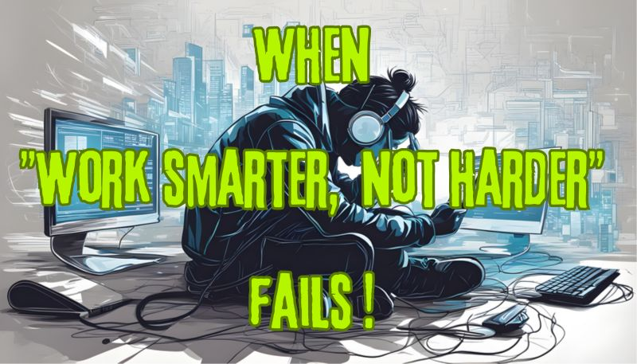

# March 27, 2024

When "Work smarter, not harder" fails ! 

"Work smarter, not harder" is a timeless adage that resonates with many of us in the tech world. But what do you do when you're venturing into uncharted territory, facing something entirely new? 🤔

In such moments, I like to propose a different approach:

"make it work, then make it work well, then make it work fast. "

It's a mindset that prioritizes action and experience over everything else. 

When you're confronted with a novel challenge, the key is to start by making it function. Get it off the ground, even if it seems daunting. Each step forward is a lesson learned. 📚

Next, refine it until it works well, ensuring that it meets your standards for quality and performance. 🛠️

And only then, when you've built a strong foundation of experience, should you focus on making it work fast. By this point, you'll have the insights and expertise needed to optimize your solution. ⏩ 

Remember, the journey to working 'smart' often begins with taking that initial leap into the unknown. 🌟 

So, tech enthusiasts, what's your take on this approach? Share your thoughts below, and let's dive deeper into this exciting topic! 💬👇

hashtag
#TechWisdom 
hashtag
#Innovation 
hashtag
#leadership

**Hashtags:** #leadership #Innovation #TechWisdom

---

## Media

---

[View original post on LinkedIn](https://www.linkedin.com/feed/update/urn:li:activity:7109265495211556864/)