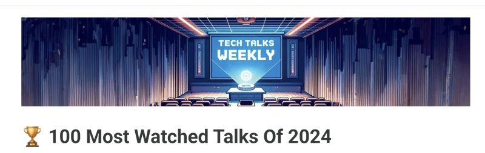

# March 27, 2025

A coworker recently shared an impressive find with me from Tech Talks Weekly: their list of the 100 most-watched software engineering talks of 2024. 

It’s a goldmine for developers serious about honing their skills—full of fresh ideas, actionable solutions, and insights that really make you pause and rethink your approach. 

I’ve already flagged a few to dig into over the next week or so. If you’re keen on staying sharp and pushing your work forward in this ever-evolving space, I’d highly recommend checking it out:
 https://www.techtalksweekly.io/p/100-most-watched-software-engineering

hashtag
#SoftwareEngineering 
hashtag
#TechTalks 
hashtag
#ContinuousLearning

**Hashtags:** #ContinuousLearning #SoftwareEngineering #TechTalks

---

## Media

---

[View original post on LinkedIn](https://www.linkedin.com/feed/update/urn:li:activity:7298248012454109184/)