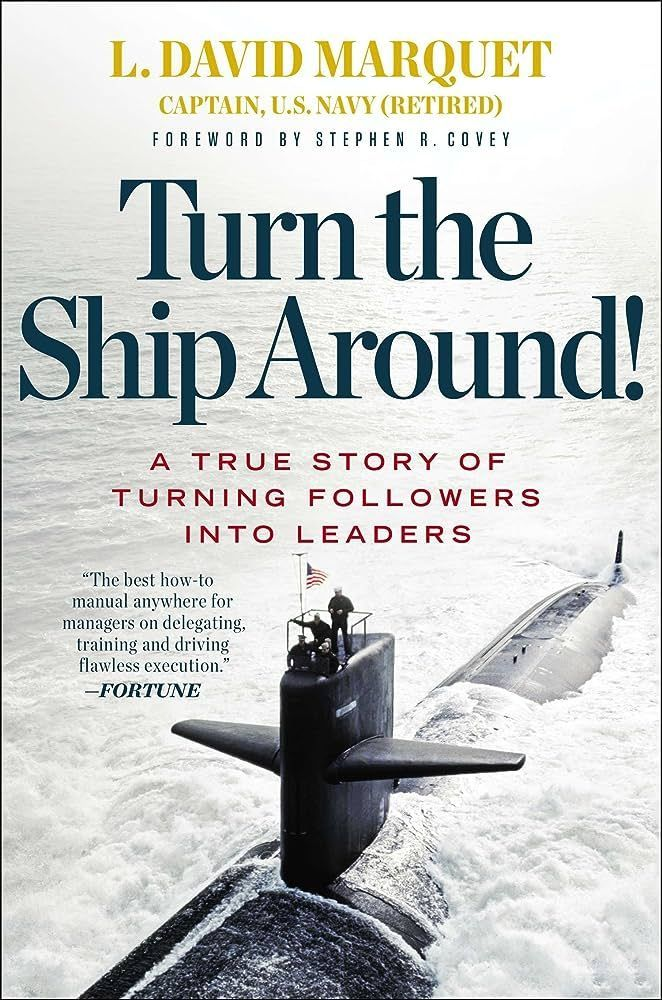

# March 27, 2025

I was recently asked what my favorite leadership book is, and the answer was immediate: Turn the Ship Around! by L. David Marquet

This book isn't your typical leadership . It's a captivating story of how Captain Marquet transformed a struggling submarine crew into a high-performing team.

Although it's been a while since I've read it resonated with me, here's why:

𝗘𝗺𝗽𝗼𝘄𝗲𝗿𝗶𝗻𝗴 𝗜𝗻𝗱𝗶𝘃𝗶𝗱𝘂𝗮𝗹𝘀: Marquet ditched the "command and control" style and fostered a "leader-leader" model - shifting power from the top down to individuals who are closest to the work.
𝗕𝘂𝗶𝗹𝗱𝗶𝗻𝗴 𝗧𝗿𝘂𝘀𝘁 & 𝗖𝗼𝗺𝗺𝘂𝗻𝗶𝘁𝘆: By giving up control, Marquet fostered a culture of trust and collaboration, a key ingredient for high-performing teams.
𝗙𝗼𝗰𝘂𝘀 𝗼𝗻 𝗚𝗿𝗼𝘄𝘁𝗵: The book emphasizes the importance of investing in people's development, both professionally and personally. 
𝗟𝗲𝗮𝗱𝗲𝗿𝘀, 𝗡𝗼𝘁 𝗙𝗼𝗹𝗹𝗼𝘄𝗲𝗿𝘀: Instead of barking orders, Marquet valued active listening and asked his crew how they'd handle situations, pushing decision-making authority down the ranks.

𝗜𝗳 𝘆𝗼𝘂'𝗿𝗲 𝗹𝗼𝗼𝗸𝗶𝗻𝗴 𝘁𝗼:
- Boost team morale and performance
- Create a culture of ownership and accountability
- Develop your leadership skills

Then Turn the Ship Around! is a must-read. 
Not only it applies to every area of work, from the tight hierarchy of a military ship to the more flat organizations you might find in tech, but also the way it is written with clear points and examples makes it easy to understand and implement.

hashtag
#leadership 
hashtag
#trust 
hashtag
#teammanagement

**Hashtags:** #leadership #teammanagement #trust

---

## Media

---

[View original post on LinkedIn](https://www.linkedin.com/feed/update/urn:li:activity:7217130688813158402/)