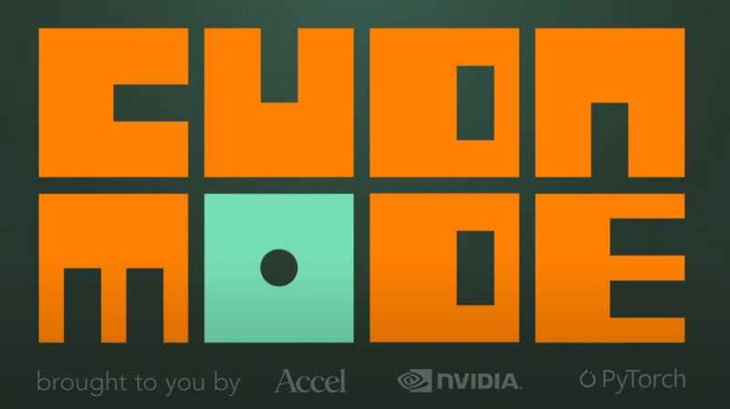

# March 27, 2025

Just finished watching Andrej Karpathy's (ex Tesla, OpenAI) insightful talk on YouTube (link in comments!) where he dives deep into LLM training.

The video is for the full GPU MODE IRL 2024 and the other talks are also quite interesting.

Karpathy breaks down the complexities of LLMs in a way that's both informative and engaging. He also discusses how he and his team rewrote PyTorch in C to make it smaller and more efficient. This is a significant achievement that could have a major impact on the future of AI research.

If you're curious, as I am, about the future of AI, I highly recommend checking out this video and following Karpathy on X.

hashtag
#ai 
hashtag
#llm 

P.S. Feel free to share your thoughts on LLMs and their potential in the comments below!

**Hashtags:** #ai #llm

---

## Media

---

[View original post on LinkedIn](https://www.linkedin.com/feed/update/urn:li:activity:7247543664443334656/)