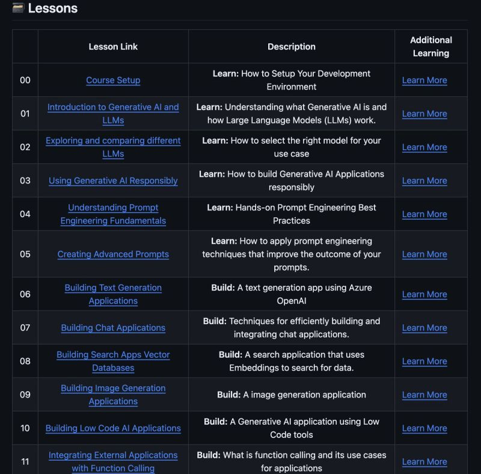

# March 27, 2025

Microsoft has released a new course on Generative AI.

You can learn the basics of building Generative AI applications with this free 21-lesson course on GitHub.
It's a great resource for anyone interested in AI.

(link in the comments)

 
hashtag
#GenerativeAI 
hashtag
#Microsoft 
hashtag
#AI 
hashtag
#Course

**Hashtags:** #AI #Course #Microsoft #GenerativeAI

---

## Media

---

[View original post on LinkedIn](https://www.linkedin.com/feed/update/urn:li:activity:7248677155042168832/)