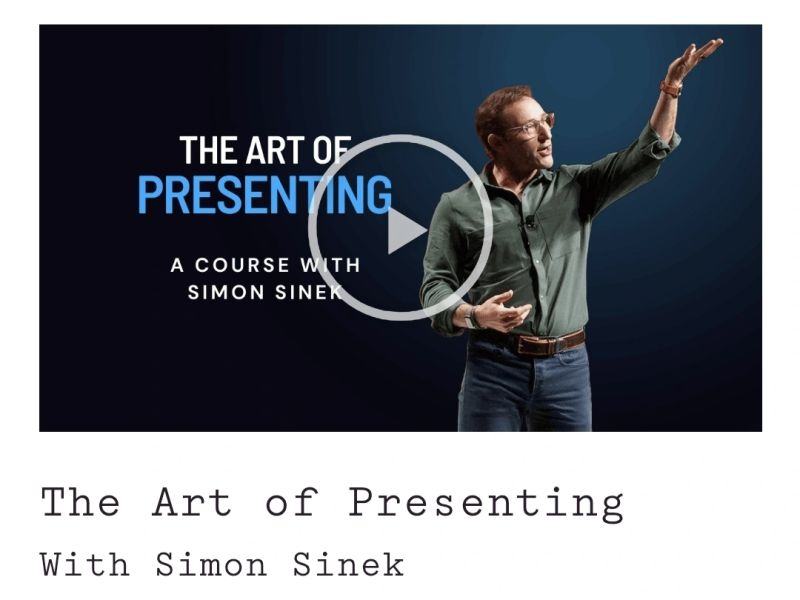

# March 27, 2025

Speaking in public is something that we all have to do, some dread it, but it does not need to suck.

I just finished this course today and even for those of us that have done a fair share of presenting it still hold deep value.

From the tips Simon Sinek gives to the video examples of him putting them into practice, it all sounds obvious and makes you wonder why you weren't doing it already.

Main takeaway for me is the giver mentality and how all other aspects revolve around it.

If you want to up your presenting game, I strongly suggest taking this course.

---

## Media

---

[View original post on LinkedIn](https://www.linkedin.com/feed/update/urn:li:activity:7296071420374126592/)