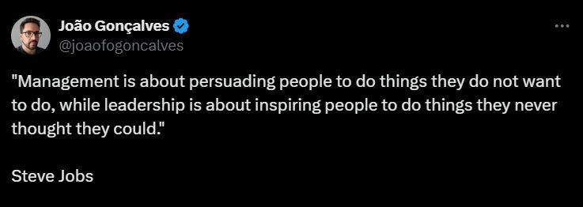

# March 27, 2025

Steve Jobs' quote, "Management is about persuading people to do things they do not want to do, while leadership is about inspiring people to do things they never thought they could," always ignites thought-provoking and strong opiniated discussions.

Sure, strong managers are the backbone of any organization, keeping things running efficiently and ensuring tasks are completed. But it's the true leaders who take us beyond the status quo, inspiring us to achieve what once seemed impossible. They ignite a passion and a vision that compels people to push their boundaries and reach their full potential.

𝗛𝗼𝘄𝗲𝘃𝗲𝗿, 𝘁𝗵𝗲 𝘁𝘄𝗼 𝗮𝗿𝗲𝗻'𝘁 𝗻𝗲𝗰𝗲𝘀𝘀𝗮𝗿𝗶𝗹𝘆 𝗺𝘂𝘁𝘂𝗮𝗹𝗹𝘆 𝗲𝘅𝗰𝗹𝘂𝘀𝗶𝘃𝗲. 
The best leaders often possess strong management skills as well. They can effectively delegate tasks and navigate the day-to-day operations while simultaneously fostering a culture of innovation and possibility.

𝗦𝗼, 𝘄𝗵𝗲𝗿𝗲 𝗱𝗼 𝘆𝗼𝘂 𝘀𝗲𝗲 𝘆𝗼𝘂𝗿𝘀𝗲𝗹𝗳 𝗼𝗻 𝘁𝗵𝗶𝘀 𝘀𝗽𝗲𝗰𝘁𝗿𝘂𝗺?

Do you find yourself thriving in the structured environment of management, ensuring things run smoothly and efficiently? Or do you crave the challenge of inspiring others and venturing into uncharted territory?

The reality is, many of us embody both qualities to some degree. 
Perhaps you excel at managing a team but also have a knack for motivating individuals to go the extra mile. 
Maybe you're a strategic thinker who can also delegate effectively.

I'd love to hear your thoughts on this quote! Share your experiences with leadership and management in the comments. 

What are some of the challenges and rewards you've encountered in these roles?

hashtag
#leadership 
hashtag
#management 
hashtag
#stevejobs

**Hashtags:** #leadership #management #stevejobs

---

## Media

---

[View original post on LinkedIn](https://www.linkedin.com/feed/update/urn:li:activity:7179390328917934081/)