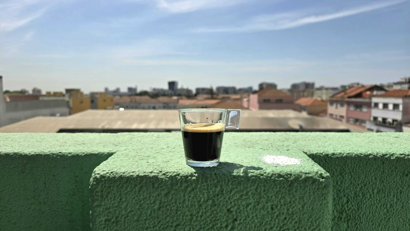

# March 27, 2025

Sunshine, Coffee & Connection!

Soaking up the sun with a cup of coffee on the balcony? Yes, please! 

But the real perk of being in the Valispace (Acquired by Altium) / Altium® office today wasn't just the amazing weather (although, let's be honest, that's a plus). It was catching up with everyone, brainstorming ideas face-to-face, and feeling that team spirit. 
It was the perfect reminder of why the office still matters.

Sure, working remote has its perks (hello, pajamas!), but there's a whole different vibe when you're surrounded by your team.

There's a spark that ignites in those casual conversations by the coffee machine, or those brainstorming sessions that flow a little easier when you're all in the same room.

So, while remote work is here to stay, let's not forget the power of in-person connection. 
Who knows, maybe your next big idea will brew over a cup of coffee with a coworker!

hashtag
#coffee 
hashtag
#remote 
hashtag
#office

**Hashtags:** #coffee #remote #office

---

## Media

---

[View original post on LinkedIn](https://www.linkedin.com/feed/update/urn:li:activity:7203714719772266496/)