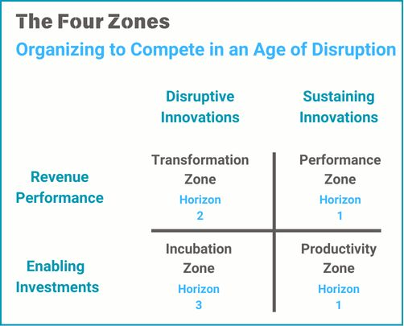

# March 27, 2025

There's been a lot of talk about disruptive innovation, but how do you know which ones to worry about?
In this GOTO 2016 presentation, Geoffrey Moore discusses Zone Management. 

His predictions are eerily correct 8 years after the talk

This framework was developed with Salesforce and Microsoft to help organizations better manage disruptive innovation.

Moore argues that established companies often miss the boat because they're looking at the problem the wrong way. He introduces Zone Management and the concept of three horizons to help companies assess and respond effectively. 

This video is a must-watch for anyone interested in disruptive innovation or Zone Management.

(link in comments)

hashtag
#disruptiveinnovation 
hashtag
#zonemanagement

**Hashtags:** #disruptiveinnovation #zonemanagement

---

## Media

---

[View original post on LinkedIn](https://www.linkedin.com/feed/update/urn:li:activity:7286043149548875777/)