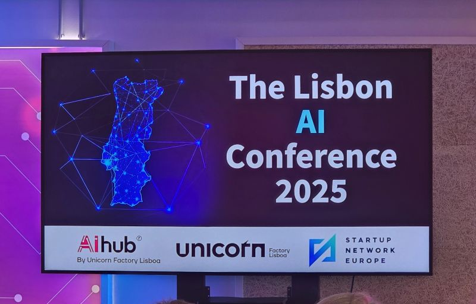

# May 31, 2025

Yesterday's event SITIO.pt on their AIHub by Unicorn Factory Lisboa was a great one.

Although short, it was packed with insights, not just about the technicalities of AI but also how to incorporate it in your strategy and business.

Even compliance and ethics were discussed.

Everything is around AI these days, yes..
but this one, being closer to one and actually being in person somehow felt different and, more real.

---

## Media

---

[View original post on LinkedIn](https://www.linkedin.com/feed/update/urn:li:activity:7331582395403399168/)