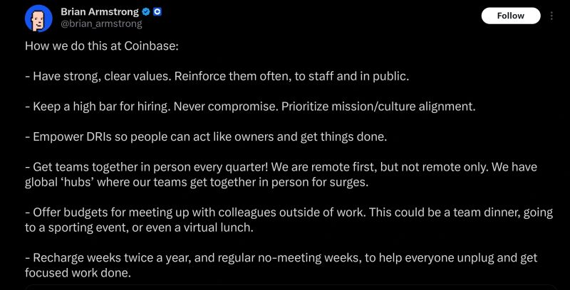

# September 28, 2025

When asked how do fully remote teams build a strong company culture, this was the answer of Coinbase's CEO, Brian Armstrong.

All very excellent examples of things to do when creating/promoting a healthy remote culture.

Coinbase and others are an example that it can work, but it takes effort and commitment

---

## Media

---

[View original post on LinkedIn](https://www.linkedin.com/feed/update/urn:li:activity:7372574558056448000/)